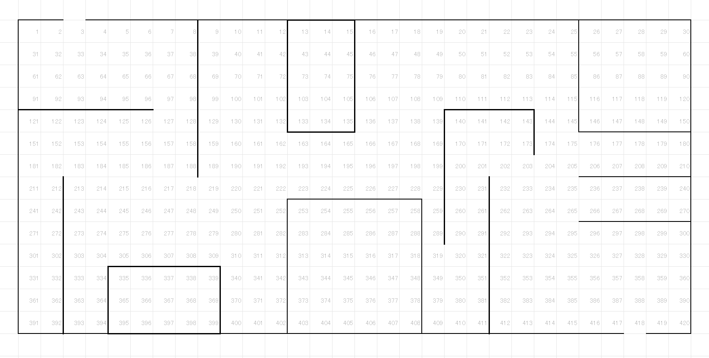
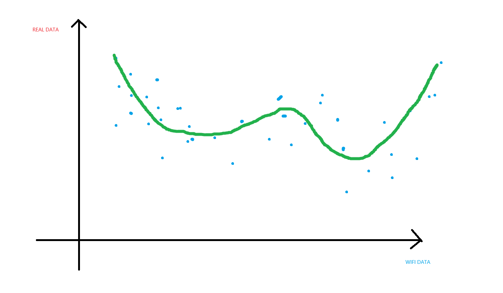

# 1. 標準経路の取得
## 1.1. 工場の平面図に基づいて、セルを分割する

## 1.2. 標準経路図の作成

分割されたセルの番号に基づいて、標準経路図を作成します。

# 2. WiFi位置座標点陣の取得

作業員が車両を運転し、標準経路に従って実際の位置データ（青色部分）を取得します。
セルの番号で位置を示します。

# 3. データマッピング

収集したデータの時間に基づいて、取得した点陣の番号を実際の座標にマッピングします。

# 4. トレーニングデータセットの作成

`2`、`3`のプロセスを何度も繰り返し、大量のデータを取得します。

# 5. 機械学習

前述の手順に基づいて、次のような検出値と実際の値のマッピングが得られます。

各点は収集された値を表し、x軸は収集されたセルの番号を、y軸はマッピングされた実際の値のセルの番号を表します。

線形回帰（Linear Regression）の方法を使用して、フィッティング曲線を求めます。

これで、この曲線を使用してWiFi検出座標を予測できます。
