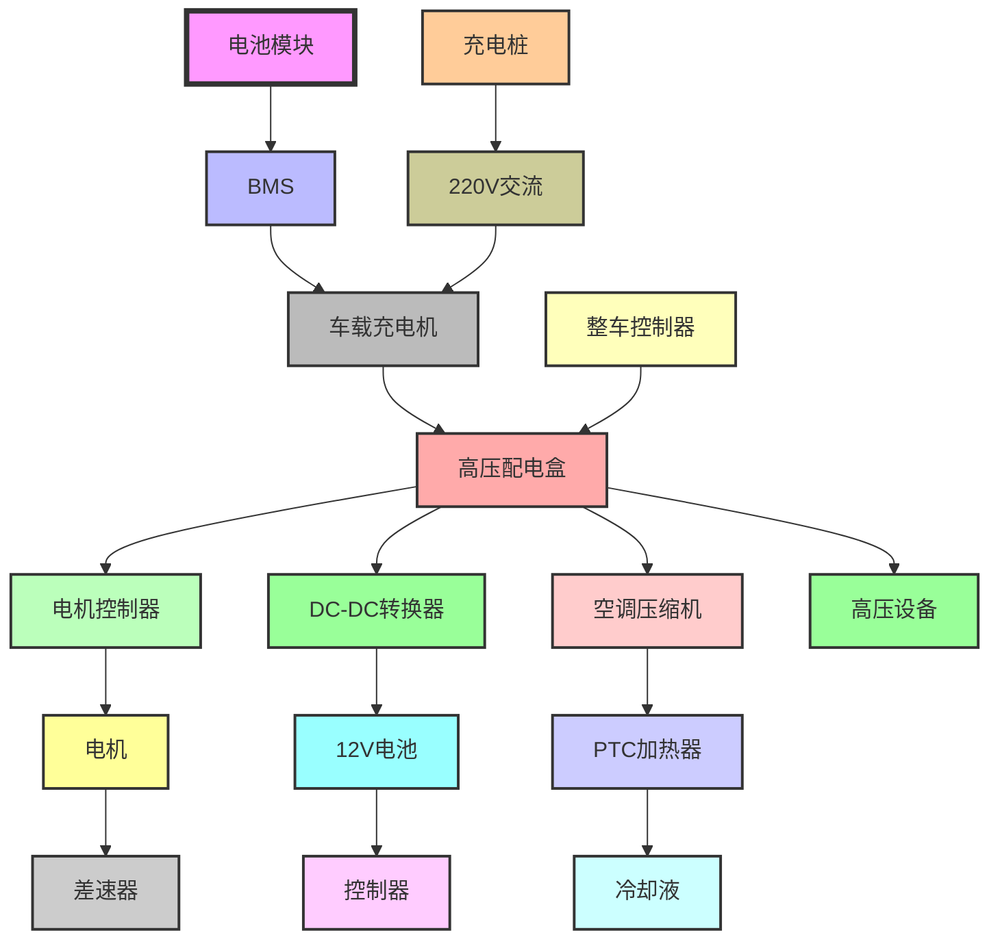
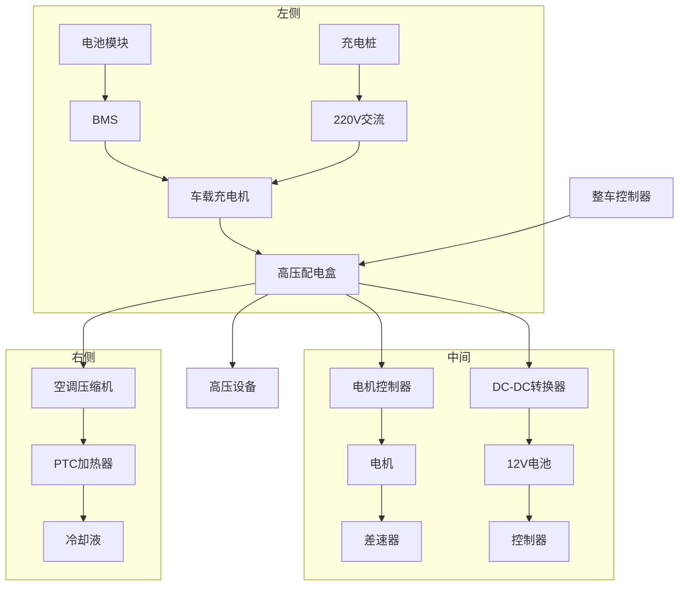

```mermaid
graph TD
  A[电池模块] --> B[BMS]
  B --> C[车载充电机]
  C --> D[高压配电盒]
  D --> E[电机控制器]
  E --> F[电机]
  F --> G[差速器]
  D --> H[DC-DC转换器]
  H --> I[12V电池]
  I --> J[控制器]
  D --> K[空调压缩机]
  K --> L[PTC加热器]
  L --> M[冷却液]
  N[充电桩] --> O[220V交流]
  O --> C
  P[整车控制器] --> D
  D --> Q[高压设备]

  style A fill:#f9f,stroke:#333,stroke-width:4px
  style B fill:#bbf,stroke:#333,stroke-width:2px
  style C fill:#bbb,stroke:#333,stroke-width:2px
  style D fill:#faa,stroke:#333,stroke-width:2px
  style E fill:#bfb,stroke:#333,stroke-width:2px
  style F fill:#ff9,stroke:#333,stroke-width:2px
  style G fill:#ccc,stroke:#333,stroke-width:2px
  style H fill:#9f9,stroke:#333,stroke-width:2px
  style I fill:#9ff,stroke:#333,stroke-width:2px
  style J fill:#fcf,stroke:#333,stroke-width:2px
  style K fill:#fcc,stroke:#333,stroke-width:2px
  style L fill:#ccf,stroke:#333,stroke-width:2px
  style M fill:#cff,stroke:#333,stroke-width:2px
  style N fill:#fc9,stroke:#333,stroke-width:2px
  style O fill:#cc9,stroke:#333,stroke-width:2px
  style P fill:#ffb,stroke:#333,stroke-width:2px
  style Q fill:#9f9,stroke:#333,stroke-width:2px


```

```mermaid
graph TD
  subgraph 左侧
    A[电池模块] --> B[BMS]
    B --> C[车载充电机]
    C --> D[高压配电盒]
    N[充电桩] --> O[220V交流]
    O --> C
  end
  
  subgraph 中间
    D --> E[电机控制器]
    E --> F[电机]
    F --> G[差速器]
    D --> H[DC-DC转换器]
    H --> I[12V电池]
    I --> J[控制器]
  end
  
  subgraph 右侧
    D --> K[空调压缩机]
    K --> L[PTC加热器]
    L --> M[冷却液]
  end
  
  P[整车控制器] --> D
  D --> Q[高压设备]

```
