[原文地址](https://blog.csdn.net/julialove102123/article/details/80822076)

特征匹配（Feature Match)是计算机视觉中很多应用的基础，比如说图像配准，摄像机跟踪，三维重建，物体识别，人脸识别，所以花一些时间去深入理解这个概念是不为过的。本文希望通过一种通俗易懂的方式来阐述特征匹配这个过程，以及在过程中遇到的一些问题。

## 基本概念

首先我通过几张图片来指出什么是特征匹配，以及特征匹配的过程。

图像一：彩色圆圈为图像的特征点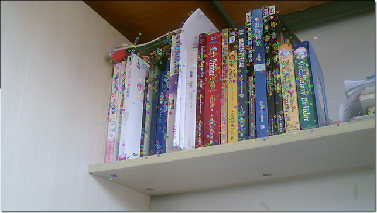

图像二：

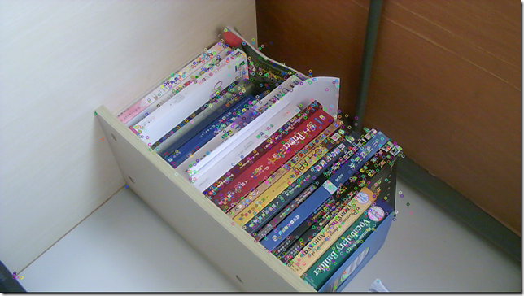

图像一与图像二的匹配：

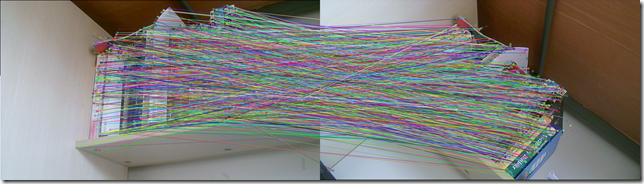

概念理解：什么是特征，什么是特征描述，什么是特征匹配

假设这样的一个场景，小白和小黑都在看一个图片，但是他们想知道他们看的是否是同一幅图片，于是他们就通过电话描述这个图片，来判断是否是同一个图片。比如说有下面两个图片

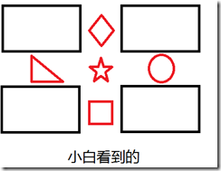             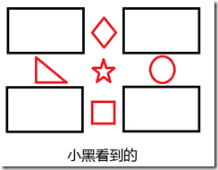  

对话1：

小白：我的图片里面有五个很明显的特征，分别在图像的上下左右中五个位置。

小黑：我的图片里面也有五个很明显的特征，分别在图像的上下左右中五个位置。

对话2：

小白：我的一个特征左边是三角形，右边是圆形，上面是菱形，下面是正方形。

小黑：我也有一个特征左边是三角形，右边是圆形，上面是菱形，下面是正方形。

对话3：

小白和小黑：那我们看到的就是同一个特征了。

上述三个对话其实分别代表**特征提取，特征描述和特征匹配**。

那么来详细的分析一下，我们的问题是要匹配两张图像是否是同一个图像，比较好的方法就是找出图像中特征显著的内容然后来进行比较，如果这些特征都一致，那么就有很高的概率称他们为同一个图像。
所以首先第一步就是找出图像中特征性强的内容（Feature Detect），上图中特征性强的就是五个红色的图案。
但是只知道有显著特征没用，必须知道两张图像中的特征是不是一致的，如何判断特征是不是一致的，就需要我们对这个特征进行描述（Feature Descriptor），如果描述非常的相似或者说是相同，那么就可以判断为是同一特征。
那么问题来了，该如何去描述一个特征，什么样的描述是一个好的描述呢。

从对话2中我们可以看出，描述一个特征其实就是描述特征与他周围内容的相互关系。
那么什么样的描述是一个好的描述呢，就要提到我们为什么要描述特征了？
我们描述特征是为了能够更好的匹配特征，使得我们认为描述相同的特征是同一个特征的是可信的（概率高的）。
所以我们的描述必须是有代表性的，具有排他性的（discriminative）,而不是模棱两可泛泛而谈的。
最后我们就可以根据描述的相似性来判断这对特征是否是同一个特征。

## 特征不变性

接下来我们将谈一下特征的不变性。我们用过很多特征，Harris Corner、SIFT、SURF、BRIEF、BRISK等，而特征的一个重要特性就是特征不变性，常见的就是旋转不变性和尺度不变性，还有一些具有仿射不变性的特征。而这些特征该怎么理解呢？下面我就用通俗地解释一下。

## 旋转不变性

再看下面两张图片：

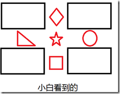                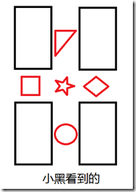

于是我们在看审视三个对话，你会发现对话2就改变了。

对话2：

小白：我的一个特征左边是三角形，右边是圆形，上面是菱形，下面是正方形。

小黑：我有一个特征左边是正方形，右边是菱形，上面是三角形，下面是圆形。

于是小黑和小白就认为他们看得并不是同一个图片。但事实上他们看得确实是同一种图片。于是我们就说这种特征不具有旋转不变性。

那么如何实现旋转不变性呢，再看下面两张图片：

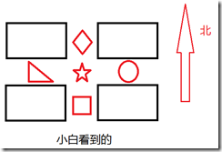        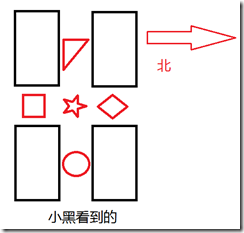

然后我们再来审视对话2：

对话2：

小白：我的一个特征西边是三角形，东边是圆形，北边是菱形，南边是正方形。

小黑：我也有一个特征西边是三角形，东边是圆形，北边是菱形，南边是正方形。

这时候两个特征的描述就一致了，即拥有了旋转不变性。所以只要对特征定义方向，然后在同一个方向上进行特征描述就可以实现旋转不变性。这称之为Rotation Normalization。

## 尺度不变性

接下来谈一下尺度不变性，依然看下面两张图片：

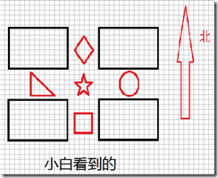          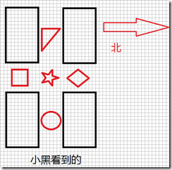

对话2：

小白：我的一个特征东边5个像素的地方有个圆形。

小黑：我有一个特征东边7个像素的地方有个圆形。

这就是尺度变化造成的特征不匹配，为了实现尺度不变性，就需要给特征加上尺度因子，比如说小白看到的是尺度为5的，小黑看到的是尺度为7的，那么在进行描述的时候，将尺度统一就可以实现尺度不变性了。这过程称为Scale Normalization。

所谓的旋转不变性和尺度不变性的原理，就是我们在描述一个特征之前，将两张图像都变换到同一个方向和同一个尺度上，然后再在这个统一标准上来描述这个特征。同样的，如果在描述一个特征之前，将图像变换到同一个仿射尺度或者投影尺度上，那么就可以实现仿射不变性和投影不变性。分别称为Affine Normalization 和 Projected Normalization.

## 总结

特征匹配的方法是先找出特征显著的特征点（Feature Detect），然后再分别描述两个特征点（Feature Descriptor），最后比较两个描述的的相似程度来判断是否为同一个特征（Feature Match）。而在特征描述之前如果能够做到确定特征的方向，则可以实现旋转不变性（Rotation invarient），如果能确定尺度，则可以实现尺度不变性（Scale invarient）。

下面是我根据上面的方式对常用的Feature所做的总结。

| |SIFT|SURF|BRIEF|ORB|BRISK|
|:----|:----|:----|:----|:----|:----|
|提点方法|DoG的最值点位置在通过二次拟合来确定位置|Hessian矩阵的行列式最值|无|使用FAST提点，使用Harris Corner去除非角点|使用FAST或AGAST提点|
|确定方向|特征邻域的梯度直方图的最值方向|特征邻域对Haar wavelet的最大响应方向|无|使用Intensity centroid方法来确定方向|使用邻域随机抽样点对，对远点对做梯度确定方向|
|确定尺度|通过建立确定尺度空间，尺度空间中DoG最值所在尺度为特征尺度|尺度空间中Hessian矩阵行列式最值所在尺度|无|无|尺度空间中FAST提点最显著的尺度|
|描述方法|在特征周围取一个region，分成4*4的sub-region，对每个sub-region使用八方向的梯度表示，总共128维|在特征周围取一个region，分成4*4的sub-region，对每个sub-region计算haar wavelet响应，分别取x方向响应和，x方向响应绝对值之和，y方向响应和，y方向绝对值之和四个值描述，总共64维|在特征点周围随机抽取随机点对，比较两个点的像素强度，根据结果的大小记为1或0，取256组组成256位的二进制字符串|通过贪心方法抽取符合正态分布的随机点对，其他同BRIEF|使用短距离点对进行强度匹配，组成512位的二进制字符串|

