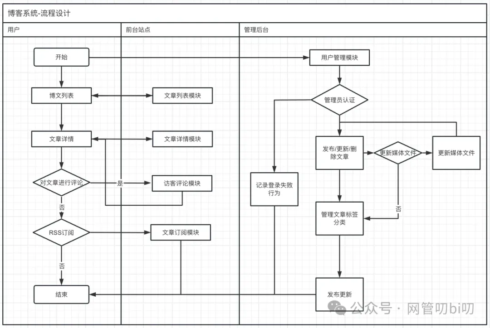
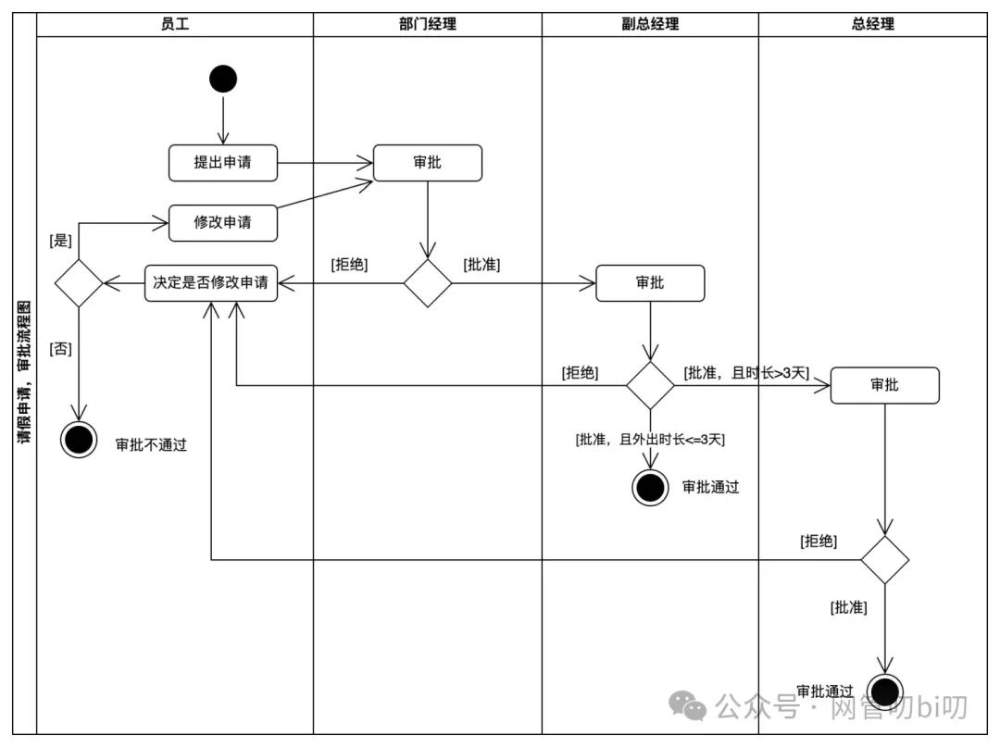

相信很多人选择当程序员除了这个行业起步阶段薪资比其他行业高一些之外，还有一个很大的因素是觉得做研发类的工作只要代码写的好，跟电脑这个“直男”打交道就可以了。

但是还没走出校门呢，毕业这一关就得边做毕业设计边写毕业论文。写毕业论文可不是直接把自己的实现代码从IDE粘贴到Word里，但凡代码多一点就会被老师要求修改，老师会告诉你要把你做的毕业设计的功能、设计思路、关键部分的实现细节用绘图结合文字表达清楚。

这时很多同学就犯难了，匆匆拿出大三的教材《软件程序设计》看看上面的那些个图都怎么画的，再找找网上的例子，模仿着能画出个类似下面的流程图。

上面这个图乍一看还可以，但是网上关于流程图的语法好几个版本，每个人画出来都不一样，而且用这种形式表达大一些的流程，就完全感觉眼花缭乱。

## 画图的底层逻辑是沟通

其实走到工作岗位上之后我们仍然面临着这样的问题，除了专心写代码外，我们的工作构成中还有大量的需求评审、需求分析、技术评审、系统方案设计这样的需要人和人进行沟通的环节。讲逻辑、讲实现方案、讲设计思路这些都需要良好的沟通能力。究其原因就是因为IT行业分工明细，它像其他行业的工作流水线一样涉及大量工种的合作，但又因为交付的软件并不像工业流水线一样是标准件，所以上面列举的每个环节都需要良好的沟通，让各职能人员之间建立共识、建立统一语言后才能完成高效协作，交付产品。

**既然需要良好的沟通建立统一语言，那么我们在需求分析、技术评审、系统方案设计文档上就不能使用太主观的语言，也不能把实现代码直接往文档上粘**，那样的话且不说有的岗位不写代码，即使同岗位的其他同事也没有那个精力一行一行的仔细看完你的代码、理解你的思路。

所以这就**需要我们能够简洁、高效地用人们都能看懂的专业图形描述出软件开发这些环节中需要重点沟通的需求逻辑和技术的关键细节**。

我们都知道从事理工专业的人，可能对构图、色彩这些不太擅长，那么有没有一种图形不需要美术基础就能掌握，足够专业让图形能突出我们想表达的技术细节，同时还足够简洁即使是不太懂技术的人也能完全看懂呢？在IT领域还真有，那就是UML。

比如同样是表达需求的业务流程，用流程图表达的就是上面图-1的那个样子，但是用表达力更强，更注重语法的UML活动图表达流程的话就是下面这个样子。

关于怎么用活动图分析表达流程，后面会有专门的章节去给大家讲解。

## 程序员画图难的成因

说到UML，无论是大学里还是市面上讲解UML的书籍中对UML的讲解都太过枯燥了，它们通常都是以技术和软件设计的角度来讲述UML的，通常上来会先讲解一大堆图，哪些是结构建模，哪些是行为建模，紧接着就是各种图的一堆语法（画法），或者是给出的示例太过于技术化，完全脱离日常生活让人无法理解。

这就给我们这样一开始不太懂的人一种UML太过专业太过复杂，不好用的印象。想的那么清楚画出图来，代码早写好了。典型的例子就是如果画类图把类的各个属性和方法都想好画出来也太费时间了，况且需求多变还要经常改，还有就是那些类图表示的类的关系一会儿是箭头、一会儿是虚线、不明白他们都什么区别，看多了就头疼。

其实上面这个现象完全就是误区，UML完全不是必须那么复杂，我们完全可以从需求分析阶段开始就开始使用，在分析的过程中构思业务的结构并画出来它大概的样貌。

后面随着对需求的进一步了解再去补全或者调整其中的内容。写技术文档常用的UML图除了能像上面这样使用类图分析业务的结构，还有活动图、顺序图、状态机图从不同角度分析业务的行为，而且是循序渐进的使用，不是上来把这些都用上。

早期对业务知晓不够透彻时UML图可以画的粗略些，流程分析也只先分析明白大流程即可，随着使用UML分析业务的过程对业务逐渐了解后再逐渐细化以及使用不同的图形从不同角度描述业务。 UML家族里提供的各种图，也不局限于只能用于技术分析，甚至需求用例、系统架构、IT架构方面的需求也能够使用UML进行描述。

## 掌握UML让自己有更多可能

无论是一线研发，还是已经转型项目经理、产品经理或者团队管理的人员或者是想要上车入行的萌新程序员，本课程都能让你收益颇多，让你掌握产品经理写需求的一些基本技能，也让你轻松应对项目经理参与竞标和项目管理时的文案编写工作。

同时还能让你管理项目质量时找到“抓手”，通过在项目团队建立技术评审、方案设计等相关机制--融合团队成员对UML的使用，让团队成员的思维性创造更容易被周知也让这些内容更容易被Review，从而达到项目开发期间高效的沟通和良好的质量保证。

## 缓解职场的汇报焦虑

除了上面讲的这些我们工作中干活需要用到的各种图形外，在职场上班和在学校上学有一个重要的区别就是我们时不时的就要被拿出来**评比、通晒、述职**，这些场合都会要求我们做汇报。

针对这个程序员在职场中的普遍痛点，课程最后一部分还会扩展一些互联网开发人员在职场中应对各种汇报的策略，讲述一些写汇报PPT的主旨思路，侧重点和注意事项。同时也讲一些使用堆砖块画法（我自己总结的）给汇报PPT进行配图的思路，怎么通过这些图快速抓住听众的眼球建立共识，以及怎么使用一些配图讲解规划给上级“画饼”来获得他们的支持从而进一步获得他们后续在资源上的支持，更好地开展工作。

## 订阅方式

本课程计划更新22篇内容，定价59元，由于微信公众号付费阅读采用微信豆的方式，课程价格会显示590微信豆。 建议使用安卓的微信端进行购买，苹果IOS会有AppStore的抽成，实际支付成本会更高。

课程已在小报童同步上线，苹果用户可以扫码下方二维码，通过小报童进行订阅。