本节我们介绍课程中使用的绘图软件，市面上能供我们用来作为技术画图软件的产品有不少，像processon、excalidraw、omni-uml、draw.io 等。

课程里因为要兼顾考虑读者的使用成本、画图专业性、上手简单、支持云端分享复制几个因素，我最终选用的是draw.io这款绘图软件，这样大家启动简单，不需要额外花钱再去买软件，我也能把课程里教大家画的图分享出来供大家参考。

我们课程全程使用的绘图软件是draw.io，我也推荐各位用draw.io跟着我一起练习，这样才能快速掌握我在课程中教授的这些图。draw.io是一款完全免费的绘图软件，既有在线版本也有离线客户端版本，而且在使用上没有任何限制，绘制出来的图直接存储在用户自己的设备或者云盘上，可谓是非常良心。

早期使用时我喜欢用draw.io客户端画图，然后再通过把画的图提交到Github上实现多设备分享，不过后来发现如果会科学上网的话，使用它的在线版本非常方便，因为离线版本需要手动保存有的时候画着画着软件崩溃或者误关了，画了半天的图就丢了，而在线版本则有自动保存更新的功能，非常方便。

本节我们主要介绍draw.io的入门使用技巧，会带着大家认识软件中的主要工作区和它们的功能，为后面实践画图章节打好基础。

在继续本节的内容前再提醒一下苹果手机用户，因为苹果税的存在本专栏在微信直接订阅价格会高于安卓用户，所以专栏在小报童同步更新，苹果手机用户可以扫描下方二维码在小报童订阅阅读，规避额外开销。

##   
安装和在线化配置

首先 draw.io 的官方地址为 https://www.draw.io，首次打开的话会是下面这个Get Started页面的视图，通过点击Start按钮就能开始使用在线版的绘图工具，当然也可根据自己的喜好点击Download按钮去下载离线版本的客户端。

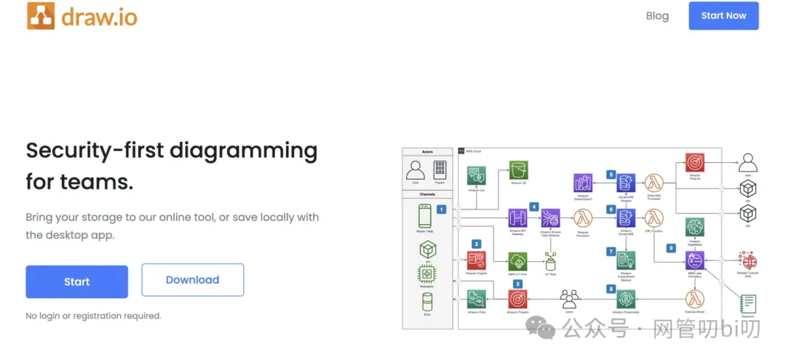

这里我个人还是推荐使用在线版本，设好后以后再访问地址 https://draw.io 或者 https://app.diagrams.net/ 会直接跳过欢迎页询问你时要新建还是打开现有的绘图。

接下来我们详细讲一下在线版本draw.io绘图工具的一些初始化设置工作，让你使用draw.io时能更称手一些，选择使用离线版客户端的同学可以跳过。

第一次使用在线版draw.io的时候会有提示框让我们确定把绘图文件保存在哪里，如果你有Google账号的话我推荐选择Google Drive，原因很简单，在Chrome浏览器里不需要再登录其他账号，直接授权就能使用。其他的像OneDrive、GitHub这些都需要登录相关账号才能进行授权，而且绘图文件的体积都非常小，Google Drive赠送的免费空间完全够存下我们所有的绘图文件了。

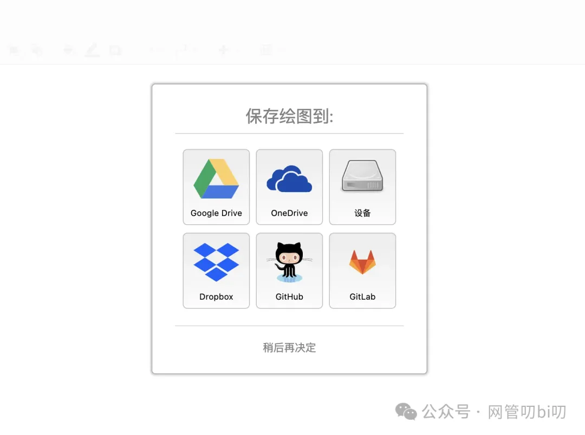

选择Google Drive 作为存储介质后，接下来就会弹出提示框让我们对其进行授权。

选择要授权Google Drive访问权限给draw.io的Google账号，如果你的Chrome浏览器中没有多账号登录的话只有一个用户供选择，直接点击进行下一步即可。

授权步骤完成后就能看到我们在开头展示的那个打开draw.io网址后让我们选择创建新绘图或者打开现有绘图的页面弹窗了。

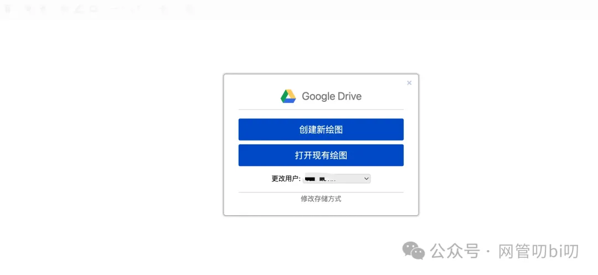

首次使用我们必然是选择创建新绘图，创建新绘图的时候会让你选择现有的模版比如：流程图、UML类图、泳道图等等，这里我们直接选择空白画布即可，以后不管我们画什么图都是选择空白画布。

一个主要的原因是在这些软件里自带的绘图模版的基础上画图时，每次修改到能满足我们的需求都要废半天劲，比从头画还麻烦。 另外等学会课程后面教你的绘图技巧后，无论是多复杂的图你都能快速画出来，而且已有的绘图模版会限制你的构图思维，所以我推荐你总是使用空白画布。等自己攒的绘图资源越多，你后面画图的速度就越快，后面再告诉你为什么，我们先把初始化工作做完。

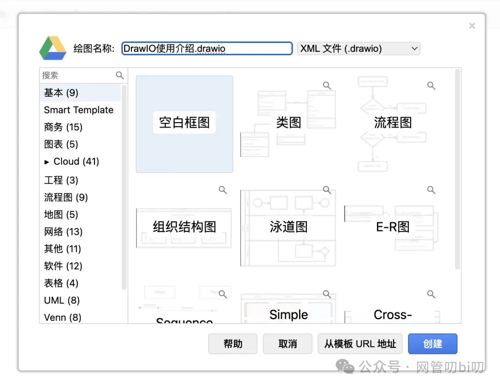

当你要保存绘图的时候，这个时候会提示你是否要把绘图直接保存到根目录里，为了便于以后更好地组织这些绘图文件，我们先新建一个文件夹存放本次课程中的所有绘图。

点击下面的“不，选择文件夹”按钮

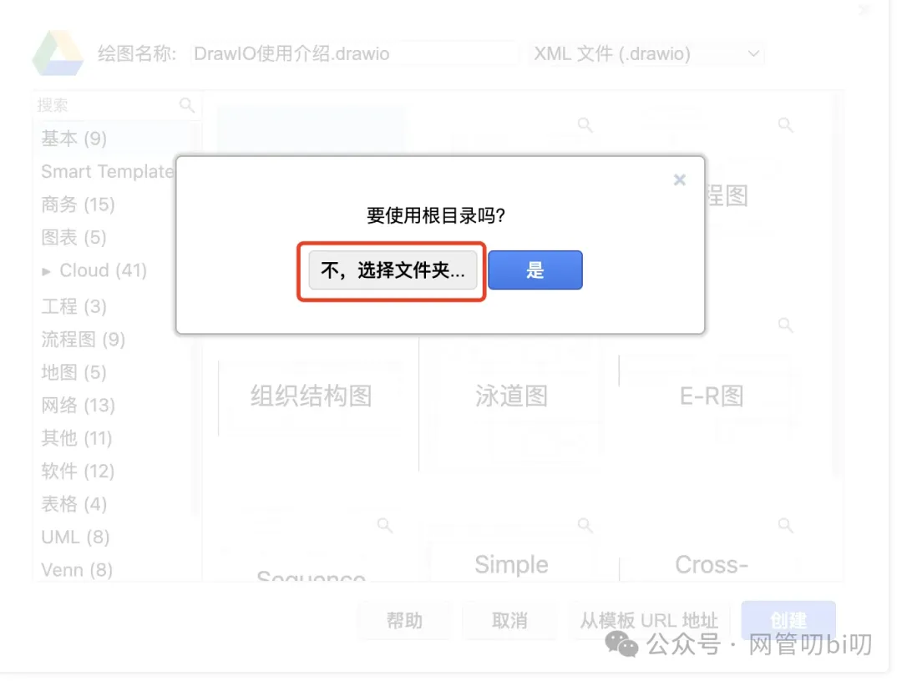

点了之后你会发现里面什么文件夹也有......，这里需要提前去Google Drive的网页端新建一个文件夹，draw.io并没有在Google Drive里创建文件夹的权限。

我们重新开个浏览器网页，用Google搜索Google Drive 或者 访问 https://drive.google.com/drive/my-drive 进入自己的Google Drive 网页端。进入网页端后，页面左上方有个醒目的新建按钮，点击新建-->新建文件夹按钮，我们创建一个文件夹存储本课程的所有绘图。这个文件夹的名字可以根据自己的喜好创建不同名字的文件夹，我这里直接取了个名叫UML。

在网页端的Google Drive创建好文件夹后再度返回draw.io的网页端，选择在我们刚才新建的文件夹里创建新绘图。

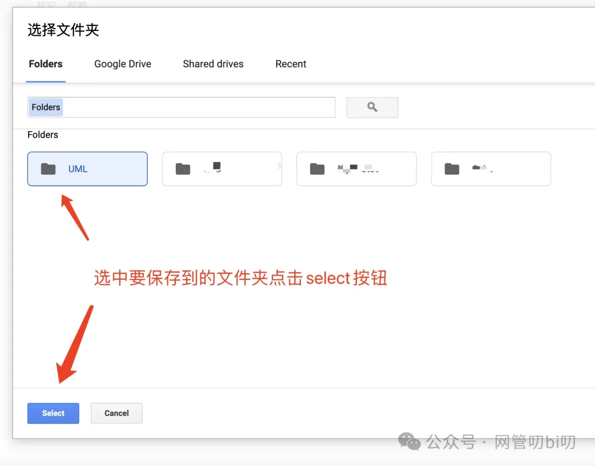

选择好保存新创建的绘图的文件夹后，我们就能进入正式进入绘图界面，下面主要讲一下绘图界面的主要工作区。

## 认识绘图工作区

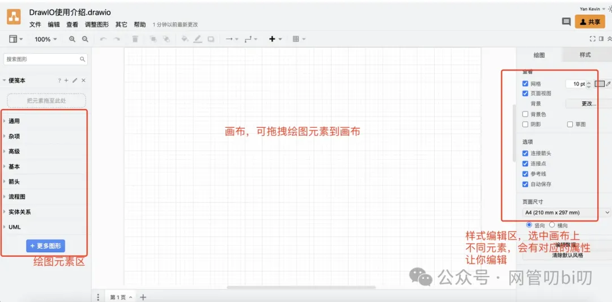

绘图界面可以分为左、中、右三个主要的工作区，我们在绘图的时候能用到的大部分功能都集中在这三个工作区中，这三个功能区按照功能大类可以划分为：

- 左区--绘图元素区，draw.io内置提供的所有绘图元素都分装在不同菜单类下，点击或者拖拽就可以把想要的绘图元素加到画布上去。
    
- 中区--画布区，顾名思义，画布区是呈现我们绘图的区域。
    
- 右区--元素样式编辑器，虽然在画布上通过鼠标拖拽可以调整绘图元素的大小和各种样式，但用多了会发现只拖拽的话，很难把绘图元素和元素之间的连线画的齐整以及达到自己想要的效果。所以像箭头种类、大小，线的走位都可以在样式编辑去进行细致的调整，选中画布上的元素，样式编辑去就会展示不同的样式属性。
    

给大家举个例子，比如画类图时，最重要的就是类跟类间的关系表示正确，即元素间的连线和箭头类型不能搞混，这个时候就需要我们在样式编辑区，像下图指示的那样去进行细微调整。

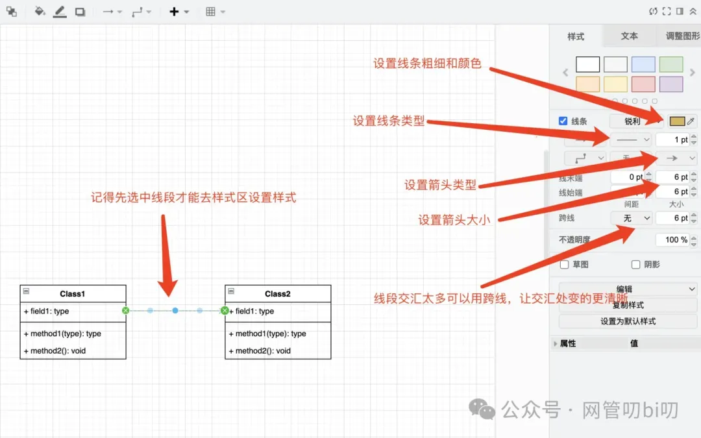

具体的一些技巧和注意事项，我们到后面具体的画图实践章节中再详细讲解。

## 两个提高画图效率的技巧

好了，认识完draw.io的主要工作区后，我来说一下为什么我推荐只使用空白画布，尽量不使用draw.io自带的模版呢?第一个原因就是找到完全适合你的画图需求的模版的难度较大，一般自带的模版都比较复杂，修改起来也不容易。

第二个原因就是Draw IO支持粘贴整个绘图或者绘图的一部分，所以随着我们使用draw.io画图越画越多，未来自己攒的图多了，遇到要画的图跟自己以前画过的图形比较相似的时候，可以直接粘过来改进行修改。对于自己画过的图每个人都能评定它能不能拿过来快速修改复用。

随着我们自己画图越多就相当于给自己积攒的素材库就越多，那么就能大大提升画图速度。

比如下面这个用部署图的Node和构件图组合绘制而成的服务器节点（下图选中的元素），就完全可以在我们需要画其他系统架构图的时候直接拿来用，修改一下tag信息就能表示其他服务器节点。

复制绘图元素的操作也很简单，打开现有绘图用鼠标框中要复制的绘图元素，注意善用Comand键（Windows操作系统是ctrl键）进行小元素的选择和反选，这样就能快速选择要复制的绘图元素。

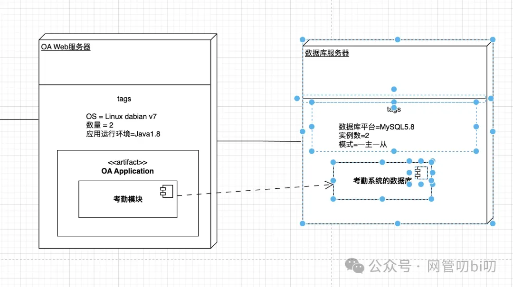

到了新绘图的页面，直接Command + v 就能把绘图粘贴过来，比如我们把上面选择的这个服务器节点图粘贴到刚才新建的绘图里。

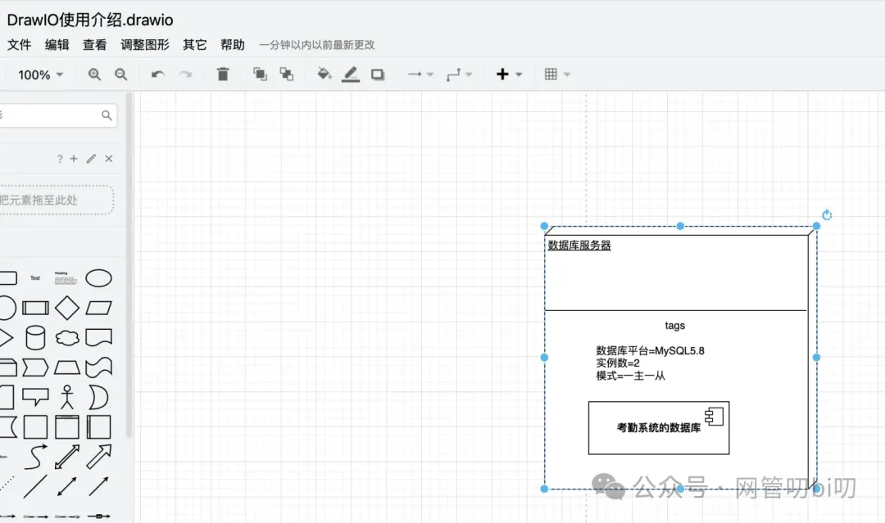

除了这种直接的操作，再给大家介绍一个更方便的操作，像上面这个服务器节点图其实是我自己用部署图的Node、直线、构件图和tag文本组合出来的。对于这种复杂、难画但是经常会用到的图形，我们还可以把它们保存到draw.io的便笺本，下次用到了直接拖拽到画布上再稍微修改一下就能用。

把图形加入便笺本的操作也很简单，首先选择我们要加入的图形--即刚才粘贴过来的服务器节点图，然后点击左工作区--便笺本菜单下的➕号，把图形加入便笺本。

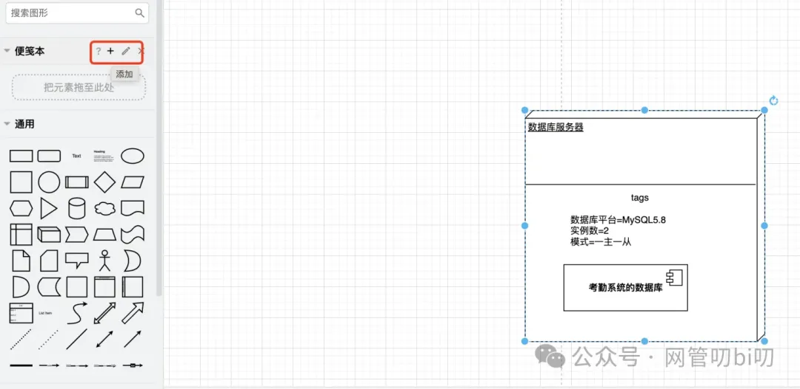

加入之后我们还可以点击➕右侧的铅笔那个图标对已保存的图形进行命名和删除。

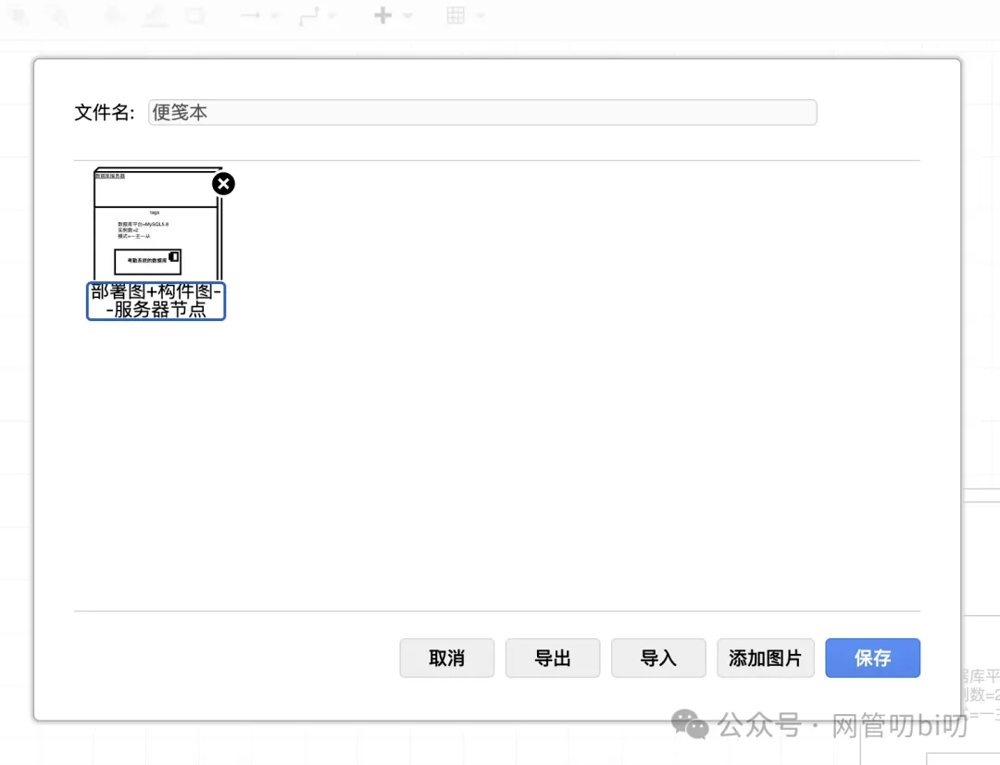

这样一来，以后再需要图画系统架构的时候，服务器节点这个绘图元素就可以直接从便笺本里直接拖拽到画布里了，再按照自己的绘图需求进行少许编辑就能用，这样一来还能再节省一部分找素材的时间。

## 总结

本节带领大家对绘图工具draw.io做了一个详细的上手使用指南，draw.io是一个完全免费的擅长绘制技术图的绘图软件，既有在线版本也有客户端供大家选择。网络速度等条件允许的话推荐大家使用在线版，即使是使用离线客户端，也记得对生成的绘图文件做定期保存，保存到GitHub这样的远程仓库上。

本节主要的内容是带领大家认识draw.io的各种功能，以及使用它绘图时的几个提升效率的小技巧，为咱们后面实践画图章节打好基础，对于本节例子中使用的部署图、构件图这些大家不用焦虑，后面都会有专门的章节去讲相关的知识，也会教大家从零开始画架构图。