从本节开始，我们正式开始课程第一部分UML的学习。我们要学到的第一个图形是类图，类图可能是我们在各种文档里见到过的最多的一种UML图，许多人一提UML首先想到的也是类图。

在各种系统的技术文档里，描述系统或者模块的核心类和业务概念时都会用到类图，比如下面这个呈现了电商系统订单模块的关键业务概念的类图。

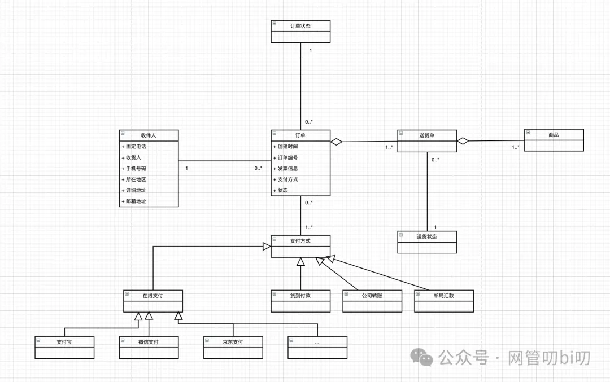

通过这个类图我们就能清晰地看到系统中都有哪些关键类，以及他们相互之间是怎么整合在一起的。 除了这种相对宏观的类图，再有就是相对微观的描述某个功能的实现的类图，比如下面这个关于支付策略功能是怎么设计实现的类图。

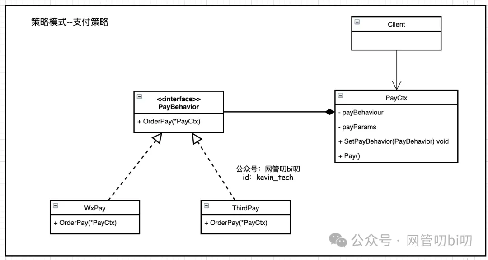

像设计模式的资料里，描述模式中各个类的功能和相互之间的关系时都会用到类图。

类图是最常用的一种UML图，也是学习其他UML的基础。同时还是锻炼自己文字表达能力、抽象提炼能力的一个非常好的方法。你想当你在接触到一个需求或者系统后，只有把里面的业务抽象提成成一个个类，才能进一步绘制出类之间的关系（结构），然后才是分析流程的交互，这在UML里分别叫做结构建模和行为建模。

说到了用UML类图，我也说说我当初在写毕业论文或者技术文档时的困惑：

- 怎么从需求提炼出类？
    
- 类图必须把类的属性和方法都画出来吗？
    
- 各种继承、实现、依赖、组合关系用类图怎么表达，他们的区别是什么？
    
- 各种类关系怎么用代码实现？
    

我相信大家也有同样的困惑，那么在这篇文章中我会带大家循序渐进的掌握前三点，先让大家能动手实践起来，能做到把需求分析提炼成类图，到下一节我们再结合着代码阐明这些类关系在面向对象编程里对应着什么样的代码结构。

**网管叨bi叨**

分享软件开发和系统架构设计基础、Go 语言和Kubernetes。

293篇原创内容

公众号

## 类图有什么用

项目初期我们往往对业务一无所知，这时最急迫需要解决的问题就是理清楚这些业务的概念以及它们的关系。 每个软件系统都会涉及到很多角色（人）、业务概念、物品等，这些东西之间可能会有很多关系，发生很多事情。类图能帮助我们识别出这些角色、业务概念、物品和事情等，并理清楚它们的关系。这个过程叫做业务的结构建模。

## 什么是类

**将某类东西归纳在一起，可以称为一个类**。 比如假设我们的课程--程序员的全能画图课--是一本书，这本书的读者，可以按照男人、女人来分类，也可以按照读者是学生还是在职人员来分类。 不过将读者分为男人和女人看起来没有什么效果，男人和女人在看书的时候有什么差异吗？ **类有很多种提炼角度，我们需要根据系统的目标、业务场景等，选取合适的角度对事物进行归纳**。

## 如何识别出类

在需求分析的过程中用类图做业务结构建模的大致步骤如下：

1. 识别出类。
    
2. 识别出类的主要属性。
    
3. 描绘出类之间的关系。
    
4. 对各类进行分析、抽象和整理
    

看一个例子： 假设要做一个在线课堂的系统，我们尝试用类图识别出在线教室里有哪些人以及这些人的关键属性。 提到在线课堂，首先我们能想到肯定有两类角色，一类是学生还有一类是老师，所以我们先画出这两个识别出的类。

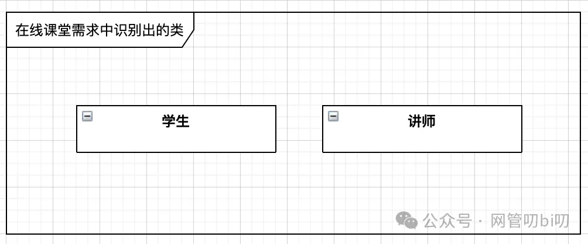

接下来我们再来想他们应该具备什么属性。

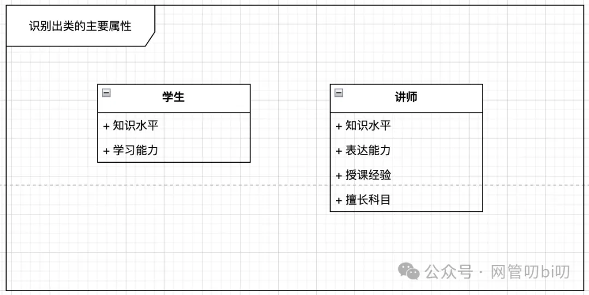

这个步骤的要点是：需要做一个在线课堂，所以在识别类和他们的属性的时候务必从业务角度出发。 如果你识别出来的类是男人和女人，没什么意义。同样的，如果识别出来的类的属性是身高、体重，这些属性无论是属于学生还是老师，对于在线课堂系统来说也没什么价值。 所以思考识别出来的类的属性也能帮我们判断这个类是否贴合实际，是否贴合业务场景。

**类的识别，要和需求调研中了解到的所有业务对象有关，每个类要画出能表达它核心业务特点的关键属性，一般无特别意义的属性，不必标记进去。**

这里也回答了我们上面提到的类图使用中的第二点困惑：用类图做需求分析或者是后面做程序设计时，没有必要把所有的类属性和方法都列到这里，只列出能表达类的业务特点的关键属性即可。

在继续本节的内容前再提醒一下苹果手机的用户，因为苹果税的存在本专栏在微信直接订阅，价格会高于安卓用户，所以专栏在小报童同步更新，苹果手机用户可以通过扫描二维码在小报童订阅阅读，规避额外开销。

## UML 怎么表示类图

接下来我们介绍使用UML类图时需要掌握的基本语法。

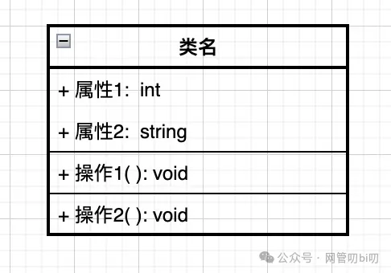

- 在类图中一个类用一个矩形表示， 上方是类名、中间是属性、下方是操作。**在需求分析阶段，表示一个类时，可以只显示一个类名，或者是类名和主要的属性。**
    
- 属性前面的 “+” 表示这个属性是public 类型的，需求分析的时候不需要管属性是 public 还是 private 的，全都画成 public 的，冒号后面的 int 表示属性的类型，在需求分析阶不标注属性的类型也没问题。
    
- 操作就是类里的方法method，"+" 表示这个操作是 public 类型的，冒号后面的void表示操作无返回值，如果有返回值可以在这里标记出返回值的类型，当然这个也不是强制的。**其实用类图进行需求分析和业务建模时，一般用不到操作，不需要标注出来**，在开发阶段用类图标识功能时，可以把类的主要方法在类图中标记出来。
    

一个类图通常包含多个类，有多个类时，我们还需要用类图表示出他们的关系，这块也是UML类图中比较容易让人觉得看不懂、难记的地方，下面我们重点梳理一下类的关系在UML类图中怎么表示。

## 类之间的关系

类的关系是类图中很重要的一部分，我们从易到难展开说说，首先是最简单的直线关系。

### 直线关系

A、B 两个类他们之间有关系，这个关系有很多种：比如有聚合、组合、依赖、继承等关系、但是在需求分析初期又不确定他们是什么关系，就可以用直线表示类之间的关系。

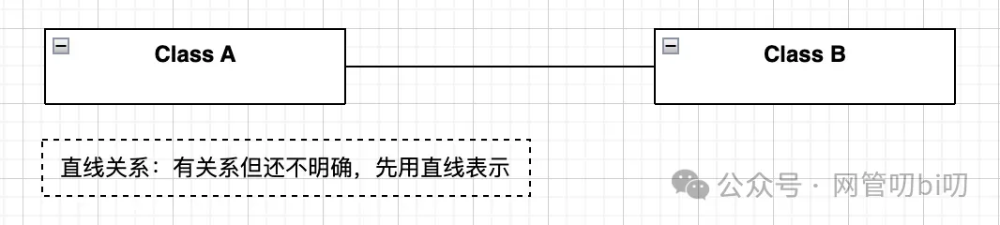

这个直线关系在 UML 术语中的标准说法是“关联”。做系统分析时，如果觉得两个业务概念之间有关系，但暂时不确定具体是怎样的关系，就先用一条直线把两者连起来再说，随着你对业务的理解，这个直线会进一步具体化。

**说明：类图中有时候因为类太多，为了排版方便，可以把“直线”画成“折线”。**

### 数量关系

画出类的“直线”关系后我们先不着急具体化他们到底是什么关系，先从数量上对关系进行具体化，分析他们之间是一对一还是一对多的关系，这也有助于未来软件开发阶段的数据库表设计：

- 下面表示一个 C 对应 一个 D类
    

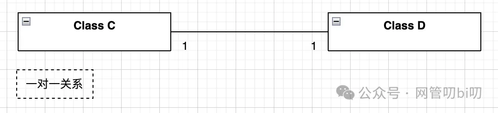

- "*" 星号则用来表示0到多个，下面表示一个E类对应多个 F 类
    

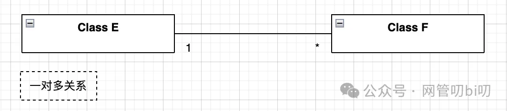

- "x..y" 表示 x 到 y 个， 比如 0..3 表示0到3个
    

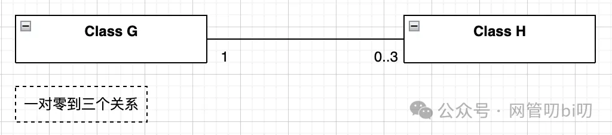

数量关系就说这么多，前期如果不确定或者数量关系显而易见，数量关系可以不在类图上表示出来。

### 关联/引用关系

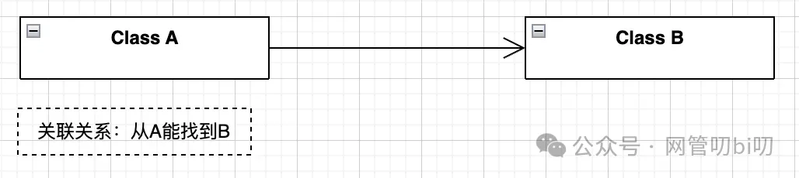

箭头表示关联关系：A类有一个成员变量引用了B，即由A能找到B，就画成这种关联关系。写代码时经常把这种情况叫做A引用了B，所以关联也可以叫做引用关系，这是从写代码的角度来解释箭头的意义。 需求分析阶段，如果发现由业务概念 A 可以找到 B， 就可以使用带箭头的线段表示。

### 包含关系

包含关系有两种，一种叫聚合，一种叫组合。在UML类图里这两种关系分别用空心菱形和实心菱形表示。

**空心菱形表示聚合，是弱包含，实心菱形表示组合，是强包含。** 这两种关系在使用时容易搞混，他们的区别是：个体是否可以脱离组织单独存在？如果从代码角度看就是他们是否有自己的生命周期。

针对我们上面这个例子个人和社区用的是聚合关系即弱包含：社区没了，不影响个人的继续存在。而心脏器官和个人的关系则用了组合关系即强包含：人没了，心脏也不能单独存活。 需求分析初期阶段，包含关系一般开始都画成弱包含，后面发现某些关系可以表示成强包含时再画成实心菱形。

**这两种类关系转换成代码时分别对应什么结构我们放到下一篇讲解类图关系的代码结构时再单独来说**。

### 继承、依赖和实现关系

#### 依赖

依赖关系其实是相对而言的，A依赖B，不一定是没了B，A就不能活了。在业务逻辑中，表示某个事情A需要B协助才能完成。举一个现实中的例子酒鬼要喝酒，但是喝酒要有酒才行，所以就可以梳理出来酒鬼依赖酒。用类图这么表示：

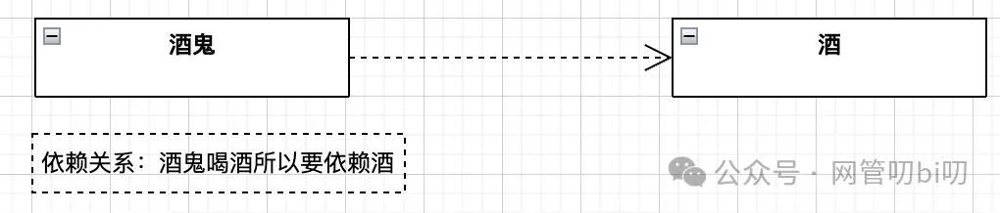

#### 继承

继承在UML术语里叫做泛化（Generalization）比如公司里经理和职员其实都是员工，所以画经理和员工的关系时要画成经理继承自员工，它继承了员工的属性，也有自己单独的属性。

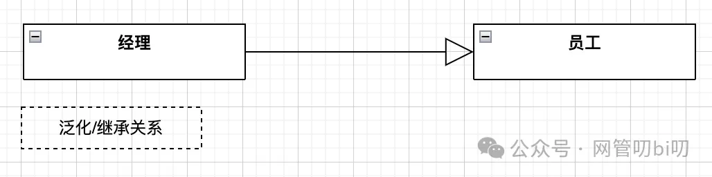

这个关系用空心的三角形箭头来表示，UML里泛化这个翻译不太好理解，Generalization 的词根是General，General 是通用的、一般的意思，所以顺着上面图里箭头的方向我们可以读出从经理角色可以通用化提炼出员工这个角色。

#### 实现：（Implementation）

实现是普通类和抽象类或者接口之间的关系，这么说有点太代码化了。举个例子小轿车、大卡车都是机动车，机动车是一个虚的类别或者叫概念。那么小轿车实现了机动车接口，证明他实现了机动车这个概念。

实现关系在UML里用虚线加空心三角形箭头来表示，如果A实现了B则把箭头指向B。

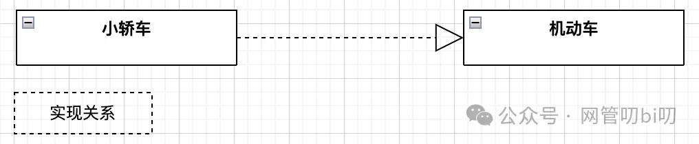

类图的语法掌握这么多就完全够我们用了，接下来我们来个用类图做业务分析的简单例子。

## 用类图做业务分析

下面以一个公司内部的考勤系统为例，演示了用类图对考勤系统做业务概念分析的成果。

这个考勤系统要管理的事情主要有公司员工的打卡、请假、外出这三件事情。 这三类事情全都涉及流程，流程用UML怎么表示，后面我们有专门的章节来学习，大家先用下面这个例子结合上面我们讲的类图知识，尝试读懂下面这个类图。

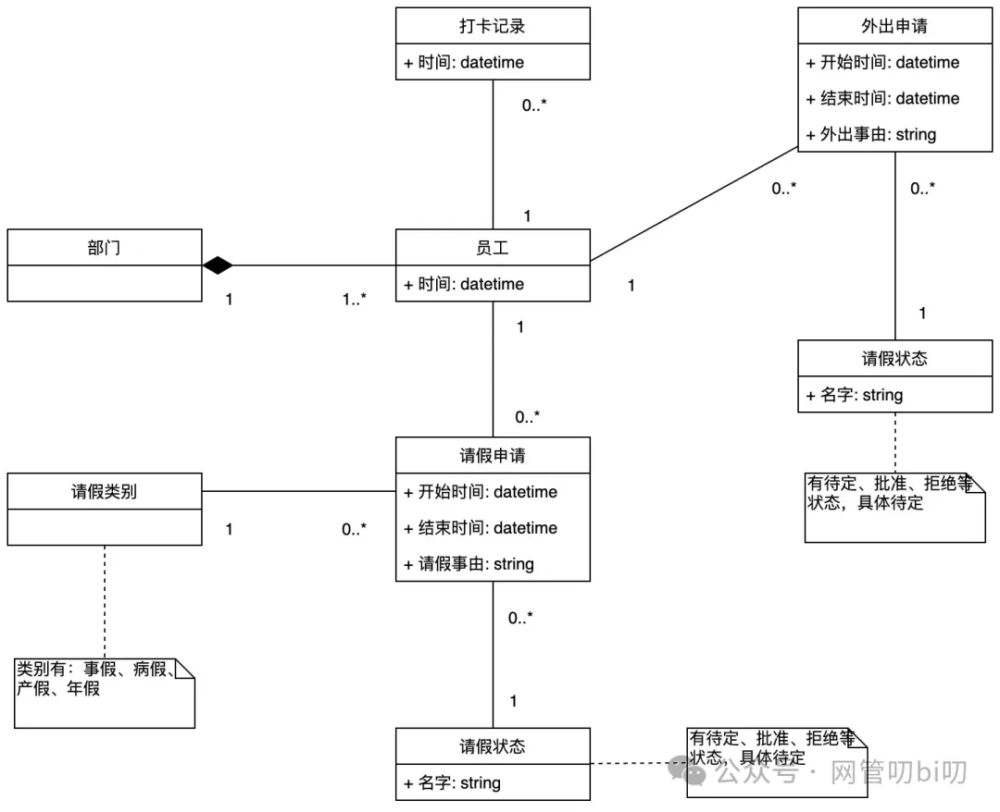

## 作业

这里给大家留一个作业，大家可以找一个自己在工作中参与的项目，尝试用类图给项目做一下业务结构分析。

无论是在纸上画、在draw.io上画都可以，一开始也不要太多考虑语法，等对业务分析的足够深了再去逐步细化。

## 总结

这节课我们学习了类图的基本知识，和怎么开始用类图做业务结构分析，接下来大家可以找一个自己在工作中参与的项目，尝试用类图给项目做一下业务结构分析。

关于类图一个繁琐点时，类的关系有点多，时间长了容易忘，这里我总结了一个类关系的速记汇总图，忘记的时候随手拿出来看一眼。

### 类关系速记汇总

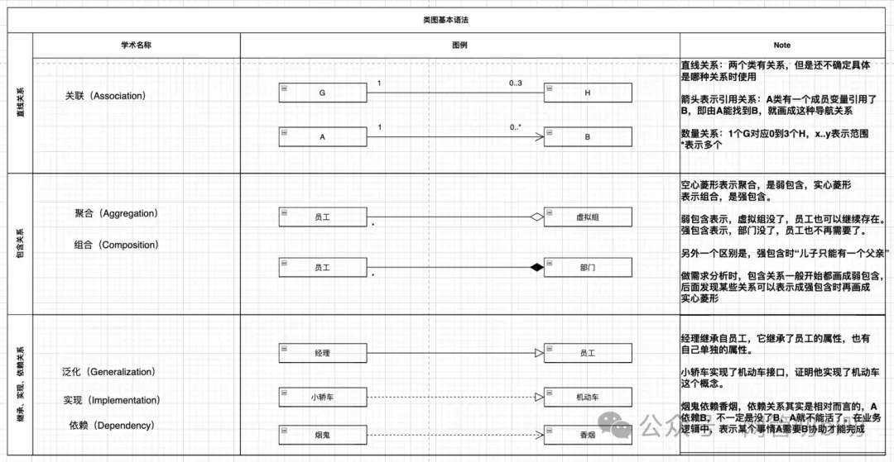

技术图严谨性很重要，所以类的关系这几种表示方法是我们在画类图时需要注意的细节，尽量还是要把图画对，这样也能体现我么自身的专业度。

下一节我们用代码解释各种类关系对应什么代码结构，相信有了代码的辅助理解，类的这几种关系你就能完全明白了。