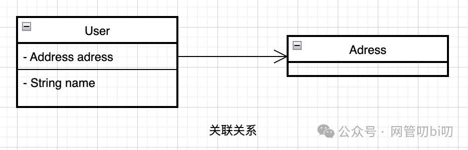
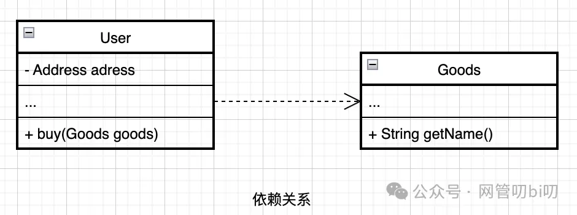
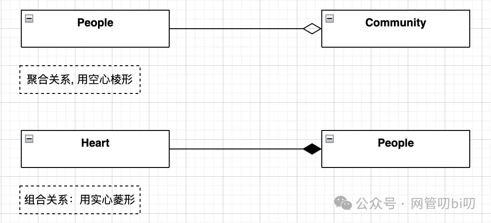
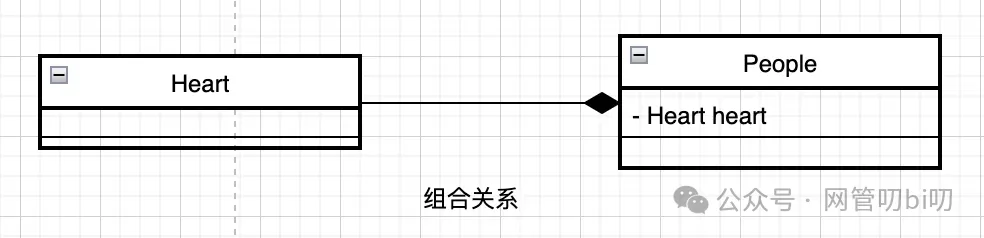
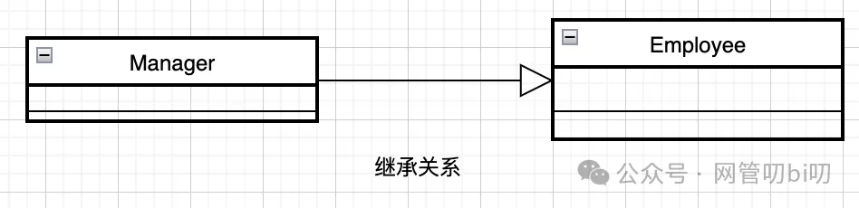

上一节我们学会了怎么把需求分解后提炼成类图，其中类图最难让人掌握的点就是类跟类的关系怎么画，我们上节把类之间的六种关系通过现实中的一些例子进行了说明，这六种关系是：

- 关联
    
- 继承
    
- 实现
    
- 聚合
    
- 组合
    
- 依赖
    

在做的各位读者应该大部分都是需要写代码的编程人士，那么心里一定会有一个疑问：类的这些关系看这些例子我是明白了，但在代码里对应什么结构呢？继承、实现还好说，编程语言里都有对应的关键字。可是依赖、聚合、组合这些关系的区别很微妙，编程语言里也没固定的关键字，我用代码该怎么实现这些关系？

这些疑问我一开始也有，而且个人的感受是，如果你在代码层面搞不清楚这些关系怎么实现，想画类图来表达业务结构时大概率也不能把它们的关系表达对。这对业务的结构分析其实影响不大，可是想继续让它能指导我们软件代码的设计，就必须把这些关系理清楚、画对了才行。

所以为了解决这些疑虑，让我们画的类图不仅能分析业务，也能指导未来的软件代码的设计，本节我们讲一下这些表示类的关系例子用代码怎么实现。例子都很简单，使用的是Java语言写的的伪代码，无论你是不是Java程序员都能看懂。

选用Java语言的有两个原因：首先大部分人都能看到Java的基础语法，其次是在我会的语言里Java的语法能用最少的代码表达清楚这些关系，不需要我过多地去用文字解释。好了，语言选择上我们不过多着墨，没特殊情况的话本节会是我们课程里唯一需要用代码演示说明的章节。

我们按照文章开头列举六种类关系的先后顺序，逐个做一下说明。

在继续本节的内容前再提醒一下苹果手机的用户，因为苹果税的存在本专栏在微信直接订阅，价格会高于安卓用户，所以专栏在小报童同步更新，苹果手机用户可以通过扫描二维码在小报童订阅阅读，规避额外开销。

### 关联/引用关系

A类有一个成员变量引用了B，则是关联关系。同时我们写代码时也经常把这种情况叫做A引用了B。 举个详细点的例子，每个User对象都有一个收货地址的成员变量，收货地址的详细信息则存储在Adress对象中这个例子用代码表示如下：

`Class User {       // Adress 作为成员变量       private Adress;   }      Class Adress {       private String city; // 城市       private String postNo;// 邮政编码       private String blockDetail;// 街区详情   }   `

### 依赖关系

A类依赖B类，表示某个事情A需要B协助才能完成。举一个例子来说用户要买商品，需要有商品才行，所以商品需要作为用户买这个行为的方法的参数。用类图这么表示对应的代码则是这样

`Class User {       ......       // Goods 作为成员方法buy的参数       public void buy(Goods goods) {           System.out.println("正在买的商品是: " + goods.getName());       }   }   `

这里Goods类的对象是作为User类的成员方法buy的参数传入的，后面我们还会看到聚合，聚合跟依赖非常相似，区别是，被聚合的类对象是作为聚合类的构造方法的参数传入的，这一点我们接下来细看。

> 说一下依赖和关联的耦合度的对比，为什么依赖比关联的耦合度低？ 依赖对应对象方法的局部变量，关联对应对象的成员变量。 成员变量和对象具有相同的生命周期，即类A一直和类B存在关联关系，而局部变量只有在方法被调用时，类A才会和类B存在依赖关系。 因此从关系存在的时间长短可以推断出依赖比关联耦合度低。

### 包含关系--聚合和组合

包含关系有两种，一种叫聚合，一种叫组合。在UML类图里这两种关系分别用空心菱形和实心菱形表示。**空心菱形表示聚合，是弱包含，实心菱形表示组合，是强包含。** 这两种关系在使用时容易搞混，他们的区别是个体是否可以脱离组织单独存在，如果从代码角度看就是他们是否有自己的生命周期。 针对我们上面这个例子，个人和社区用的是聚合关系即弱包含：社区没了，不影响个人的继续存在，更具体的类图如下。代码实现时People对象作为构造函数的参数传入

`Class Community {       // People作为成员变量       private People people;          public Community(People people) {           this.people = people;    }   }   `

而心脏器官和个人的关系则用了组合关系即强包含：人没了，心脏也不能单独存活，更具体的类图如下。代码实现时则是由People构造函数自己new出Heart对象

`Class People {       // Heart作为成员变量       private Heart heart;              public People() {           this.heart = new Heart();       }   }   `

通过上面的代码分析我们两者的不同点主要是构造函数上的不同。

聚合："整体"类包含"部分"类作为参数，Community类的构造函数要用到People类型的参数，这种情况下People类对象可以脱离Community类独立存在，即部分可以脱离整体独立存在。

组合："整体"类包含"部分"类的实例化，在People类实例化之前一定要在构造函数中先实例化Heart(心脏)类，此时Heart类的对象不可以脱离People类的对象独立存在，即部分不能独立存在。

### 继承关系

继承在UML术语里叫做泛化（Generalization）比如公司里经理和职员其实都是员工，所以画Manager类和 Employee类的关系时要画成经理继承自员工，它继承了员工的属性，也有自己单独的属性。这个关系用空心的三角形箭头来表示，UML里泛化这个翻译不太好理解，Generalization 的词根是General，General 是通用的、一般的意思，所以顺着上面图里箭头的方向我们可以读出从经理角色可以通用化出员工这个角色。 继承关系的代码非常简单，就是使用extedns关键字完成类的继承即可：

`class Manager extends Employee {          }   `

这里扩展一个思考题为什么做软件设计时都提倡少用继承关系多用组合、聚合，主要有这么几个因素

- 耦合度高，父类变化也会引起子类变化，也可能造成类体系无限膨胀。
    
- 继承的子类，实际上需要在编译期就确定下来，这满足不了需要在运行期内才能确定对象的情况。而组合却可以比继承灵活得多，可以在运行期才决定某个对象。
    

尤其上面的第二条说的，子类要想实例化其父类必先实例化，因此要实例的对象在编译时已经确定，不能够动态生成指定对象，这就导致不够灵活。

> 组合、聚合关系是结构型设计模式的核心，典型的设计模式有代理模式，适配器模式，装饰模式等

### 实现关系

实现是普通类和抽象类或者接口之间的关系，举个例子小轿车、大卡车都是机动车，机动车是一个虚的类别或者叫概念，需要真正的事物来实现这个概念才行。那么小轿车实现了机动车接口，证明他实现了机动车这个概念，具体的类图应该这么画。' fill='%23FFFFFF'%3E%3Crect x='249' y='126' width='1' height='1'%3E%3C/rect%3E%3C/g%3E%3C/g%3E%3C/svg%3E)对应的代码是:

`public interface Vehicle {       public void run();   }      Class Car implements Vehicle {       public Engine engine;       public void run() {           this.engine.start();       }   }   `

多说一句，为什么要引入接口和实现的概念，一方面是为了约束类族（比如 java.util.List 这样的类族）的行为，这也在一定程度上提供了面向对象多态方面的特点。还有一个小收益就是使用接口能缓解项目中的循环依赖问题。

### 总结

最后再说一下类的这六种关系的耦合度 类关系耦合度从高到低依次是：继承=实现>组合>聚合>关联>依赖。 

关于关联和聚合的区别，聚合是一种特殊的关联关系，它是较强的一种关联关系，强调的是整体与部分之间的关系，从语法上是没办法区分，只能从语义上区分。

这里再放一下我们上一节给大家整理的类关系的速记图，帮助大家后面在写代码时能快速回忆这几种类关系的特点。