我们已经花了两节课来讲UML的类图需要掌握的语法以及怎么用它们开始做业务需求的结构分析，同时还用代码结构详细解释了UML类图中的六大关系，相信大家已经能看懂技术文档中类图的各种细节、同时掌握了使用类图分析业务结构的方式和方法。

这节课再来教大家一下怎么使用 draw.io 画类图，进一步降低大家开始动手画图的起步难度。在类图的第一节--《[UML类图，这样用既简单又实用](http://mp.weixin.qq.com/s?__biz=MzUzNTY5MzU2MA==&mid=2247499889&idx=1&sn=e7be08961657379d8cd6e8cd92b334e0&chksm=fa8311e6cdf498f090d2ef1d62ff1c8ba68eba69338ab46aed874c6795399c763394632b7fda&scene=21#wechat_redirect)》中，我们上来使用了这样一个购物网站订单业务模块的类图。

今天就讲一下，怎么从零开始使用 draw.io 画出一个这样的类图，会把UML类图中的各种细节用 draw.io 软件怎么画出来给大家捋一捋。

公众号

因为本节都是实践动手方向上的内容，所以还会给大家讲一个类图在排版布局上的建议，本节案例的类图最后会画成下面这样。

我会在本节末尾把绘图源文件分享给大家，可以直接拿来拷贝到自己新建的 draw.io 画布上，无论你现在使用的是在线版和客户端版的 draw.io 都能直接复制过去。

大家如果觉得只看内容有点枯燥的话，可以先把课件提供的绘图源文件拷贝到自己的画布上，在看内容的同时尝试调一调本节说的各种参数。其实画图软件的使用主要是一个手熟的过程，本节学的一些知识后面再画其他类型的UML图的时候也会用到。

在继续本节的内容前再提醒一下苹果手机的用户，因为苹果税的存在本专栏在微信直接订阅，价格会高于安卓用户，所以**专栏在小报童同步更新，苹果手机用户可以通过扫描二维码在小报童订阅阅读，规避额外开销**。

## 画类图起步

画类图的起步阶段，需要先把需要的类图框一个个码到画布上去。在类图中用到的类图框在 draw.io 左侧工作区--绘图元素区中都能找到，直接选择自己需要的类图框然后拖拽到上画布上即可。

这里 draw.io 提供了下图红框框中的四种类图框-- 对象Object、接口 interface、带属性和方法的类图框以及只有属性的类图框。在实际使用时如果只做业务分析，我们只需要选择后面两种类图框中的任一种使用即可，做技术方案上的分析时有时候会用到表示interface的类图框。

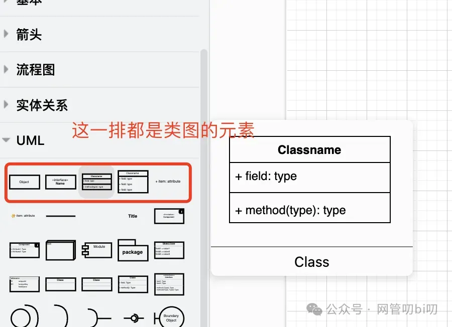

在做业务结构分析时，我一般用第三个，带属性和方法分割线的类框，如果不表达类的属性和方法就把相应的内容删掉，如果不够则把field单元拖到类框中进行属性或者方法位置的扩充，具体操作方法如下。

先把一个带属性方法分割线的类图框拖到画布上。

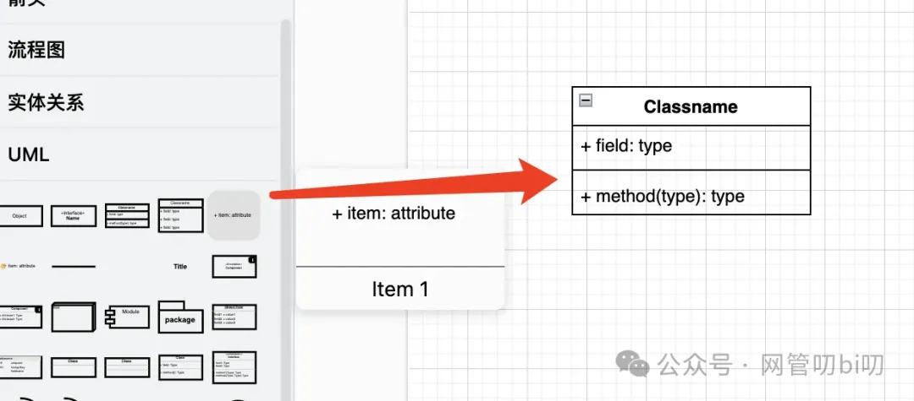

然后按照下面的图标注的方法来来扩充类，把 field 元素拖到类图框上，先不要松开鼠标，等类图框变成蓝紫色后就表示field 元素被成功加到类图框中了。

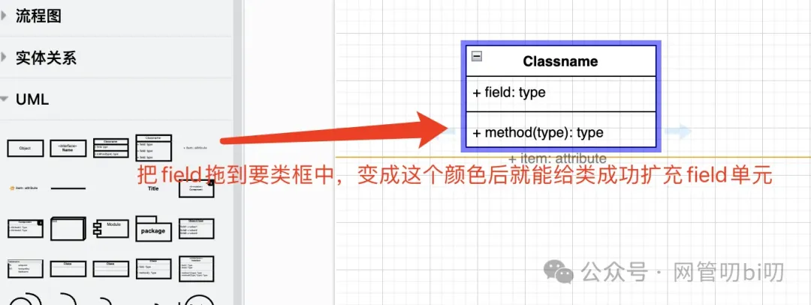

加进去后，再把它调整到想要排列的位置上去。

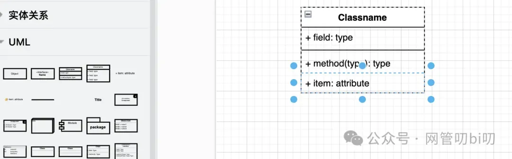

类的名字和字段方法名都可以在元素上编辑成自己想要的文字，这样单个类图框就码好了。

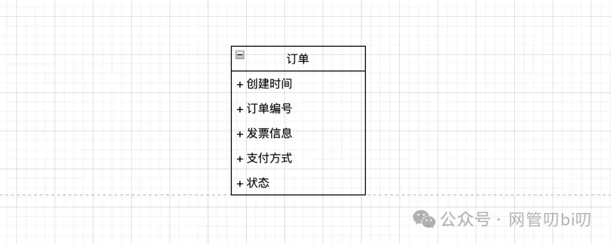

接下来我们要做的就是把识别出的类都先码上去，觉得会产生关系的类图框要尽量放到同一个区域，减少后面画类的关系时线条的过多交汇或者长度过长。

## 画清楚类的关系

类图框码好后，还有一项重要的工作是表示清楚类之间的关系。所以接下来我们讲一下画类图时的另外一个占用大工作量的任务--画清楚类的关系。因为UML类图里类的关系是靠线条配合各种箭头来表达的，所以要做的就是设置好有关系的类，它们之间的线条和箭头的类型。

把类图连起来非常简单，只要把光标悬浮在类图的边框上，光标附近能拉出线段的地方都会显示出下图中的箭头。

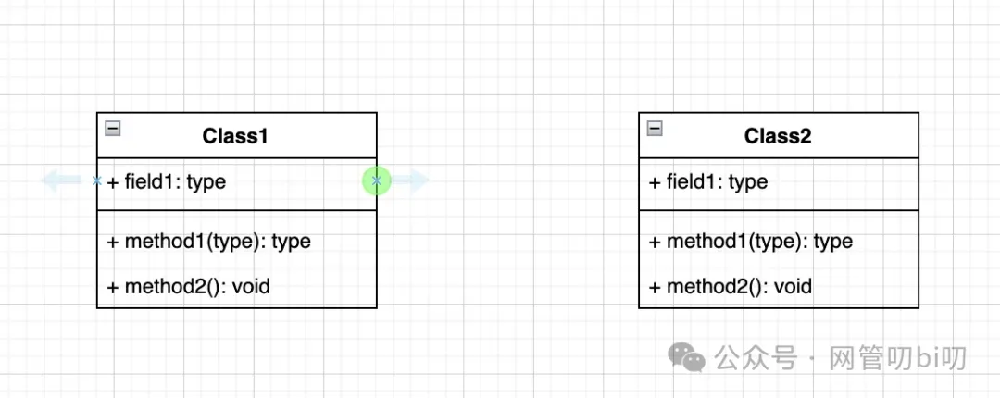

鼠标从箭头的绿点位置可以拉出线段就可以与关联的类进行相连。

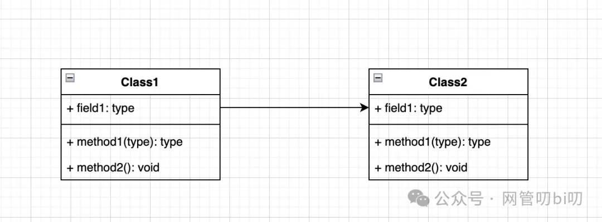

画类图的关系的时候主要是根据类间的关系去设置线段的这些样式，这里我总结下我们在这个环节中可能会在绘图软件中用到的样式调整：

- 线段的类型：实现还是虚线
    
- 线段箭头的类型：继承、依赖、聚合、组合、实现这些类间的关系需要设置成不同的箭头类型，有的是线条箭头，有的是三角箭头，而有的则是菱形箭头。
    
- 线段箭头的大小：根据自己绘图的布局去调整各种箭头的大小
    
- 线段的颜色和粗细。
    

这些样式都可以在选中类框间的线段后，在整个视图右侧的样式编辑区进行设置。我在下面的图示中做了详细注解

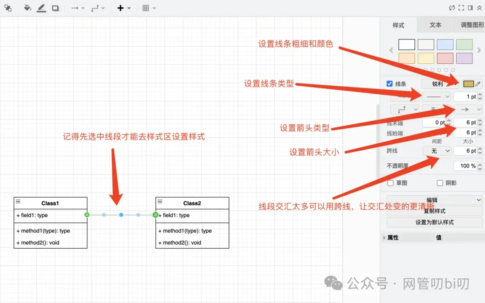

因为图示中做了详细的标注，这里我就不过多着墨啦，如果你看本节内容的同时也在跟着画，可以反复调试一下这里列举的这些样式，也可以直接复制我提供的绘图源文件到自己的画布上去调试。

## 排版布局技巧

上面就是绘制类图的必备技巧了，接下来介绍一些怎么让类图显得简洁不那么乱的技巧。 画类图的时候，一般的类图有个十个八个的类都算少的，类图中的类一旦多起来后就会显得特别乱，无论自己还是别人阅读起来都觉得很杂乱，这个时候注意下面几个细节会很大限度降低类图杂乱无序的程度，让整个图看起来很清晰。

- 布局：
    

- 核心模块的累放在类图中心部位，由核心类向外延展其他类
    
- 按模块组织类，类似DDD聚合根的思想，代表聚合根的类是模块的焦点，由聚合根再向外延展其他类（这个后面章节会再详细介绍）
    
- 可以给不同模块设置类图框不同的背景色，并做好备注，便于区分模块
    

- 线交汇
    

- 想要类图不乱，线的交汇一定要尽量少，其实如果按照上面组织好各模块的类图的布局后，能很大限度减少不必要的交汇，大部分的线段都是从中心往外扩散的，交汇的情况会很少。
    

下面是我画好了的一个购物订单业务的类图的示例

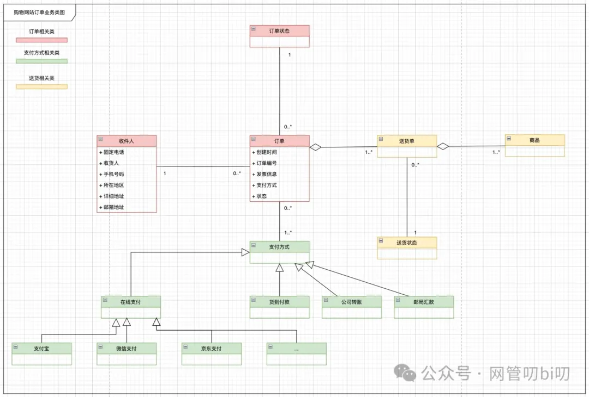

大家可以模仿着画起来，记住着三个要点布局、线交汇不要太多， 按模块上色。当然这个类图中的类不算太多，也没必要按模块上色，这里只是给大家做个演示。

大家先试着自己画一下， 我把上面这个类图在draw.io 上分享出来了，可以直接拿原图进行参考（支持拷贝到自己的画布上进行修改）。

- 在线链接：https://drive.google.com/file/d/1H74ngezWSgc2-tYumSnTZpiUxmNqP58Y/view?usp=sharing
    

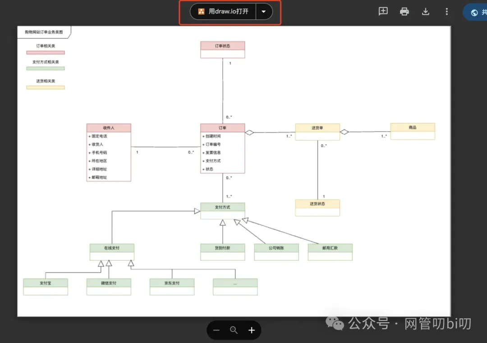

如果你使用的是客户端的 draw.io ，或者访问外网有困难，可以收藏一下下面这个Github仓库，后面会把课程中用到的绘图源文件都传到这个仓库里。

- https://github.com/kevinyan815/developer-omni-illustration-tutorial/
    

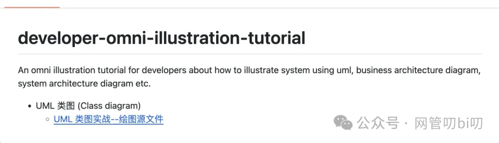

里面的源文件下载到你自己的电脑上，即可使用 draw.io 客户端打开。