本节带来大家怎么用"流程图"做业务的流程分析，其中最重要的是带大家学会流程中的分支、循环、并行用"流程图"该怎么表达，注意我这里的"流程图” 是加了引号的，因为我们的是UML里的活动图，它比普通的流程图在专业性和语法表达能力上更突出，甚至能用来指导我们后续的代码实现。

别走开，学完本节再遇到需要写文档画流程的时候你就能轻松应对。

前几节我们学的类图是进行结构建模的重要工具，而本章开始介绍的活动图是行为建模的重要工具之一，它并不是我们经常见的流程图，而是UML工具箱里专门为行为建模提供的重要工具之一。本章内容大纲如下

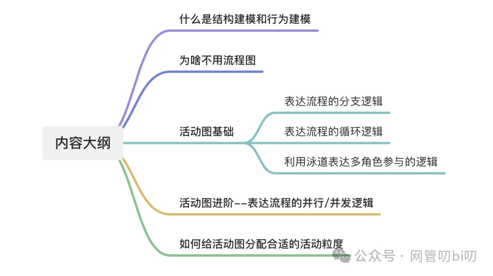

开始学习活动图之前，先了解一下结构建模和行为建模。有人会问什么是结构建模，什么是行为建模？这里用个简单的例子解释一下。

## 结构建模与行为建模

比如要做一个新的考试管理系统，该系统的建设目标很可能是这样的：

- 解决手工管理存在的容易出错、效率低、不利于统计等问题，为考试组织者、老师、学生提供便利的考试管理服务平台。
    

接下来要思考的问题是：

1. 在没有这个系统（或者是使用老系统）时考试是如何管理的？各个涉众：考试组织者、老师、学生是如何参与考试相关的工作的？
    
2. 应用了该系统后，考试应该如何管理？各个涉众：考试组织者、老师、学生如何在本系统中工作？
    

将上面的问题进一步分解，可以细分为两类问题：

- 第一类问题：事物内容及事物间的关系。解答这类问题就是结构建模的工作，比如：用类图表示考试以及其他类的关系就是做结构建模的工作；用部署图构件图表示系统的部署和架构设计也是结构建模的工作（后面章节会学怎么用UML表达系统架构）。 结构建模所表示的内容一般是静态的，在一段时间内是不会变化的。
    
- 第二类问题：流程相关的问题。流程有可能是某一个角色通过多个动作来完成某项工作，也可能是有多个角色参与，期间经历多个步骤，最终完成某项工作的过程。 考试管理系统中，老师出题、学生选课到参与考试的过程，老师批改试卷到统计分数的过程都可以说是流程。
    

其实从不同的角度来看，有不同的流程；流程也有大小之分，流程中还可能有子流程，诸如此类。**我们需要系统地分析好这些流程，而行为建模就能帮助我们解决这个问题 。 行为建模表达的是某段时间内事情是如何发展的，****发展到最后达到怎样的效果。**

简单地说，结构建模表达的是静态内容，行为建模表达的是动态内容。类图是进行结构建模最常用的UML图，而活动图是行为建模最常用的一种UML图。除了活动图，后面章节介绍的状态机图和顺序图也是很常用的行为建模 UML图，这三种图常被成为行为建模三剑客，他们以不同的视角来描述系统行为。

## 流程图

一提到流程分析大部分做案头工作的人都会想到流程图，很多人会把它和活动图搞混。流程图不包含在UML中，但两者有些相似。 如果没专门学过UML，会把活动图也当成是流程图。流程图算的上是行为分析的鼻祖，下面先看一个流程图的例子。

这里我画了一个我早起上课的流程图，描述了我上大学时，有课的早上决定自己是去上课还是逃课睡懒觉的心里斗争过程。

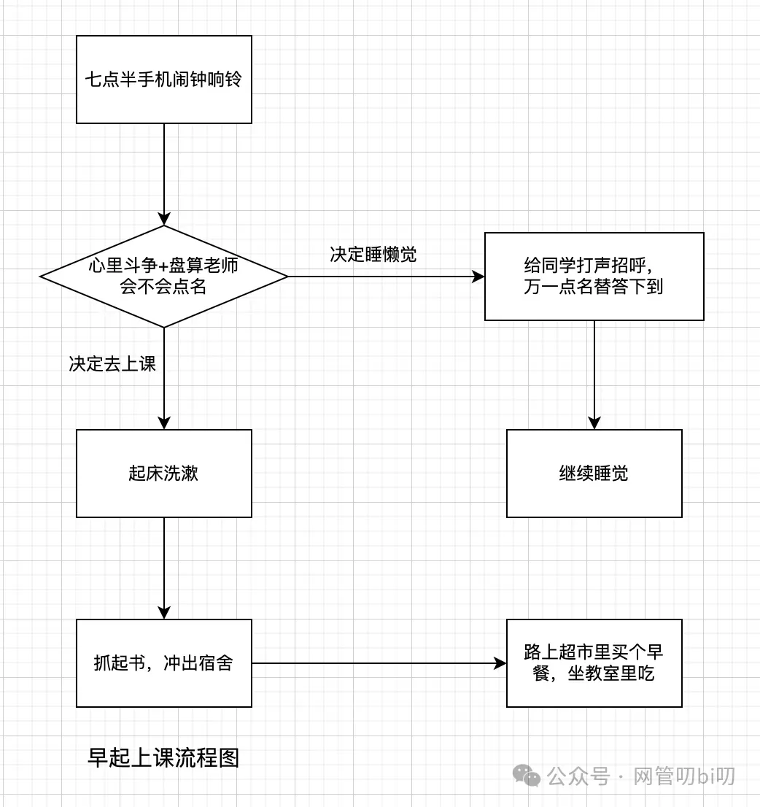

流程图很容易读懂，上面这个图不用解释大部分人也能看懂，每个矩形表示流程中的一个步骤，菱形则表示判定，从这里开始会有分支路线，如果决定去上课则走下面的起床洗漱去上课的流程，如果决定睡懒觉则走菱形右边的流程。

以上介绍的是流程图的最基本的语法，它还有其他语法，不过流程图并不属于 UML 图，在这里就不做过多介绍，我们马上要学习的活动图与流程图很类似，并且表述流程会更专业。

## 活动图的基本语法

下面通过一个费用报销申报及审批流程的例子来学习活动图的基本语法。 公司要求在职员工费用报销统一走报销流程，具体规则如下：

1. 员工将当季度内需要报销的每项费用和对应票据整理好，在OA报销系统中提交
    
2. 如果该费用属于项目开支（比如项目出差的差旅等费用），则由项目经理审批
    
3. 如说该费用不是项目开支（比如团建产生的费用），则由部门经理来审批
    

你可以先试着自己用流程图表达上述流程。 如果用活动图，该怎么表达这个工时审批流程呢？下面是用活动图对这个流程的描述。

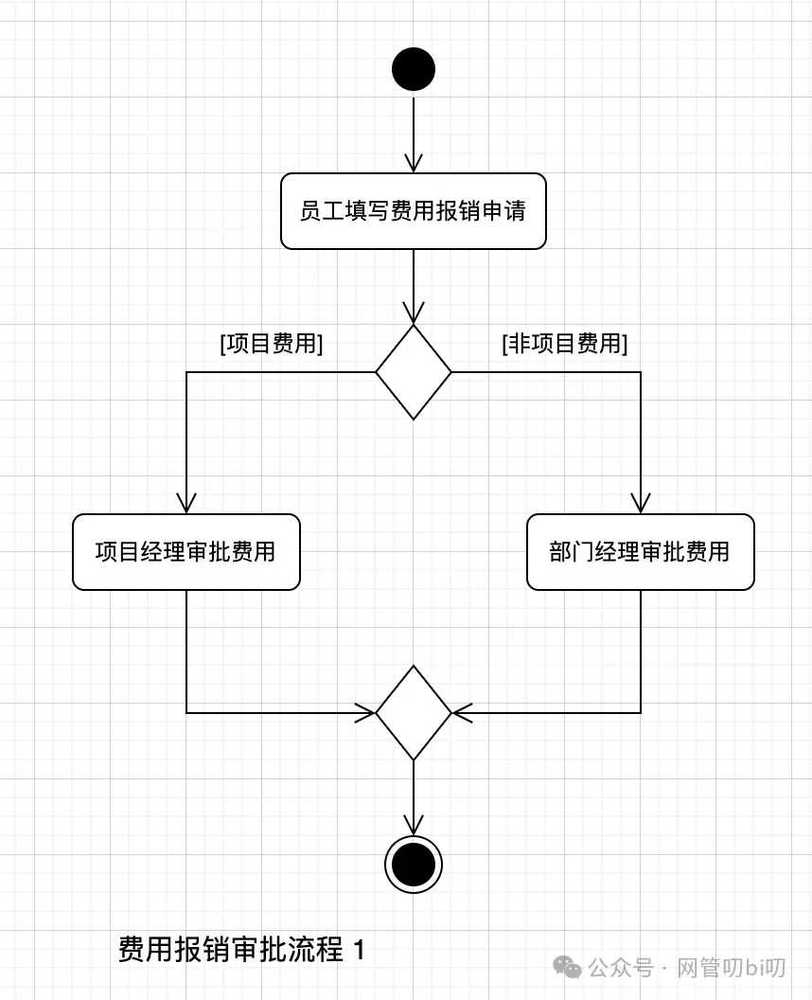

每个活动图都有一个开始状态（Initial State) 和一个或者多个结束状态 (结束状态) ，开始和结束分别用不同的圆形表示：

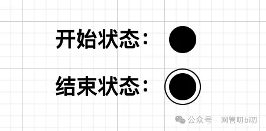

活动图里的每个圆角矩形，表示的是一个单独的活动（Activity）。

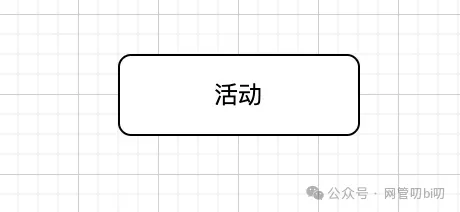

流程中从一个活动到另一个活动的过渡则使用下面这种箭头从前面的活动指向后面接续的活动。

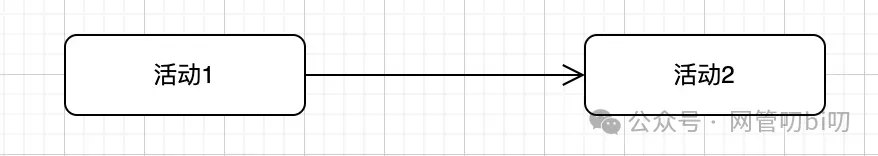

**“活动” 可理解为流程中的一个步骤，活动中的文字需要用somebody do something 这样的“主动宾”形式来表达**。

比如“员工填写报销申请”，“项目经理审批费用申请”， **不过主语并不是必须的，对于流程中涉及到多个人的活动时，主语才必须有。如果流程中的所有主语都是同一个人，就没有必要重复多次写这个主语。**

**后面复杂的流程我们会用泳道分割，每个泳道代表一个参与者一个主语，这种情况下也不用在活动中写主语**。

### 分支

上面的活动图，从菱形开始有两个或者两个以上的分支，这个菱形叫做判断（Decision），表示从这里开始将根据条件选择其中一条分支继续下一个活动。每一条分支上用中括号“括起来”的文字，表示条件，如上图的 [项目费用]，表示如果是项目费用的话，走这条分支。这个用中括号括起来的内容叫做守护（Guard）

一般来讲，前面有判断分支线路的话，后面应该相应的 “合并” 来合并线路，上图用来合并汇总分支线路的菱形叫做“合并”，不过有时候“判断”的某一分支线路可能会绕回前面的流程，这个时候就不必使用“合并”菱形来合并线路。

### 判断的三种表达方式

上面不同项目工时分支的菱形那里，如果觉得不够明显，还可以在菱形旁边加一个问句：“是否为项目工时”，这样这个分支判断会更明显些，让整个活动图表达的流程更清楚。

' fill='%23FFFFFF'%3E%3Crect x='249' y='126' width='1' height='1'%3E%3C/rect%3E%3C/g%3E%3C/g%3E%3C/svg%3E)

这个图的表达方法与流程图很类似，流程图里也是使用菱形表示分支判断，不过表达判断的文字是写在菱形里的。

很多刚接触UML的同学也会在活动图的菱形里写下判断文字，这是不对的，使用活动图时对于分支判断的表达一般有三种方式。

1. 在判断菱形旁边写下判断文字（如图1.2）
    
2. 不写判断内容，直接通过活动图分支里的守护和后续活动来表示这个判断
    
3. 在菱形前面单独增加一个活动框（如下图），来表名具体的判断动作，这时菱形旁边就不需要再写表明判断的文字了。
    

' fill='%23FFFFFF'%3E%3Crect x='249' y='126' width='1' height='1'%3E%3C/rect%3E%3C/g%3E%3C/g%3E%3C/svg%3E)

**实践时，如果需要强调在整个流程里判断的重要性就使用第三种表达方式，否则使用第一种，我一般都用第三种，这样逻辑会显得更清楚**。

### 多层分支

上这个图有点过于简单，不过你可能会问，如果工时被拒绝了怎么办？工时被拒绝，无非就需要提交的人修改工时再提交，这就用到了多层分支--对应代码中的if else 的嵌套， 多层分支用下面的方式表示。

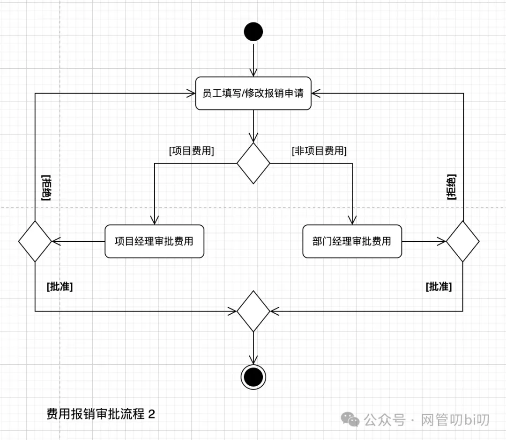

有的人画这种多层分支可能会有点招架不住，不是画不出来就是画的太乱。

活动图原则上是在能表达清楚的情况下尽量简洁，通过适当的注解、文字说明等来说明一些异常情况，多层分支这么画下去，很容易由于不好组织让整个图变乱，显得没有逻辑。

这个时候就应该想办法更好地组织流程里的活动，把一些太小的活动进行合并，让整个流程显得简洁，比如上面这个图中我们就把“员工填写工时”和“员工修改工时”这两个活动做了合并。

### 循环

业务流程里的分支判断我们知道了用分支表示，那么循环呢？观察上面审批流程的图，你会发现在经理拒绝费用报销后，流程会回到员工修改报销申请，然后继续按原来的流程走到经理审批，审批不过流程还会走回到员工修改申请哪里，知道审批通过，或者员工放弃修改。

所以**活动图表示循环是通过上面这样的活动闭环来表示的**，循环只有满足断开条件才会继续往下走，当然上面那个图我们没有画出员工放弃报销这个步骤，后面在实践演示环节给出的活动图示例中会有这方面的演示。

### 泳道分区

上面工时审批流程，活动的发起者/执行者一共有三类：员工、项目经理、部门经理。为了更好地表达动作的发起者，可以在活动图中使用泳道。在泳道中表明活动的发起者，将发起者发起的活动全部画到自己的泳道中，这样就可以很清楚地表示出整个流程中有多少个活动发起者（参与方）。比如我们把上面的员工报销活动图加上泳道，就会变成下面这张图：

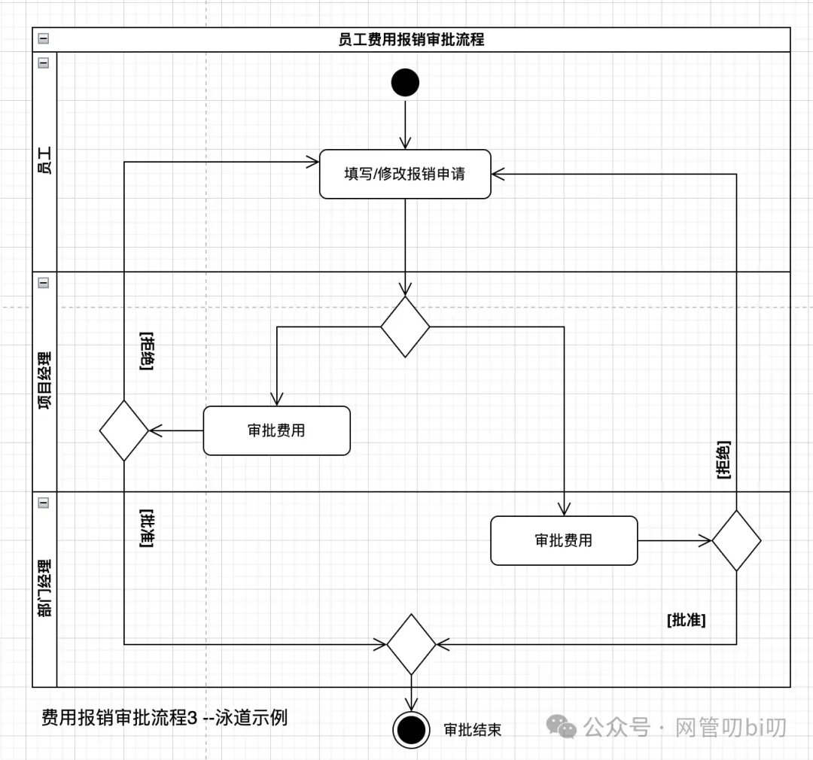

在泳道中表明活动的发起者，将发起者发起的活动全部画到自己的泳道中，这样就可以很清楚地表示出整个流程中有多少个活动发起者（参与方），他们分别负责了什么活动。

使用了泳道后，在该泳道上的活动，全部默认主语就是该泳道的所有者，每个活动只需要用“动宾”方式表达即可。

泳道可以画成横着排列的也可以画成竖着排列的，两种方式都可以，看自己怎么组织发起者和活动。开始和结束状态画在哪个泳道或者是画在泳道外面都可以，主要看整个图形怎么组织。

流程涉及到多个参与者时，用泳道可以很好地区分他们，清晰地表达出他们在流程协作中的所处的位置和关系。但是使用了泳道后也会有一些诸如活动线相互之间交叉需要跨线、箭头飞来飞去的问题，需要多画多实践才能组织好活动图。

## 并行活动

上面展示的活动图算是比较简单的，整个流程从开始到结束所有的活动都是串行的。一般稍微复杂点的流程都会有一个活动结束后并行开启多个活动的情况。

比如在我们的工作中，产品PM写好了需求文档，进行需求评审时会同时叫上业务、研发、测试、数据分析人员一起进行评审，而不是先业务评完了，再研发评、再测试评。

那么「产品通知需求评审」这个活动后面同时引发了业务评审文档、研发评审文档、测试评审文档这三个活动，在画这个流程的活动图的时候要能表达出这几个活动的并行关系，这时就需要一个新的活动图语法来表示并行。

先看一下这个需求评审流程的活动图

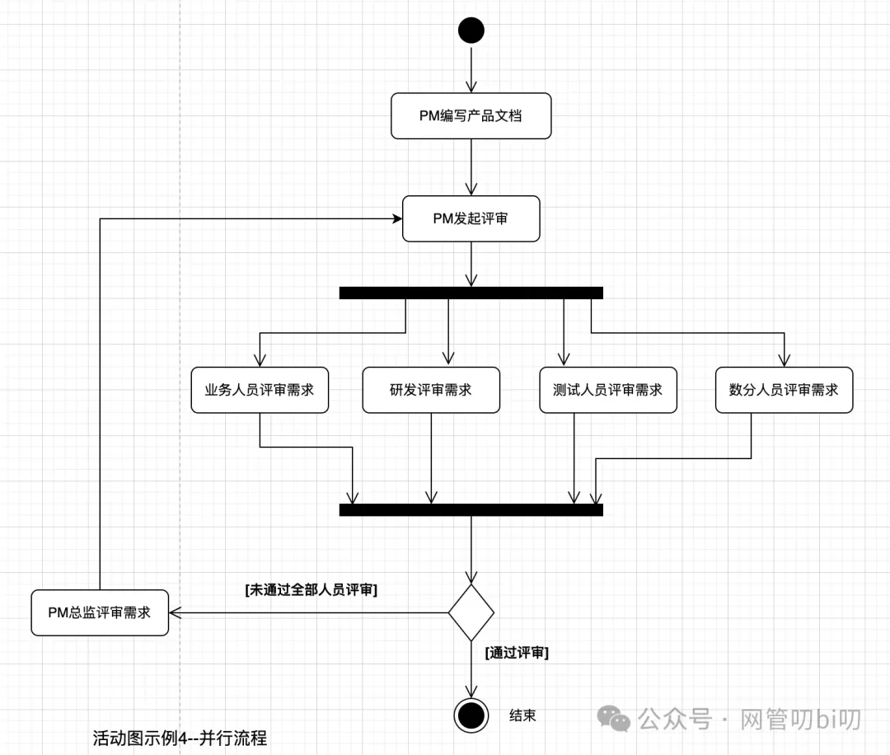

图中的 第一个 “实心粗横线” 有一个箭头汇入，多个箭头指出（叫做分叉 -- fork），就表示从这里开始，将会并行地进行多个活动。 也就是文档评审这个流程中的多个角色会 同时 /分头 评审这个文档。

图中的 第二个 “实心粗横线” 有多个箭头汇入，单个箭头指出 （叫做汇合 -- join） 表示并行的多个活动必须全部完成，才能继续下一个活动--这个汇合可以用 Go 语言的 WaitGroup 或者 Java语言里的 CountdownLatch 辅助理解一下 -- 在这个例子里也就是所有角色都必须完成评审后才能进入下一步。

**学好活动图里并发的画法对流程分析非常有帮助，尤其是在把活动图用到技术实现流程分析的时候也非常有用，比如遇到程序要在不同的几个服务拿到数据进行验证后才能继续下一步，这时就能用到这里学到的并行语法绘制出既专业又易懂的活动图，这一点也是流程图做不到的**。

活动图里的 分叉 和 汇合 是成对出现的， 排列上则没有过多要求， 根据整个活动图的布局，可以横着画也可以竖着画“分叉”和“汇合”。

## 活动的粒度

在活动图中，活动用圆角矩形绘制，表示流程中的一个步骤， 活动可大可小还能拆分出子活动，最后拆分出动作，动作是不可再拆分的。

流程中的每个步骤其实可大可小，太细了表达不清楚流程的主体意思，所以用活动图做需求分析的时候基本上完全用不到动作这么细的粒度来作为活动。但粒度也不能太大，让其他人没法了解流程中关键的步骤。

比如下面这个表示“数列排序”流程的活动图

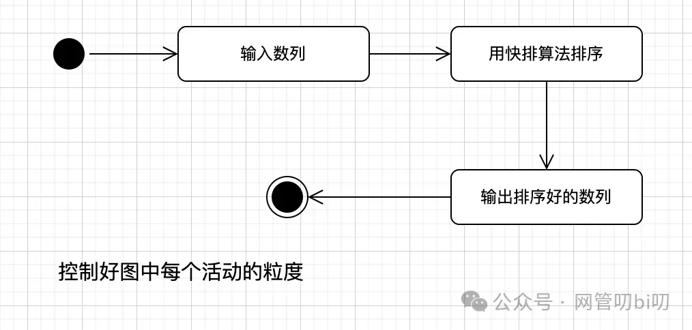

就算不懂快速排序算法的人，也能看出来这个步骤画的太粗了：输入 --> 运算 --> 输出 整体大流程没错，只不过运算这个步骤画的粒度太大了，没法了解排序这个过程中的关键步骤。

如何控制活动的粒度，没有标准答案，下面是一些实践建议：

1. 想清楚活动图像表达什么内容，表达的重点是什么。
    
2. 可以先用比较大粒度的活动，流程大体情况清楚后再逐步细化活动的粒度
    
3. 需要重点说明的部分，活动的粒度要足够细到能说明问题，比如上面那个例子运算部分列出使用的排序算法的关键步骤
    
4. 用于技术实现流程分析时，同样要突出代码设计中的关键步骤，不需要每个if 判断、每个运算都画出来。什么是关键步骤呢？类似实现中调用哪些服务获取了什么数据，在哪个流程步骤里改变了程序关键实体的状态要突出，太小细节的代码实现不必在活动图的流程里体现。
    

## 练习：考勤审批流程的活动图

下面是一个考勤系统外出申请流程的活动图，大家先试着通过活动图把外出申请的流程详细叙述出来。同时也尝试使用本节学到的活动图的知识在下次技术评审时尝试用活动图分析需求涉及的流程。

## 总结

画活动图的过程，也是你仔细思考分析整个业务流程的过程，画的过程中时不时停下来思考一下这个图有什么问题，其实用活动图的一大目的是发现问题，通过发现问题能牵扯出一大堆隐藏的业务逻辑，等我们思考清楚这些问题怎么解决后，我们对需求就有了更清晰的了解，同时整个活动图画出来一定是通顺的，不会让人明显看出来流程上有毛病。

### 活动图语法总结

说了这么多活动图的画法，这里再给大家准备一张活动图语法的速记图，降低大家开始使用活动图分析流程的成本，今天介绍的活动图的这些语法不用刻意去记，需要的时候随时翻出这张图。

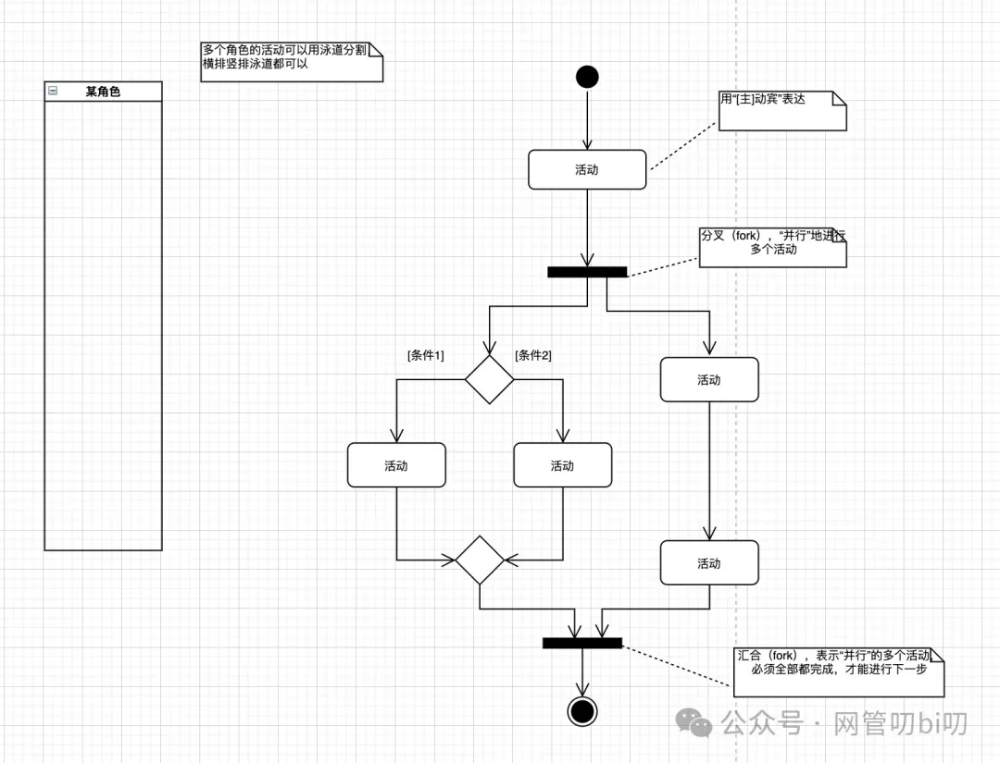