这节课我们讲的顺序图是大家看各个公共技术平台的技术文档、SDK使用指南时见过最多的UML图，这里给大家找了一个微信支付SDK文档里的图，大家一看就能知道我说的是什么。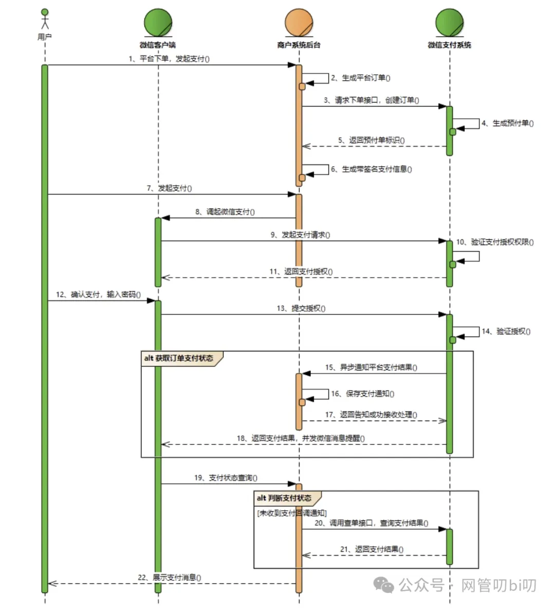上面这个图表达的是微信支付下单这个操作中：用户、微信客户端、商户后台服务、微信支付服务是怎么协作完成下单支付这个步骤的。

怎么样，大家是不是在接入腾讯、阿里、字节这些大厂公共开发平台提供的能力时，在他们的SDK技术文档里都见过这种图，我这节课的内容就是教大家怎么读懂顺序图以及怎么在实际应用中画出顺序图。

在开始教大家这些东西前，先给大家来个小插曲。**不少人把这种图叫做时序图，其实他的正确说法应该叫顺序图-- Sequence Diagram，UML里还真有一个种图叫时序图--Timing Diagram，不过由于UML正牌的时序图几乎没人用，所以大家不用太纠结这个名字，咱们在工作中讨论技术方案时有人说画时序图大概率想说的就是咱们今天要学的顺序图**。

## 认识顺序图

比如你去一家餐馆吃饭，从进门落座到点单、上菜、吃饭以及最后的结账，我们都是跟服务员交互的，用顺序图表达你在餐馆吃饭跟服务员的交互流程如下：

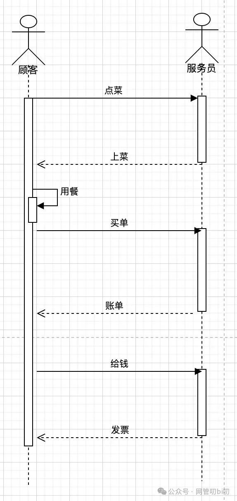

但其实谁都会知道，我们去餐馆吃饭除了跟服务员点菜，还需要服务员给餐馆后厨派单，厨师做完菜后再把菜给服务员，服务员再给你上菜，你吃完后买单结账也是把钱先给到服务员，服务员把钱给到收银员，收银员结帐开发票再由服务员把发票给你整个流程就结束了。

看，我们通过这一波分析又发掘出来去餐馆吃饭除了服务员，还有厨师和收银员参与整个流程，整个流程用顺序图表达如下：

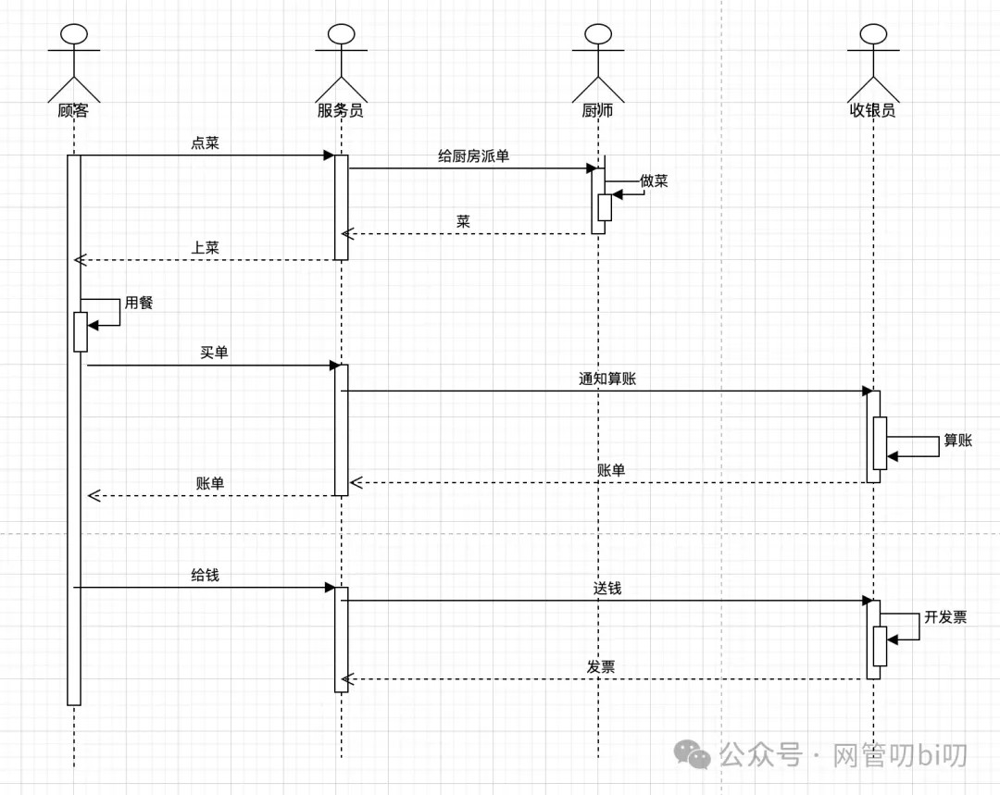

上面那一大段分析餐馆就餐流程的文字用这个顺序图就能直观表达出来，这在做需求分析和技术评审给别人解释整个流程时可比上面那一大段文字更直观，也更容易让协作的人理解。

**我们使用UML图的一大目的就是在团队中建立统一、高效的需求分析和技术方案的表达和沟通方式。** 无论是什么职能团队的成员都能一看即懂，即使不懂技术也能呢理解起来也不难，比写一大堆文字顺带夹杂着代码片段的文档要好理解的多。

这个例子是把顺序图用在了需求分析中，用在技术方案详细设计中也能发挥出其发掘接口内部实现流程和逻辑的功效，下面例子中我们会有这方面的演示。

## 使用顺序图的最佳时机

之前两节课介绍的活动图和状态机图，活动图是流程分析的万能工具，状态机图是直观展示业务实体在业务流程中状态流转的利器，而今天要学的**顺序图则特别适合用来发掘流程中隐藏的内部流程，而且是更适合聚焦于表达大流程中的某个步骤中的详细流程**，UML并没有给顺序图做这个限定，我是从这几年用UML做需求分析和技术方案的经验中总结出来的。

因为顺序图的语法中更强调角色间的交互时相互之间提交和返回的消息，所以**顺序图还特别适合表示API接口的内部逻辑实现**，比如前端调用了下单接口，但下单接口内部实现下单时会查询库存、查询优惠信息、计算金额等这些在单体服务里可能是分别对应不同的模块，而在微服务里就是对应多个服务的调用，这些内部逻辑对前端都是不可见的，所以顺序图特别适合用来发掘和表达内部流程是怎么实现的。

## 顺序图的语法  

现在我们来详细学习一下自己画顺序图要掌握的那些语法，首先是基本语法，然后是循环和选择分支这些进阶语法，掌握这些语法后就能读懂我们文章开头给出的那个微信支付技术文档里的顺序图了

### 基本语法

首先顺序图表达的流程中的每个参与者都叫做“角色”，角色如果是人就用这种人形小公仔表示

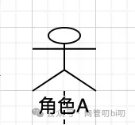

也可以用另外一种更通用的画法表示角色

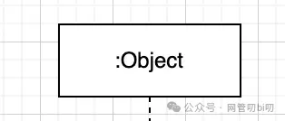

:Object，":"后表示的是某一类事物，用这种方式既可以表示“人”的角色，也可以表示“机器”、“某服务”这样的角色，会更通用些。我一般用顺序图表达某个接口的内部流程时，会两种结合使用，这样用户服务的人机交互会更分明些。

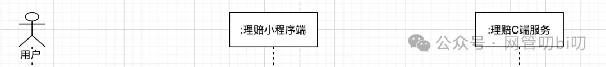

角色下面那条虚线叫生命线

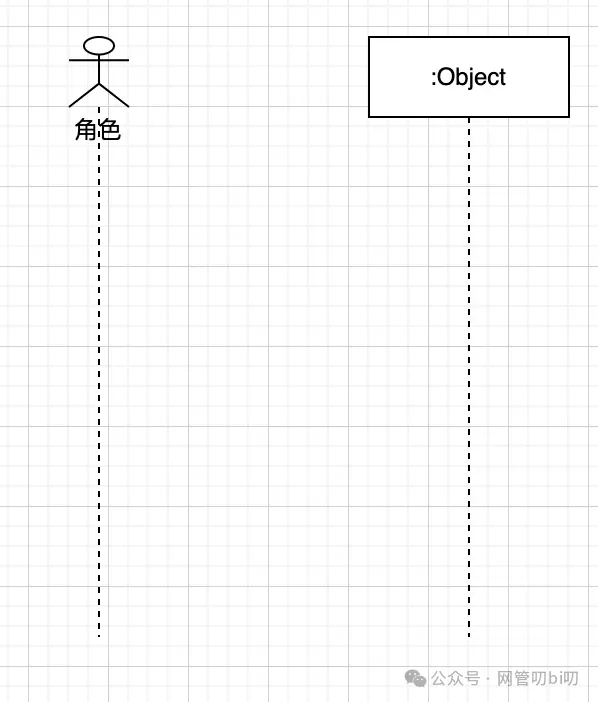

而画在生命线上的那些细长矩形框叫做“会话”，每个会话表示角色间的一次交互，一般一个完整的流程中生命线上会有很多这种会话框。

顺序图中角色间的会话要画出相互之间的请求和响应，就跟API接口请求一样。

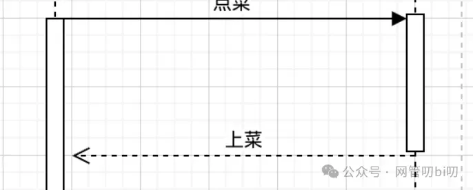

在顺序图里他们分别叫做消息和返回值。

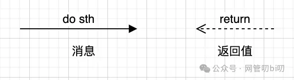

如果返回值暂时不确定，可以先不写上面的文字，看到这个需要箭头知道是会话的返回就行了，发起的会话消息也是一样。

会话中还有一种情况，如果是表示角色自己做什么事情

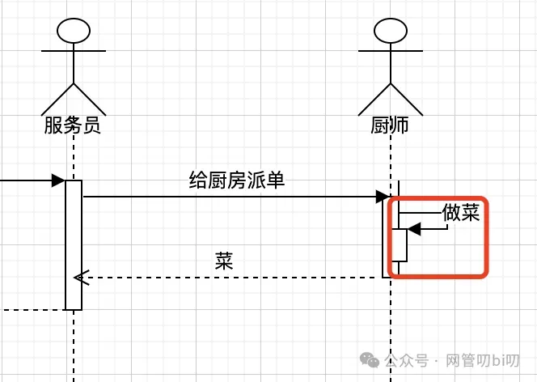

则用这种小会话框并把箭头指向自己，表示自调用。

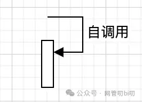

这里在给大家提供一个基础语法的汇总图，刚开始画顺序图，不知道怎么画才对时可以直接拿来参考。

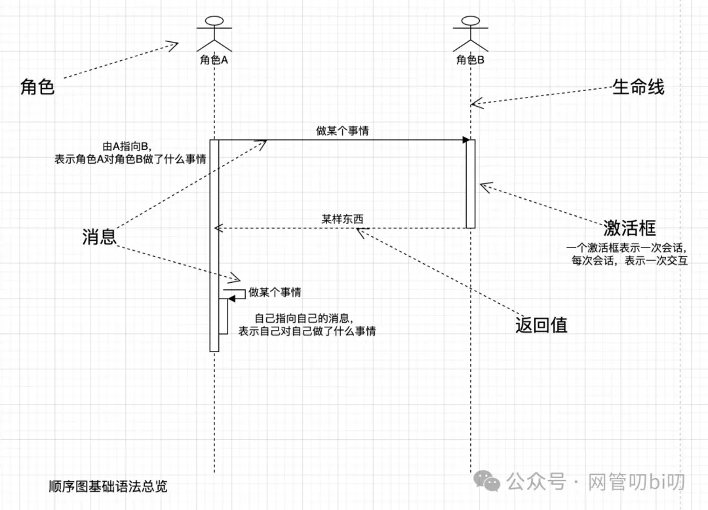

### 分支和循环

UML的顺序图中也有分支和循环结构用于表达流程中需要循环处理和走不同分支的细节。先来看怎么在顺序图中表示循环。

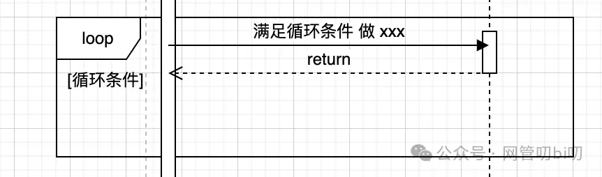

顺序图中如果有需要在循环中处理的步骤，我们就拿一个框把他们的会话框包住（这个框是包图的框，后面有专门的课程讲），左上角标记出loop类型，代表是循环结构。方括号"[]"需要标记出循环条件--即写出来满足那些条件流程中角色间的交互会进入循环。

顺序图的分支结构有两种，分别能表达出编程语言中的 if ... else if... 和 if ... 条件选择分支结构。 首先是alt框表达的多条件选择分支结构

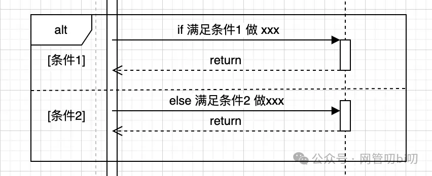

上图用了一个相同的包图框把需要进行条件的选择的交互流程包住了，在满足"[条件1]"或者"[条件2]"时流程会对应进入框中右侧的部分表达出“if 满足条件 1 做某事”或者“else if 满足条件2做某事”的意思。 如果表示流程中的单一条件选择分支(if ... )，可以用下面这种标记了"opt"类型的框。

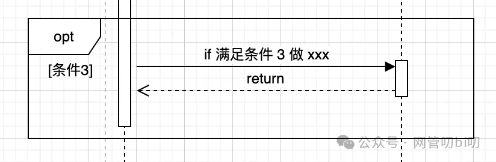

它框中的部分就是我们在程序中需要用单个if语句实现的逻辑“if 满足条件3 做某事”，不满足则跳过不执行。 这里总结一下顺序图中的分支和选择结构，凡事需要进入特殊情况的流程，需要把流程中的会话框放在一个包图框中，有三种提供特殊流程的框他们分别是：

- loop：循环，中括号"[]"会写出循环条件，表示如果满足“循环条件”则重复执行框住的内容。
    
- alt: 条件分支, alt 是alternative的缩写，"[]"中标记的是进入分支需要满足的条件，表达的意思是if 满足“条件1” 执行框住的内容else if 满足“条件2”执行它对应框住的内容，如果有更多分支可以增加虚线在框住分割出更多分支。
    
- opt：可选分支，opt是optional的缩写，表示如果满足条件则执行框住的内容否则跳过不执行可以理解为程序中只有一个if的条件分支。
    

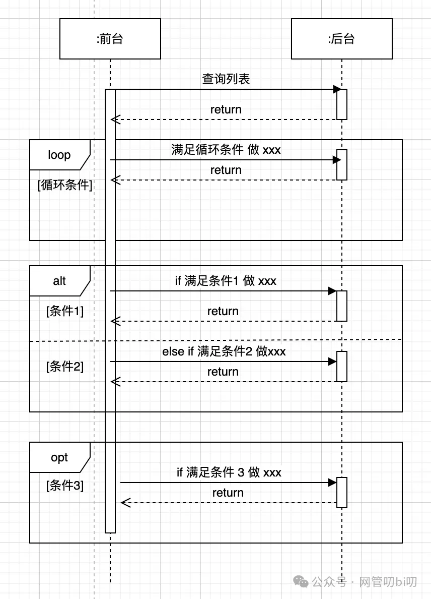

循环框和分支选择框还可以嵌套着使用，表达的是程序中的for 和 if 的嵌套，不过我不建议在顺序图中搞的那么复杂，如果没有特别需要我一般不在顺序图里用这些分支和循环结构，用的时候也不会进行嵌套使用。用UML顺序图做需求分析和技术方案是只体现出大的条件判断和循环逻辑即可，能达到讲清逻辑、知道开发实现的程度即可，不必每个小细节都画出来。

## 案例参考

案例参考环节，我这里给出两个我在工作中实际使用顺序图做技术方案分析的一些例子。一个是会员自动续期使用优惠券，另外一个是业务使用公司的支付中台进行支付的对接流程--怎么调起支付？怎么拿到支付结果这些都在顺序图里有表示。

### 会员自动续期使用优惠券

首先会员的自动续期这个业务相信大家都能理解，我们开的爱奇艺、腾讯视频会员或者B站大会员时都有一个选项叫“自动连续续费”，属于做订阅类的业务常见的一种营收策略，“自动连续续费”单价会低一些，但是会员的流程时间会更长（毕竟有人开通后会忘记取消这个选项）。

所以做这块业务一般都会有个自动续期管理服务，每天会跑数据把快要到期的会员生成自动续费任务，再调用会员内部的服务进行续费。会员服务内部也是生成订单、再去调用支付中台有支付中台再调用微信或者支付宝银行卡等支付通道进行扣费。

会员自动续期使用优惠券，相当于是自动续期上迭代的新需求，是公司里提高营收常见的一种运营策略，在连续续费比买单月便宜的基础上再给你点优惠没准你服务的周期还能变长。所以下面这个顺序图我们突出表达的是会员自动续期使用优惠券时会员业务的几个后端服务的交互关系和发生时间，

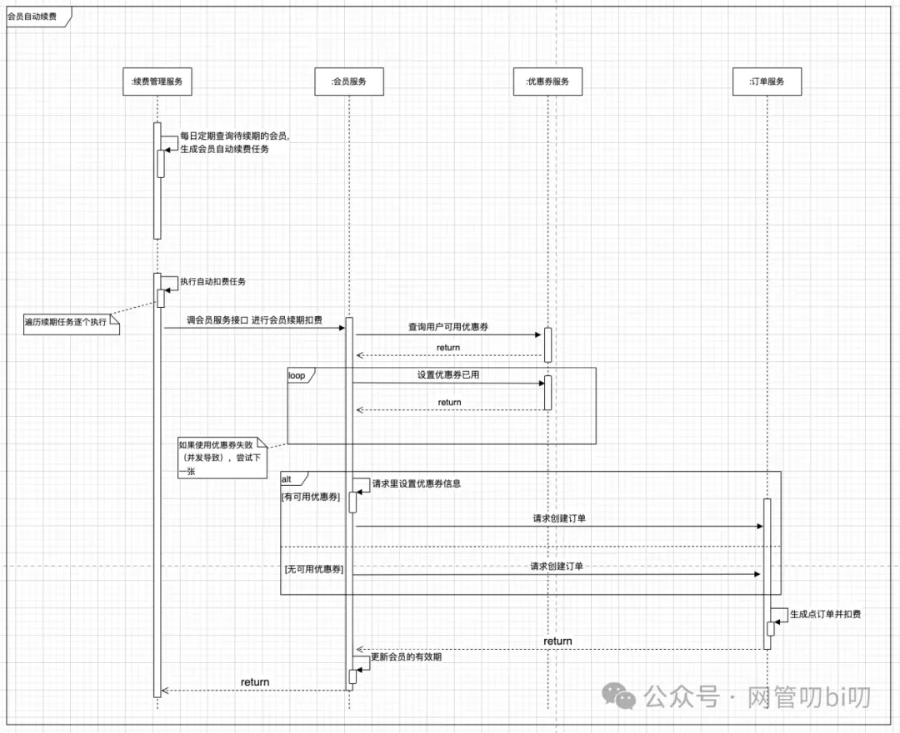

因为这个顺序图表达的是会员自动续期使用优惠券会用到哪几个服务，相互间是怎么个交互顺序，所以整个流程就聚焦在了整个会员业务里，扣费是由订单服务发起调用支付中台完成扣费的细节, 所以在这里就直接省略成「订单服务生成订单并扣费」。

**每个顺序图都要有聚焦点和合适的流程颗粒度，像订单是怎么调用支付中台，支付中台又和支付通道怎么对接从用户那收到钱的就不必在我们上面这个顺序图里体现出来，那些应该由表达支付中台SDK下单的顺序图体现出来**。

接下来我们就看一下用顺序图怎么表达清楚整个支付过程中不同角色、服务间的交互。

### 支付中台下单支付流程

下面是一个经典的支付中台下单支付的详细流程，乍一看是不是有点眼熟，跟开头微信文档里的那个顺序图有几分相像。其实习得所有技能的开始阶段都是模仿。

这幅图确实是当初公司里建设支付中台时项目经理参照微信的技术文档梳理出来的，但是我觉得比微信文档里的画的更清晰些。

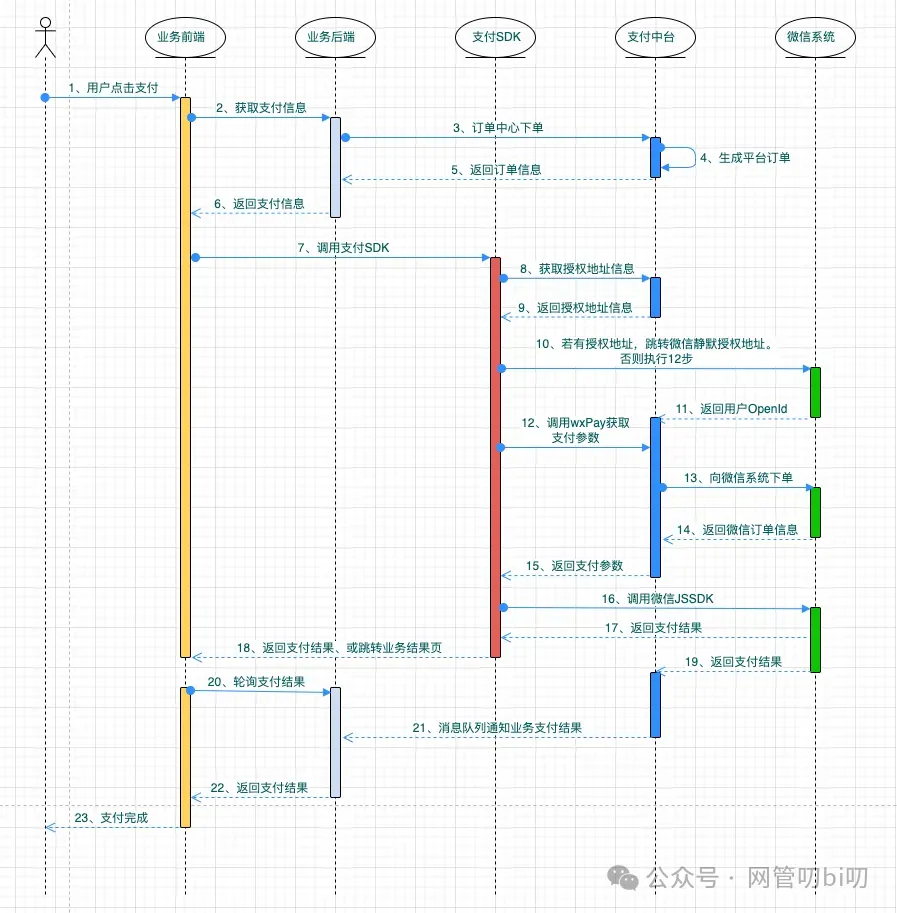

**上面这幅顺序图由于角色间的交互较多很是复杂，所以在这个顺序图里会话间发送的消息和返回值都标上了序号，方便阅读**。只要跟着需要的指引读顺序图就能很快把流程里边的详细逻辑搞清楚，所以遇到流程交互较多的顺序图建议采用这种标记的方式让条理更清晰更容易被人读懂。

## 最后

经过上面UML顺序图的学习，相信文章开头的微信开发文档里的支付下单顺序图或者是未来遇到需要对接某个平台的SDK时他们文档中的交互顺序图大家都能够看懂了。

下一节我们会详细给大家演示一下怎么在绘图软件上完成顺序的绘制。