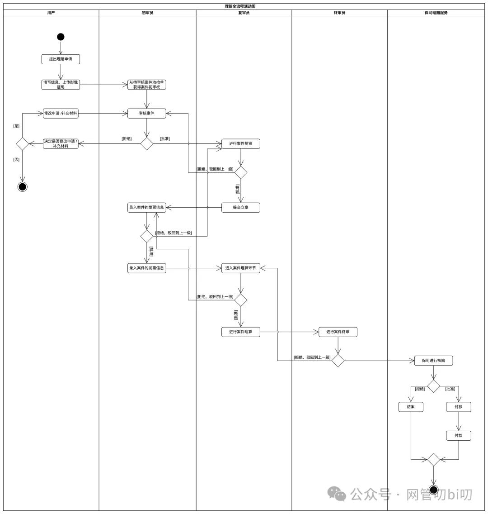
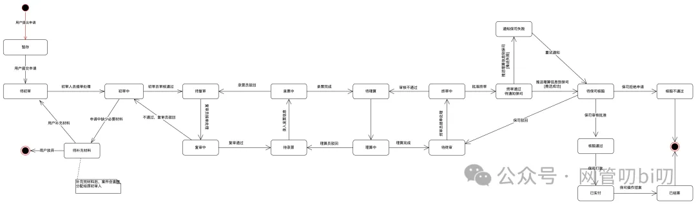
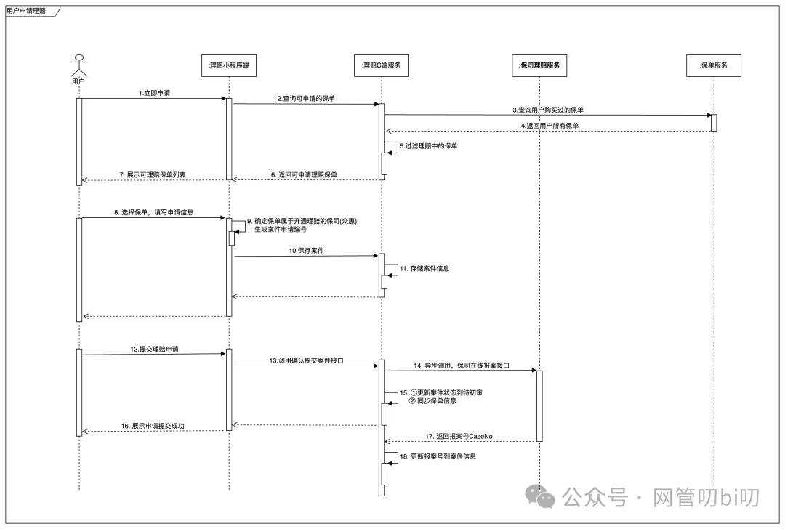
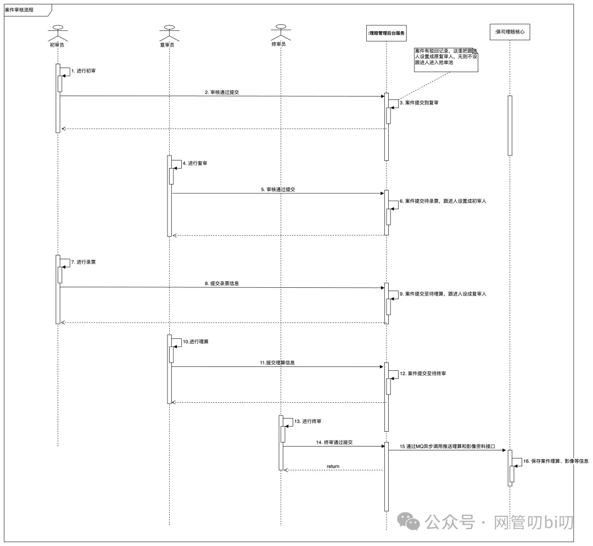

通过[**上一节的学习**](http://mp.weixin.qq.com/s?__biz=MzUzNTY5MzU2MA==&mid=2247500398&idx=1&sn=07415b679914dcb5182e3f02145263f4&chksm=fa8313f9cdf49aefbc7ddeb0de89649ab28e66ea790c588a9e051a7ecba9c51bbc2b93396b7f&scene=21#wechat_redirect)我们已经学会了怎么在给项目做技术评审的时候先确定业务的结构、识别出根实体、在写代码的时候依据根实体划分领域，接下来就该轮到UML工具包里的活动图、状态机图、顺序图登场，让他们帮我们分析并图形化系统的业务行为了。

**本节课我们会先盘点一下UML流程分析三剑客--活动图、状态机图、顺序图他们各自的特点和适用场景，然后会用一个真实的项目案例 — 保险公司的理赔业务系统，给大家完整地演示怎么用三剑客面面俱到、从粗到细地对业务行为进行分析和建模。**

如果你对流程分析三剑客还不够熟悉，这里建议把前面这三节的内容学完再继续看下面的内容。

- [手把手教你画出专业规范的“流程图”](http://mp.weixin.qq.com/s?__biz=MzUzNTY5MzU2MA==&mid=2247500171&idx=1&sn=4c82b42dfe6fc82ce339e7841336ee8c&chksm=fa83101ccdf4990a37d531609940fba057fa77869c857648c1b1ea85aba31bb41d21fd0fe5fa&scene=21#wechat_redirect)  
    
- [学会理清系统核心的状态机，能少抠不少代码](http://mp.weixin.qq.com/s?__biz=MzUzNTY5MzU2MA==&mid=2247500209&idx=1&sn=6a455667731f1907921df7cb1e420bad&chksm=fa831026cdf4993054522197f48e5e1669200a4644027e14ba60379b0339771111fbcb788fec&scene=21#wechat_redirect)  
    
- [微信支付宝的开发者为什么都用它来演示对接](http://mp.weixin.qq.com/s?__biz=MzUzNTY5MzU2MA==&mid=2247500291&idx=1&sn=80ee7773c12a7f0a4e1d478e866caf1e&chksm=fa831394cdf49a82ef67895450e9b3161e1cb714cc198ea91096ac4451788cf31226f621b8dd&scene=21#wechat_redirect)  
    

## 三者的特点和使用经验

活动图、状态机图、顺序图这三个我们每个都单独用一个章节讲解了他们对于业务流程分析和实现上能起到的作用，很多人会问需要用UML把流程分析和实现可视化出来的时候应该用哪种？

答案是他们三个用于流程分析的阶段不同，分析流程的视角也不同，**如果是相对复杂的需求我倾向于他们三个结合使用，从大流程梳理、到表示核心业务实体状态转换、到内部流程实现挖掘，给业务行为来个全方位的剖析**。

首先我们来汇总说明下UML里流程三剑客各自的特点和优势。

活动图、状态机图和顺序图是三个分析流程的UML工具，网上也称 UML 流程分析三剑客。三种图分别有不同的特点和适合的场景，结合起来使用能让我们通过不同的视角更透彻地分析流程。

### 活动图的特点

1. 强调各个角色都做了什么事情，这些事情的先后关系。
    
2. 在表达整体大流程上有优势，适合表达流程中的各种分支、并行、循环等情况。
    
3. 活动的粒度不易过细，否则无法直观表达出整个流程
    

活动图在我们一开始拿到需求后分析整个流程的时候更常用，需求分析或者技术方案时应该先捋出需求的整个大的流程，这个流程使用活动图来表达就会很清晰，**活动图是将流程分解成了一个一个的活动（步骤），通过活动的先后顺序来展示流程是怎么开展的，而且活动图能表达的语法更丰富像分支、并行、循环这些情况都能在活动图中直观地表达出来；**

### 状态机图的特点

1. 事情围绕某个核心事物展开。
    
2. 表达的事物在业务整个生命周期中有不同状态，状态会因为发送了一些事件而变化。
    
      
    

想表达流程中事物的状态变更适合用状态机图。一旦确定大流程后要深挖需求里的核心业务实体的时候，就会需要用到状态机图以更微观的视角挖掘每个核心业务实体在大流程中的状态变化过程。

所以活动图、状态机图两者结合能更有利于我们做好需求分析和技术方案设计，我们开发的系统正是用代码来实现状态机图里业务实体状态变更的一个个方法（比如 UpdateOrderPaid、CloseOrder等），然后按照活动图表达的整体流程把这些代码串联组织在一起来实现需求的。

  

### 顺序图的特点

1. 强调角色之间的交互，信息传递、反馈很明确，适合表达流程内部各个角色交互的细节。
    
2. 强调按时间顺序分别发生了什么事情，这些事情的先后关系。
    
3. **特别适合用来发掘流程中隐藏的内部流程，而且是更适合聚焦于表达大流程中的某个步骤中的详细流程，**在表达比如单个接口内部逻辑上有优势。
    
4. 在单个顺序图中不适合表达复杂的或过多的特殊流程（循环、条件分支等），针对过多的特殊流程最好拆解到多个顺序图或者结合文字注释来表达
    

因为顺序图的语法中更强调角色间的交互时相互之间提交和返回的消息，所以**顺序图还特别适合表示API接口的内部逻辑实现。比如说下面这个例子：**

前端调用了下单接口，但下单接口内部实现下单时会查询库存、查询优惠信息、计算金额等这些在单体服务里可能是分别对应不同的模块，而在微服务里就是对应多个服务的调用，这些内部逻辑对用户都是不可见的，但是作为开发人员我们要对这些非常清楚才能完成功能的开发，所以顺序图特别适合用来发掘和表达内部流程是怎么实现的。

  

流程三剑客搞定业务行为建模

综合下来：活动图适合早期理解需求时梳理整个业务路程，理清流程中每个步骤，**在绘制活动图的过程中会让我们对整个需求有更好的理解，搞清楚需求里都要做什么**。

接下来我们就可以深挖业务流程中的核心实体的状态机，比如通过绘制订单的状态机我们能把订单整个生命周期中的状态流转和各个触发状态变更的事件搞清楚，同时整理出来的状态机中的状态就正好是数据表里状态字段和程序中实体类的状态枚举值。

状态机梳理完后我们会发现系统业务行为就是通过这些核心实体的状态变更表现出来的，而各个导致状态变更的行为/事件就是我们要开发实现的东西，不过这些从外部观察会显得比较简单：比如创建订单、支付订单之类的行为通过活动图表达就是一个“活动” ，对于系统单一业务行为的深度挖掘就轮到顺序图上场了。

从上面的总结可以看到流程三剑客结合使用能覆盖我们从需求分析、流程梳理、确定状态机、挖掘流程步骤具体实现的每个环节，通过三者结合能很好的完成系统业务行为可视化，甚至是从外到内多个视角的可视化。

上面说了这么多，接下来我通过一个完整的例子带大家一起用UML的流程三剑客给一个项目做一回业务流程分析和建模，基本上学会后你工作中能接触到的项目让你来主导技术评审都有方法可依啦。

## 业务行为建模实战演示

我们演示的例子是一个保险理赔系统的业务流程分析，像车险、医疗险在出险了以后（车有损坏、或者看病需要保险，这在保险行业里叫做保单出险）。

### 活动图梳理大流程

以往保险出险后理赔是打保险理赔热线跟理赔专员确认后邮寄各种花费的票据过去让那边审核，审核通过后保险公司再给报销。现在多以手机APP或者小程序来完成在线理赔。

不管是在线还是以前的去线下理赔都需要有填写资料提交理赔申请、提供票据、理赔初审、复审、终审最后核赔通过后报销的流程。下面我们就用流程图把这个流程仔细梳理下，把整个流程可视化让它变得更直观。

上面活动图里用了泳道，每个泳道是一个角色，流程中角色参与的活动都画在自己的泳道里，这样让可视化复杂流程时变得更清晰更有条理。

图中一共有五个角色：用户、初审员、复审员、终审员和保司的理赔服务人员。

初审员参与初审环节和录入票据环节，初审环节主要看用户提供的材料、票据是否齐全，进入复审后会有复审员会检查申请的理赔是否在用户购买的保险的责任条款内（就是能不能赔），能赔后由初审员把这个案件的发票录入到系统中（如果没有自动识别功能的话），接下来在理算环节复审员会核定能赔多少，再交给终审员去审核。

这里说一下，现实中很多保险公司是会把理赔前面这些流程外包出去的，受理用户、材料审核都由第三方代理服务搞定，最后核准好后再交给保司理赔部最后审核，保司理赔部主要负责最终全局审核和打钱就可以了，这样保司就能节省一些理赔的人力成本，付一些服务费把前面繁琐的环节交给中介代理来做。

### 状态机图可视化业务状态流转

理清了大流程了，要想用系统把这个流程实现了，我们还需要搞清楚这个流程中核心实体的状态是怎么流转的，不然后面开发阶段自己或者合作一起开发的小伙伴也会烦糊涂，这个时候状态该改成什么呀 blabla 之类的，所以这个时候就需要把状态流转用状态机图可视化出来，这样大家都容易理解。

既然是保险的理赔流程，那核心实体一定是理赔单呀，注意是理赔单或者理赔案例因为在理赔过程中走完前是不能影响保单的状态的，而理赔不同的险种他们的时效是不一样的，车险可能比较快但是医疗险的话，如果责任条款例没垫付这一项的话这个周期还挺长的。

说了这么多，来看一下理赔案例的状态机图

这里使用理赔申请演示主要是因为现有保险理赔的流程就很复杂里面设计到很多审核，对应的理赔单就会有很多状态，通过上面状态机我们能清晰地展示理赔单整个业务生命周期里都有哪些状态，状态间是怎么转换流转的，梳理完这些后就能直接作为我们编码实现中和数据表中的状态枚举值使用。

### 顺序图挖掘关键步骤的内部流程

上面两步都做好了，接下来就应该去细化每个更细的流程了，思考怎么用程序实现这个流程。

用顺序图分析清楚客户端发起请求到给响应之前都有哪些重要的步骤，这个时候就轮到顺序图上场了。

因为顺序图的焦点是内部细节所以能表达的流程往往都不会太大。

下面是用顺序图整理的用户提交理赔申请和理赔审核这两个子流程的细节，图中的每个小人代表的是一个参与者，对象框代表的是负责具体任务的服务。

#### 用户提交理赔申请

通过这个图我们可以看到用户通过小程序申请理赔后，后端有中介的理赔C端服务，保险公司的保单和理赔服务写作来实现用户理赔报案这个流程。

#### 理赔审核

理赔案件的审核，主要是工作人员在管理后台中完成的流程，下面是这个顺序图详细地表达了流程中的参与者以及实现流程所需要的服务怎么协作来完成理赔案件的审核。

## 总结

了解需求梳理大流程用活动图、业务状态太多用状态机图、挖掘关键步骤内部流程和实现细节用顺序图，项目、模块从无到有记得用类图。

很多人会问，我们每天迭代速度那么快工作那么忙怎么有时间做这些工作，都是直接写代码。这里我想说，这两节是为了给大家用具体的项目示例展示使用 UML 能覆盖到做技术方案、技术评审的方方面面，我们不一定每个需求都要把这些家伙事儿全用上。

真实使用的时候我一般活动图状态机图是先梳理出来的，然后顺序图等想实现细节的时候有的时候甚至是边想代码细节边画出来的。

一般大点的需求做这些准备工作和写代码的比例在1:1， 真正这么施行下去想明白了、了解清楚了再去写编码实现比上来直接写代码要快，而且程序照顾不到的细节也会少一些，不会有很多业务逻辑上的BUG。

最后说一下，在做各种Presentation，或者是有机会对接客户的时候，用好这里讲的只是就会显得我们很专业，我们的方案也会显得更有说服力。