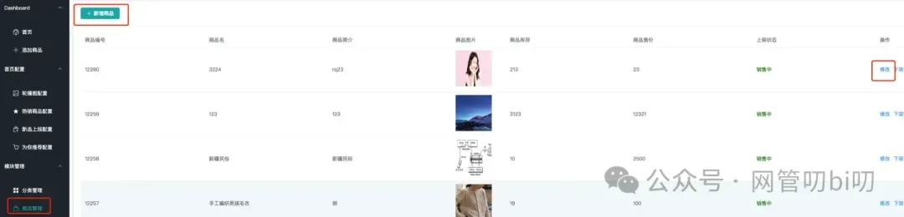
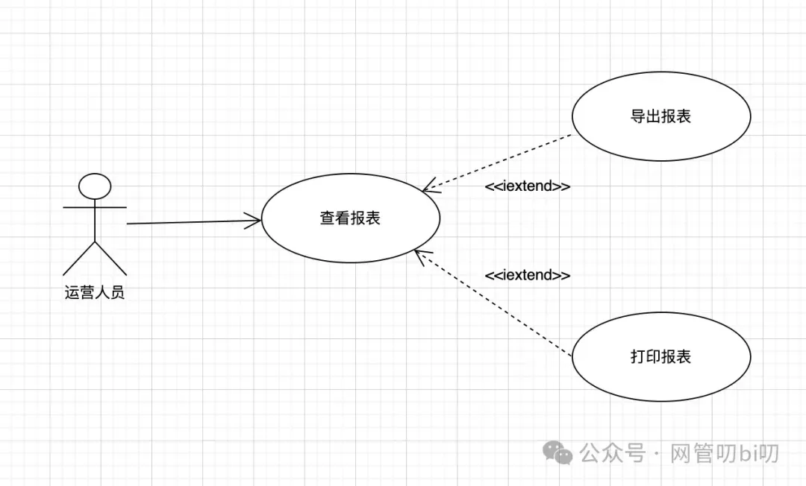
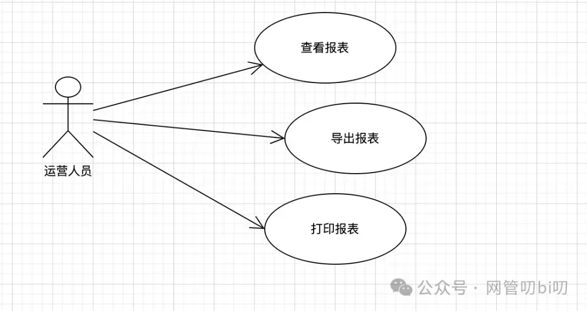
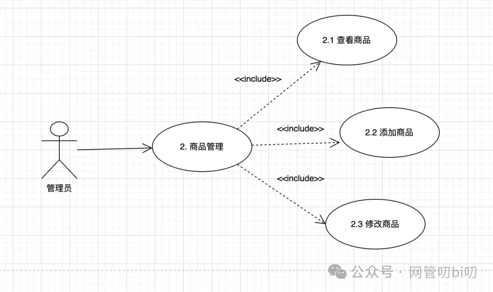
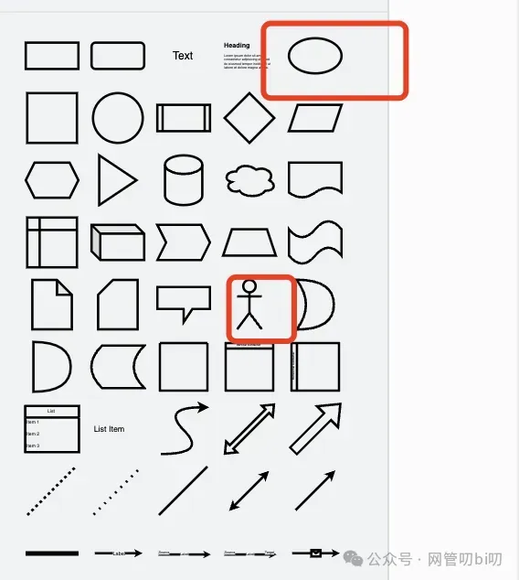
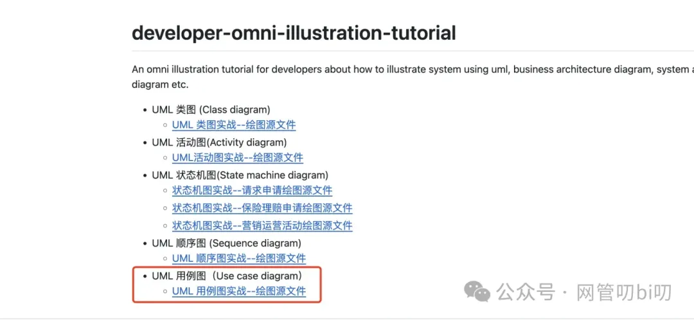
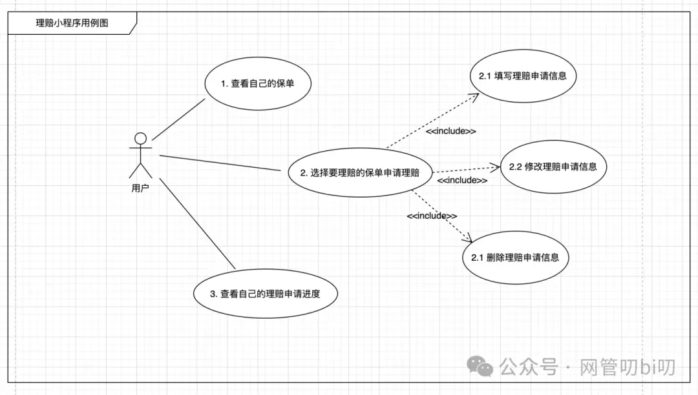
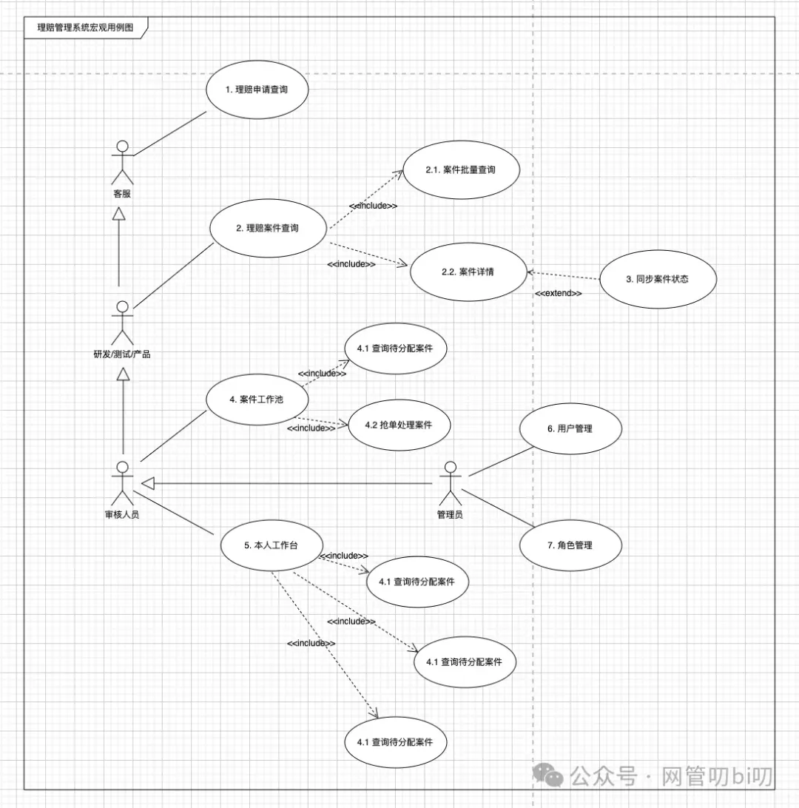

[**上节课**](http://mp.weixin.qq.com/s?__biz=MzUzNTY5MzU2MA==&mid=2247500677&idx=1&sn=09abe193e942c00a976b7a31a9fb128b&chksm=fa831212cdf49b04f6ca8762622f39f03d3a54a8bf19cbf51af735ec63ff642fd2c67b26bd4d&scene=21#wechat_redirect)我们通过几个示例给大家讲了用例图的基本语法，用例图的是通过图形描述系统的两个问题：

1. 这个系统有谁在用
    
2. 这些人通过系统能做什么事情
    

关于它的语法，其实没有那么多，我们知道通过用例图怎么描述下面这个商品管理页面的需求

以及分清楚下面两个用例图的区别即可

这些我们都在上节内容中有过详细讲解，今天更多的是来给大家分享一些使用上的建议，你的用例图怎么准确描述出系统功能、以及怎么靠用例图作出更详细的需求规格给到甲方确认或者让程序员来进行实施，掌握这些足以让我们应对项目经理的客户对接、产品经理的需求拆解等工作。

## 用例的粒度和建议

跟前面学过的活动图中活动的粒度一样，用例图中用例的粒度应该是多大或者是多小在UML里并没有明确规定和固定的法则，需要通过实践慢慢体会，这里给大家一些实践后的建议。

刚开始实践使用用例图表示需求的新手，建议遇到能拆分成子用例的用例时都进行拆解和详细说明，等熟练掌握用例图之后，如果负责的业务需求会在系统中有大量类似“管理某某”的用例，一般只会选择其中一两个进行分解和详细说明，而其他相似的“管理某某”用例只会用文字注释说明需要注意的地方，不会再逐一分解成子用例进行详细说明。

以上是对用例粒度的建议，大部分需求的用例中，CURD类的用例占比较大，下面还有一些实践上的建议：

- 在合作方（客户、产品PM、业务、与系统有关的其他职能人员）能准确全面理解的基础上用例越精简越好，用例图是降低沟通成本提高沟通效率的工具，并不是完全替代我们沟通的工具。
    
- 我们不应该盲从的从客户、需求源头人员的想法中直接导出用例，用例应该更多地从系统的目标、待解决的客户问题而推导出来的。
    
- 用例不应该使用技术语言来描述，要用使用这个系统的人们能看懂的语言，保证他们能够看懂。
    
- 全面并且有重点地表达用例，对于重点难点用例应该重点着墨，对于常识性的用例则不需做过多拆解一带而过就好。
    
- 可通过子用例和扩展用例分解和细化重点功能用例，用例的粒度应该保持大体一致。注意这一点应该灵活把握，不应僵化。
    
- 用例图不是万能的，也不是表达需求的唯一方式，使用UML用例图时表达出来的是相对宏观的需求，用作跟客户沟通很方便，在项目开发阶段一般需要配合用例表说明用例的前置流程、执行逻辑、执行结果、异常流程这些关键细节输出详细的需求说明给研发人员才能进行开发。
    

## 用例表

使用用例图表达需求更多的是让客户、甲方以及团队的其他人员能快速了解需求的全貌，假如你是一个产品经理/项目经理或者是想要转型成产品经理/项目经理，那么用例图还是一个必须要掌握的技能。

不过想要让研发人员实现系统需求，光输出用例图给他们显然是不够的，一般还需要借助用例表来对每个用例进行详细描述，毕竟很多细节的问题只有通过详细的需求文档才能描述清楚，用例表没有具体的固定格式，如果你公司里正好有一套标准，那么用现行标准即可。这里给到一个比较通用的用例表格式。

|   |   |   |   |
|---|---|---|---|
|用例表模版|   |   |   |
|**用例编号**|用例图在用例中的编号|**用例**|用例图中的某用例|
|**执行者**|用例的角色|**优先级**|高: 一般:|
|**描述**|简单描述执行执行这个用例用来完成什么目标|   |   |
|**前置条件**|列出执行本用例前必须存在的系统状态、用户数据等前置条件|   |   |
|**基本流程**|说明正向流程--数据完备、满足完成各种条件的情况下的流程|   |   |
|**执行结果**|列出走完正常流程后用例的结果|   |   |
|**异常流程**|说明数据不满足条件，出现错误或者其他异常情况时流程与正常流程的差异|   |   |
|**备注说明**|对本用例的补充说明|   |   |

上面模版用例表中，每个表格项都用文字做了解释，针对用例号这项，在遇到从零开始新建设系统的需求时建议对用例做一个编号，比如像下面这样。

这样研发或者其他人员在看需求文档也更容易从用例图上的序号定位到描述用例详细需求的用例表：

|   |   |   |   |
|---|---|---|---|
|**用例编号**|2.3|**用例**|修改商品|
|**执行者**|产品库管理员|**优先级**|高: ● 一般:|
|**描述**|产品库添加产品|   |   |
|**前置条件**|1. 添加产品的管理员需要具有产品库管理的权限      2. 产品状态在已下架、编辑中|   |   |
|**基本流程**|管理员在商品列表中选择要编辑的产品，弹出弹窗后可对产品的头图、价格、展示顺序xxx 进行修改  [一般这里可以加上系统该功能的原型图，或者是已有系统该功能的截图]|   |   |
|**执行结果**|产品xxx 更新为最新，发布后用户可见|   |   |
|**异常流程**|点击编辑，商品状态为已发布，不能继续编辑产品popup 弹窗提示xxx  若商品描述中为通过敏感词校验，有xxx风险不能继续保存商品编辑结果，弹窗提示xxx|   |   |
|**备注说明**|对本用例的补充说明|   |   |

上面这个用例表大概展示了一下用例图中2.3修改商品这个用例使用用例表怎么详细描述需求，一般在公司的产品文档WIKI都是以类似格式书写的，这里给大家做一个演示，具体使用时表格可再自行调整。

## 画图参考

在 draw.io 上画用例图非常简单，使用的都是我们之前几节实战课教过的画法。 用例图中表达角色的那个小人，还有角色在系统中功能用例的椭圆，都在draw.io左侧绘图元素区通用菜单的下面，我用红框框了出来

角色间的继承、角色和用例之间的关联都是用线条搭配对应的箭头表示的，这些元素的画法在类图的实战课中我们有过详细的讲解，如果忘记大家可以回看。 鉴于比，较简单用例图就不专门出实战课了，我把课程中用到的示例整理到了一个绘图源文件中分享给大家。 访问这个Github仓库 https://github.com/kevinyan815/developer-omni-illustration-tutorial 就能找到绘图文件，下载下来到本地用draw.io 打开就可以随意粘贴复制或者修改。

这里面包含了两个用例图，用的还是一直举例用的保险理赔业务系统，其中有两个图形，分别对应了系统的C端和业务端。

#### 理赔小程序用例图

#### 理赔审核系统用例图

## 总结

本章节的主要内容是使用用例图获取和直观的展示系统需求，其实系统需求往往就是围绕下面这两个问题的各个功能点：

1. 这个系统有谁在用
    
2. 这些人通过这个系统能做什么
    

我们能把他们描述清楚就是一个及格的系统需求，而UML工具箱里的用例图能以可视化的方式描绘出系统需求的大体功能，足以在我们面对客户、甲方、其他同事时让他们快速理解需求中要求的功能点，这样甲方/上游能更好的确认需求，同时也可以让我们按照用例逐一输出需求文档。

详细描述需求的方式有很多，这里介绍了一种专业产品经理常用的用例表的方式来详细描述用例图中的用例，我们从上面的例子中也可以看到使用用例表详细描述用例需求时能达到的效果，比一句话描述需求或者口头沟通需求要清晰很多。

本节课的主要内容还是用例图，使用用例图就足以让我们应对项目经理的客户对接、产品经理的需求拆解等工作，如果你还需要参与具体实施的需求评审等工作可以再借助这里介绍的用例表的方式继续开展后面的工作。

**其实现在国内研发人员之所以有工作很难很累的感觉，主要时我们处于整个交付链条的中下游，很多时候需求到我们这里时间并不时很充裕，再有一个就是上游充斥着一句话需求、模棱两可的需求、不负责任的需求--比如此功能按原系统老逻辑处理，请问什么是系统老逻辑，产品专员可能根本说不清，往往是某个在团队待得时间较长参与过原来开发的研发人员才能说出来，这样的产品需求文档从交给程序员到编码研发中间平白多出了很多沟通、调研原系统逻辑的成本，而这些成本又会进一步挤压程序员的开发时间**。

我知道现在国内公司大部分产品需求都很不规范，一句话需求是经常的事儿，但是我们不能因为环境这样就不去了解更规范更专业的产品需求文档该怎么写，今天这些内容我觉得即使有天不用转至写程序变成项目经理带项目、对接客户了，或者转岗成产品经理了，这些东西也都是可以拿来即用的，用了就能起到正向作用的。

## 课后练习

聊的有点多，现在给大家留个作业，把你上班时开发过的需求，这个需求既可以是一个大的系统也可以是一个小的独立模块，使用用例图把它的功能拆解描绘出来。描绘出用例图后，你可以再尝试使用这里教给大家的用例表把每个用例的具体需求详细描述出来，看看能不能写出一份需求文档。

掌握了今天这里介绍的用例图和用例表拆解、描述需求的方法，如果再学会画原型图，那么产品经理这个岗位的技能门槛你就算直接迈过去了而且说实话能超过国内一大半的产品经理，剩下的就是跟人沟通打交道这些软技能的事儿了。 毕竟产品经理作为交付连的中间环节，上要对接产品运营、甲方商务能需求源，下要对接研发团队，和人打交道占据了很大的工作比重。那么你有想过转型产品经理吗，或者正在做产品经理的你有什么想说的都可以在评论区聊一下。