这节课开始教大家画系统架构图，这是每个程序员都应该会的技能，不光是因为它能让你装B吹水还因为它的存在是合理的，在项目实施前除了了解功能性的需求，高级别的工程师还应该学会关注系统的安全性、易用性、性能要求以及IT资源上的需求，因为这些东西都是成本，不列出来怎么给客户报价或者是找领导申请预算。

所以系统架构图的首要目标是描述这些非功能性但又占用成本的需求，此外它还能帮助其他人了解项目在宏观上的结构对项目有一个更全面的认识。

**今天我教大家一个画系统架构图的通用公式，用它可以拆解任何系统，帮你画出整洁专业的系统架构图，这个方法不需要大家有任何绘画基础、也不需要有多高的审美，只需要掌握其中的拆解系统的方法论和几个图形的组合和拖拽，就能把系统架构图画的既整洁又专业。**

课程中会用下面两个系统为例给大家演示怎么画出它们的系统架构图。

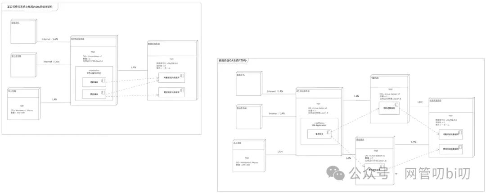

本节我们先学会这个架构图公式的方法论和两个必要的语法点--UML的部署图和构件图，下节课会带大家一起从头开始，拿到一个系统的建设需求和目标后，用公式拆解系统画出系统的架构图。

## 为什么要使用架构图

调研需求的时候需求方会跟我们说系统要具备什么样的功能，能完成什么样事情，解决他们的什么问题，这些都是功能性的需求。其实非功能性需求也是项目中的一部分重要工作，比如系统安全性、易用性、性能方面的需求以及系统在已有IT资源利用性和已有系统兼容对接上的需求都算是非功能性需求。

如果这部分非功能性需求被忽略，往往会在项目执行的中后期造成巨大的问题。此外项目除了人力成本外 IT 资源也是一个大成本，无论是给甲方客户报价还是自己的项目向公司申请预算都需要涵盖这部分成本，不然不就亏了嘛。

所以调研记录和表达出非功能性需求也是项目在准备期的一项重要工作，而UML工具包里的部署图和构建图是获取和描述非功能性需求的重要工具。

部署图和构建图在UML中是用来描述软件系统架构的，很多软件系统在需求阶段就已经有一些软件架构和软件技术框架上的要求，如果忽视了这些要求会给软件后期的工作带来灾难性的后果。

大部分项目在建设初期就会对软件架构和技术框架有一些限制，主要有这方面：

1. 新项目需要在已有系统的基础上进行开发，原系统的已有架构和技术框架会影响新项目的技术方案。
    
2. 新系统需要与已存的系统进行对接。
    
3. 新系统需要充分利用现有IT资源，合理控制成本。
    
4. 新系统需要导入哪些数据，需要同步数据到哪些系统。
    
5. 原有IT平台需要改造，才能保证新系统和已有系统都能正常运行。
    

为了更好的分析和描述这些软件架构和技术方案选择上的需求，我们可以使用部署图和构件图对这些需求进行逐一描述：

- 使用部署图和构件图描述当前的IT系统架构
    
- 列出客户对IT资源类和技术框架类的要求
    
- 根据列出的要求，用部署图和构件图画出新系统的软件架构和技术框架
    
- 和客户沟通确认这些内容，同时确定客户的IT架构环境怎么改造，新系统如何部署在IT环境中。
    

## 一个系统架构分析案例

某公司现有OA系统只支持员工考勤使用，现公司希望将员工报销进行流程线上化提高内部效率，公司当前的OA系统和IT架构信息如下：

1. 当前OA系统只能由员工在内部局域网通过工作电脑访问。
    
2. 公司有大概200名员工，根据工种不同配备的办公电脑系统为Windows 10 或者 MacOS
    
3. OA系统应用部署在两台Web服务器上，服务器系统未Linux Dabian v7
    
4. IT资源有两台数据库实例，一主一从，数据库类型为MySQL5.8，OA的考勤系统使用的数据库部署在上面。
    

整理好这些信息后，我们可以使用部署图和构件图描述出系统的当前现状，该OA系统的软件架构和IT资源现状可以用UML部署图和构件图协作表示如下：

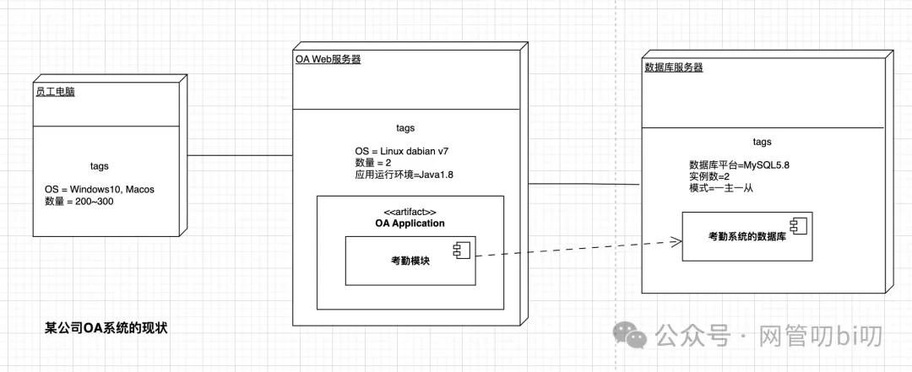

该公司提出希望在OA系统中建设费控系统的需求的同时，要求新集成进来的系统要符合以下IT架构方面的要求：

1. 系统需要共用部分考勤系统的数据，根据员工考勤数据自动核验员工的出差、加班报销申请。
    
2. 系统需要支持能通过智能手机完成部分功能，支持笔记本通过WIFI登录系统使用全部功能
    
3. 新建系统需要充分利用现有IT资源，不能明细增加IT资源的成本。
    

下面我们使用部署图和构件图画出费控系统上线后的IT架构情况，如下图所示：

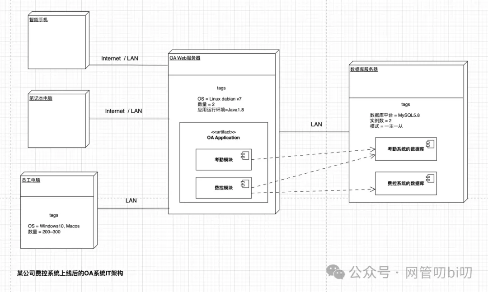

本图清晰地描述了系统的IT架构上的要求，需要注意的是这个并不是系统架构的详细设计，在项目准备期架构设计能表达这种程度--明确软件架构上的要求--就够了，这样即方便与需求方进行确认，也方便与其他项目成员同步这些信息。

思考：从上面的架构图我们能看出来本OA系统使用的是单体架构，那么假如要做成微服务架构，考勤服务、费控服务都是单独的微服务，那么这个架构该怎么画呢？大家先思考一下，学完本节的所有知识后告诉你答案。

## 部署图和构件图的语法

### 部署图

#### 节点

在 UML 部署图中，节点（Node）是用来表示系统的计算资源（例如，个人计算机、传感器、打印设备或服务器）的元素，节点在UML中用三维盒型来表示。

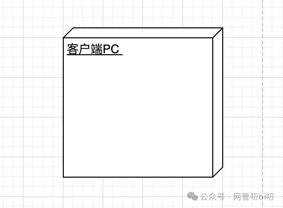

每一个节点都有一个单独的名字标记，比如上面的“客户端PC”还有上面例子例的“智能手机”，“Web服务器”等。

#### 节点标签

在UML部署图中，一个节点表示一类资源，如果想再表示这类资源的更多细节则是通过节点图上的tags来表示，故名思义就是给节点指定一些能具体他它的特征的标签和标签值，比如上面Web服务器节点通过“Number=2”，“应用环境=Java1.8”这两个标签清晰地表达了公司IT资源里有两台能跑支持Java1.8版本程序的Web Server。

Tag的书写格式是“配置=配置情况”，等号左边是想说明的属性，等号右边是具体的内容。

#### 连接

系统的多个节点如果相互之间有交互， 则在结点之间用连线表示它们系统之间进行交互的通信路径，这个通信路径称为连接（Association），在通信路径上会标出具体的连接方式，比如上面例子例的“Internet” 或者局域网“LAN”。

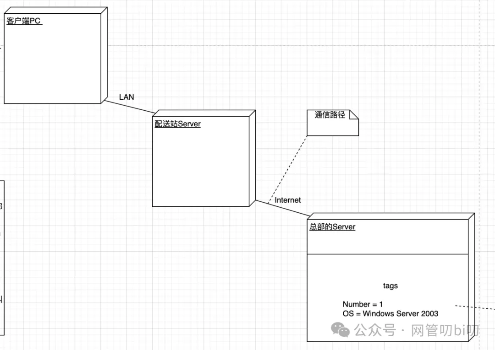

用部署图表达系统的架构相对来说比较简洁，主要是因为节点中的Tags能帮助我们表达很多内容，部署图的语法不只这么多，但是掌握到这种程度就完全够我们做需求调研以及画架构图了。

#### 工件

工件（Artifact）也叫物件，它在部署图中代表软件系统中的可独立运行的软件，比如说我们描述IT架构中，员工访问系统必须在员工电脑上使用Chrome浏览器，用工件这么表示。

有的UML文档里说工件是用来表示软件系统中的物理实现单元，例如可执行程序、库、软件组件、文档和数据库都可以用工件表示，不过我一般画架构图时只用它表示可执行程序，数据库、软件模块能等则用构件图表示。

### 构件图

构件图也叫组件图，属于对构件图英文术语 Component Diagram 的不同版本的翻译，要想搞清楚构件图必须先搞清楚什么是构件，它有以下几个特点：

- 能实现一定功能，或者提供一些服务。
    
- 不能单独运行，要作为系统的一部分来发挥作用。
    
- 可单独维护、升级、替换而不影响整个系统。
    

在技术类的文档里常会看到两种表示构件图的框框

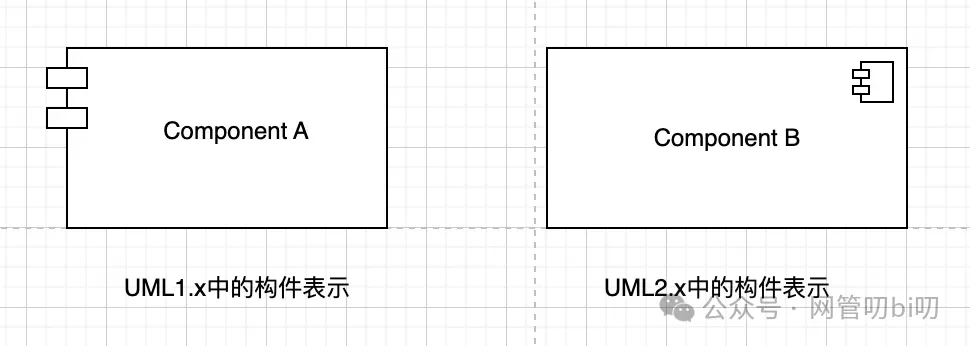

我一般只使用第二种，现在大部分画图工具里都是有提供UML2的这种构件图元素的。

构件与构件之间如果有依赖关系，表示方式与类图中类与类之间依赖关系的表示方式相同，都是使用一个从用户构件指向它所依赖的服务构件的带箭头的虚线表示。如下图所示，其中“ComponentA”为一个用户构件，“ComponentB”为它所依赖的服务构件。

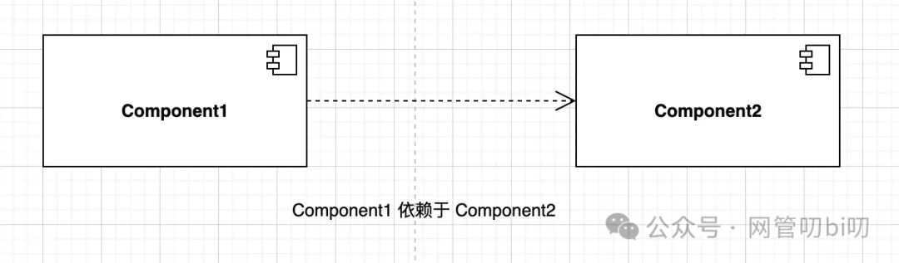

如果一个构件是某一个或一些接口的实现，则可以使用一条实线将接口连接到构件，表示构建提供的服务，同理构件需要什么样的服务也可以在构件图中表示出来。

下面这张图表示了构件1 提供了什么服务，以及需要别的构件提供什么服务。

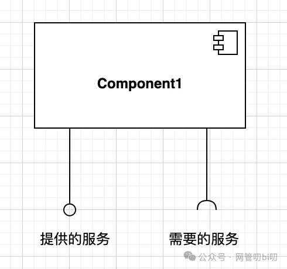

两个构件的对接可以像下面这张图里这么表示

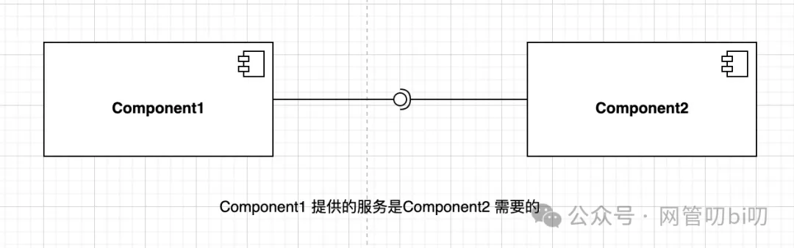

这张图表示Component1提供的服务是Component2所需要的。

在构件图和部署图组合使用表示系统架构时，我只在需要标出构件提供了什么服务被其他部分使用时才使用这个画法，一般在架构图中只表达出组件间的依赖关系。

最后再说一下为什么把数据库归到构件而不是工件，这里我的经验是数据库虽然的确是可独立运行的软件，但我们这里表达的是OA系统，那么对于业务系统来说数据库只是系统的一部分，通过数据库自身无法独立完成业务系统的功能，所以我倾向于在画业务系统的架构时，用构件图来表示数据库、消息队列等具有基础支撑性质的应用。

## 总结

部署图和构件图可以帮助我们获取和描述软件架构方面的要求，部署图的主要目的是在物理层次上做整体的系统规划，部署图的节点表示物理上的一类设备，artifact 工件则表示一个可独立运行的应用程序，构件图则有以下几个特点：

- 能实现一定功能，或者提供一些服务。
    
- 不能单独运行，要作为系统的一部分来发挥作用。
    
- 可单独维护、升级、替换而不影响整个系统。
    

节点、artifact、构件均可以添加Tags 来进一步说明配置情况，格式为“配置项=配置值”，下面两张图汇总说明了部署图和构建图的常用语法。

在节点中放入artifact或者构件，表示artifact 或者构建部署在这个节点上，而artifact中包含构件则是想突出表示artifact内部的某个提供主要功能的构件。

### 部署图要点

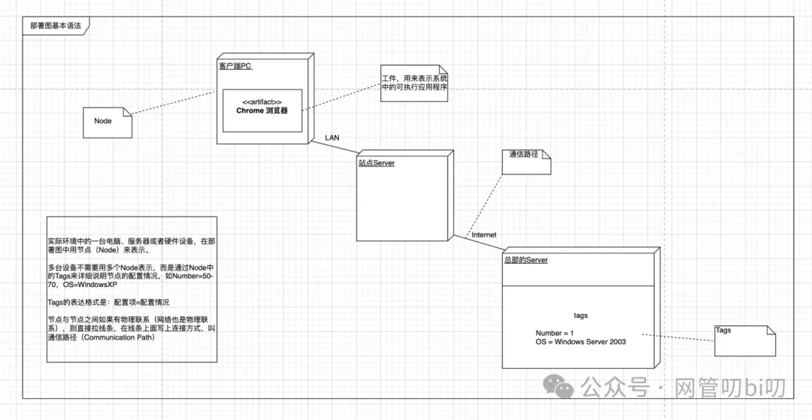

### 构件图要点

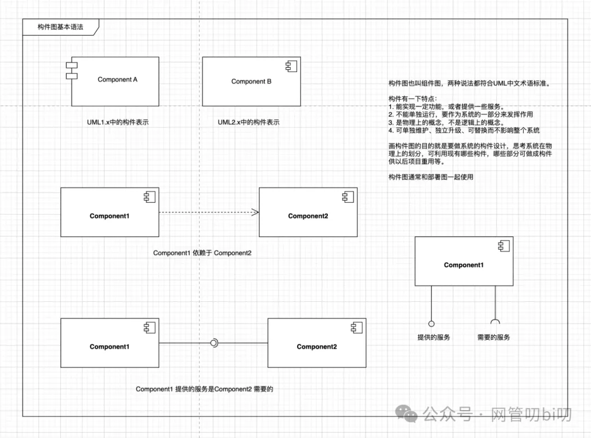

### 微服务版本的OA架构图

现在是时候揭晓我们在本章开头留下的思考题的答案了，该怎么画微服务架构的OA系统呢？下面是我的答案。

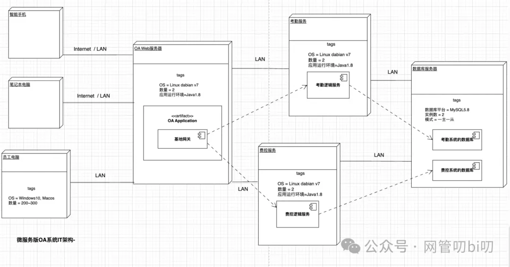

部署图和构件图画出来的系统架构虽然不如网上那些五颜六色的架构图好看，但是因为其标签的语法能够用有限的图形表达出丰富的内容，让整个架构图显得既简洁又专业，大家多加练习使用就能感知出来它们真的特别适合用来表示系统架构。

**下一节课我带大家从头开始，从拆解系统需求一步一步画出系统的架构图。**