上节课《[**从零开始学会画系统架构图**](http://mp.weixin.qq.com/s?__biz=MzUzNTY5MzU2MA==&mid=2247500740&idx=1&sn=d8ca896a4ac07689c7b7a429dc8e6bc8&chksm=fa831253cdf49b454b2d93f516808aaa628ed4a091264b49b701e0bffe0665139721bc63459d&scene=21#wechat_redirect)》中我给大家介绍了画系统架构图的通用公式，用它可以拆解任何系统，帮我们画出整洁专业的系统架构图。

上节课我们大部分内容是用实际的例子给大家讲清楚这个公式的底层逻辑，以及详细地交待了画架构图的两个必备基础语法，本节我们从理论走向实践，带大家一起用公式，拆解系统性需求、画系统架构图。

在画架构图之前请大家一定确保有仔细学上一节关于UML部署图和构件图的内容，尤其是语法，在画图的时候如果忘了一定时不时的回到上一节课去确认一下自己画的对不对。

这节课我们就拿上节OA系统--微服务版架构图（下图）来给大家演示怎么用一步步画出专业且整洁的架构图。

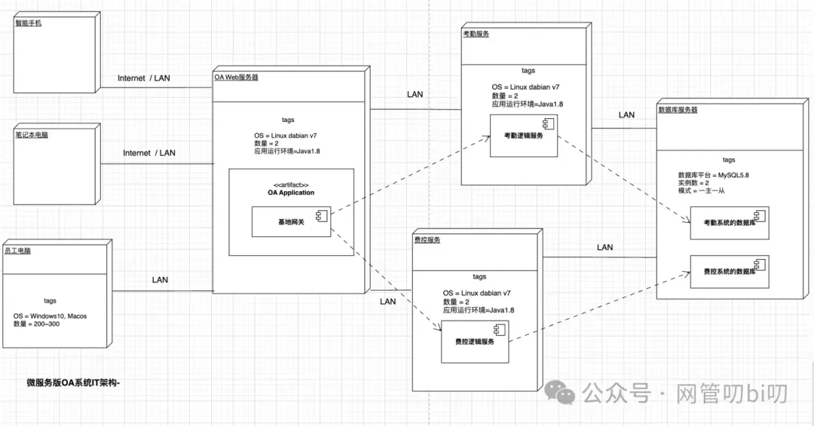

上节课我们说过，架构图存在的意义是它能以一种直观的表现形式表达系统的非功能性需求，比如系统安全性、易用性、性能方面的需求以及系统在已有IT资源利用性和已有系统兼容对接上的需求都算是非功能性需求。

非功能性需求怎么获取呢？主要是通过与客户/甲方/PM进行沟通（跟谁沟通取决于你做的内部还是外部项目），在进行整理归纳梳理出来的，这个沟通环节我就不跟大家还原了，牢记画任何架构图前，我们都需要先确认系统关于架构的要求，客户想要达到什么样的效果。下面是本次实战示例的系统架构信息。

该系统是一套为公司员工提供考勤和费用报销线上化处理的在线OA系统，其IT架构方面的需求信息如下：

1. 该系统支持手机、笔记本和办公台式机三种终端登录到系统，其中手机、笔记本以互联网的方式连接系统而台式机只能由公司内网链接系统。
    
2. 公司有大概200名员工，根据工种不同配备的办公电脑系统为Windows 10 或者 MacOS。
    
3. 系统采用分布式架构由OA的业务Web服务、费控服务、考勤服务组成，减少相互之间的耦合未来可独立迭代升级。
    
4. 考勤和费控服务的数据可以相互共享，数据库都部署在同一个MySQL数据库主从实例上，MySQL版本为5.8
    

其中前两个需求属于需求方对系统的要求，而3、4中关于架构细节方面的要求更大可能是技术部门内部对系统建设的规划性要求，毕竟业务方也不管你系统运行环境是什么版本是不是微服务之类的。

那么我们接下来就按照上面获取到的系统架构信息，使用部署图和构件图把他们都表达出来--部署图是架构图中偏物理维度的元素--比如服务器、接入客户端之类的元素，构件图可以先简单理解成服务器上运行的各种组件。

我们先来画节点，部署图的节点可以在draw.io绘图元素去UML菜单下直接选择然后拖拽到画布上。

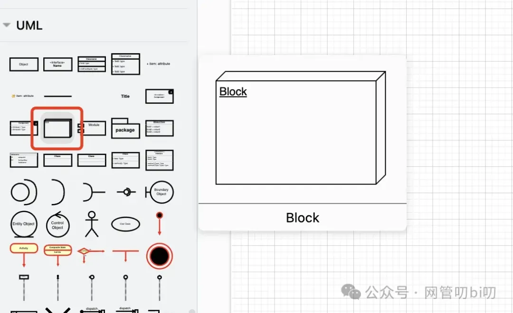

拖拽到画布后，可以把它调整成我们想要表示的元素--在架构图里无非就是系统的各种客户端或者各种服务器。

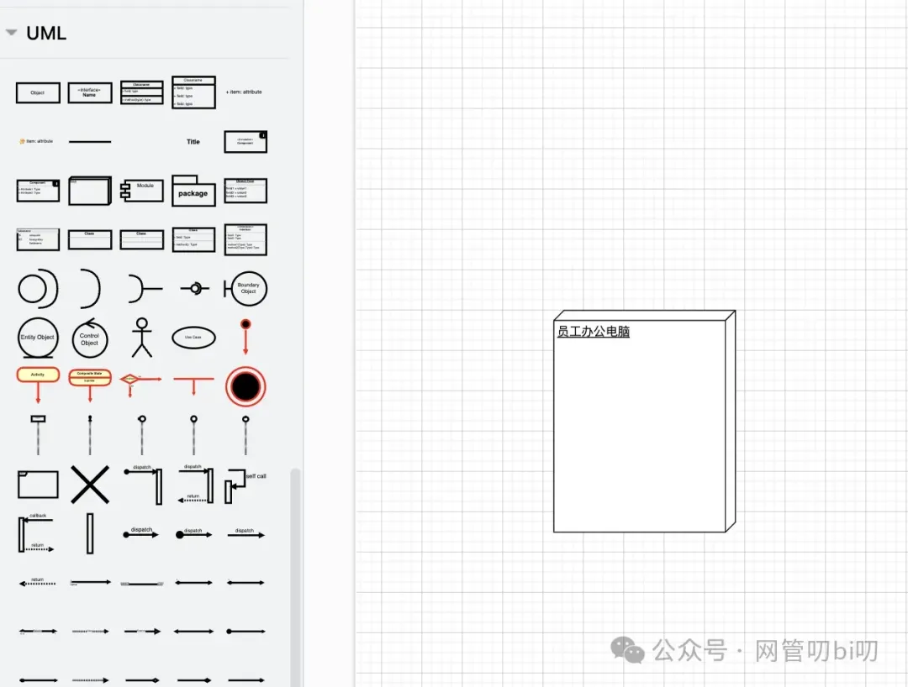

节点通过tag详述自己的数量、类型之类的特征信息。 在draw.io里我们需要自己组装带tag信息的节点，分为下面两步，先拖拽一个分割线到节点上去。

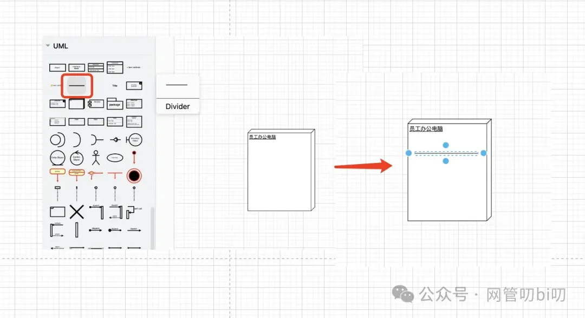

然后在拖拽一个文本框到节点上，用于书写节点的tags信息。注意文本框大概率需要调整一些文字排列、大小等样式，我们可以选中文本框后在右侧样式调整区选择文本Tab后进行调整。

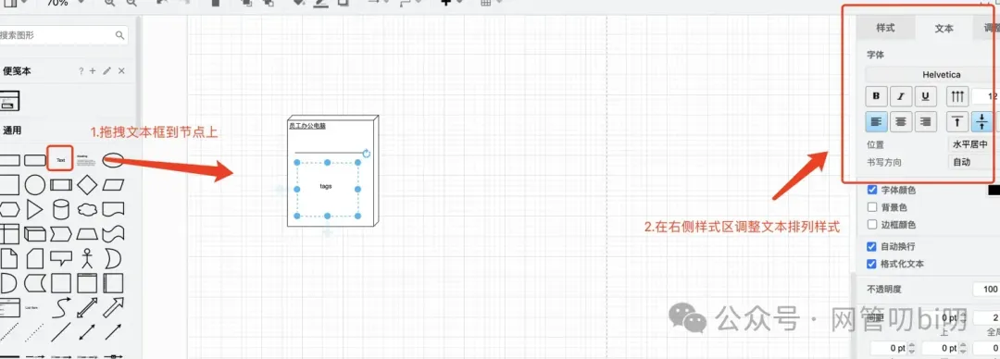

这样我们就能组合出一个带tags信息的部署图节点 了

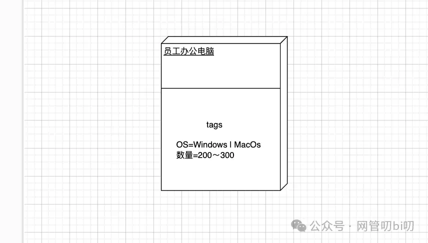

因为部署图节点在画架构图的时候非常常用，每次这么组合也不是事儿，太浪费时间了，这里我给大家再说一下之前提到过的一个技巧，即draw.io支持把自己创建的图形加入到我们自己的收藏夹。

方法很简单，单击并拖拽鼠标框中我们刚才组合好的带tags信息的节点，然后点击左侧便笺本菜单右侧的+号

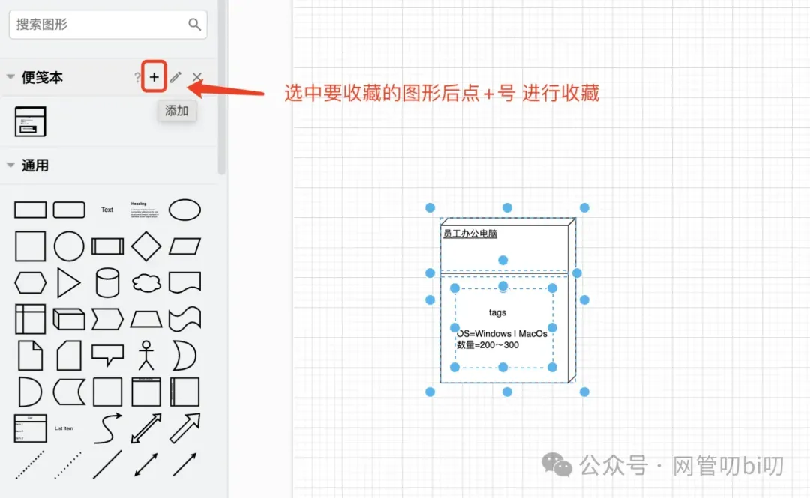

这样就能把我们自己画的图形收藏在这里

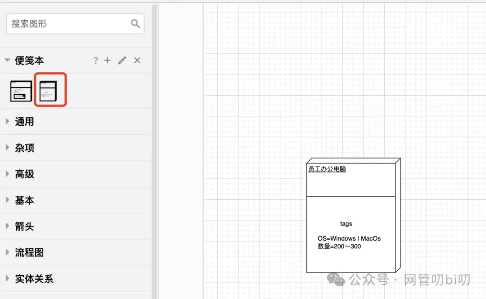

下次再用到我们已经收藏的图形时，只要点击这里已经收藏过的图形的图标就能把它加到画布上去，能节省我们不少时间。

部署图的节点是架构图的基础元素，我们示例架构图的其他元素都会在这个节点的基础上加东西表现出我们想要表达的架构方面的信息。

观察上面的架构图，我们发现除了基本的带tags信息的节点外，还有一些是带构件图的节点，以及带工件的节点。

接下来我们演示下面这个带构件图的工件的服务器节点该怎么画

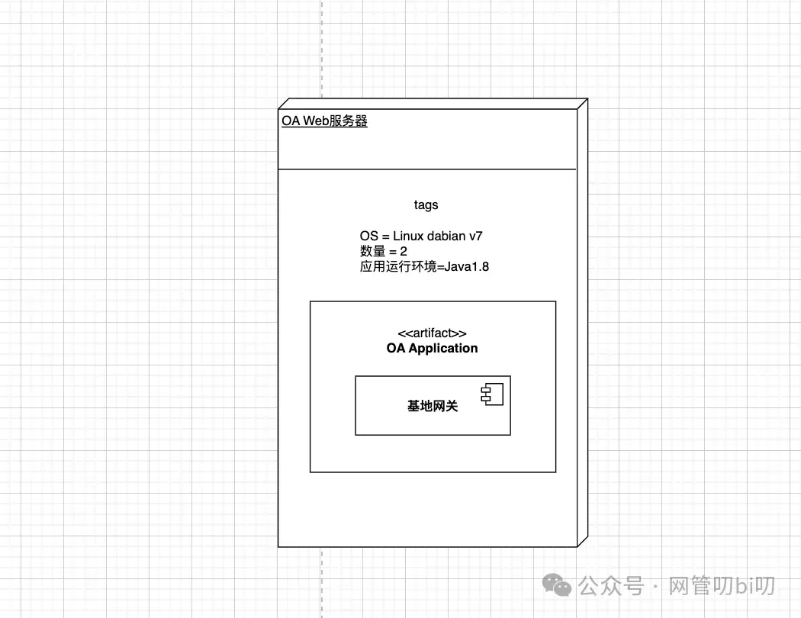

工件（artifact）在draw.io里也没有现成的绘图元素，好在工件比较好画，用矩形框并在里面标记出工件信息`<<artifact>>` 就行啦

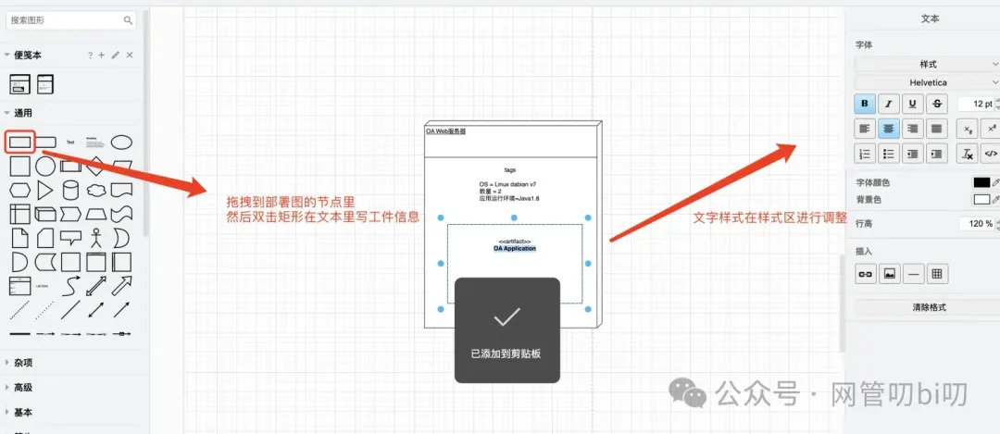

接下来给这个节点添加构件，构建图在draw.io里有两种供我们选择

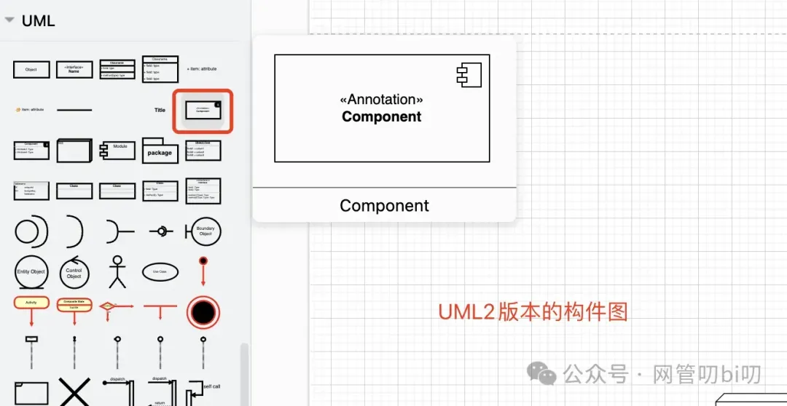

这种构件图是UML2.x版本语法里构件图，还有一种是下面这样UML1.x版本语法里的构件图。

这里我们还是选择紧跟语法更新，使用UML2.x版本语法里的构件图。

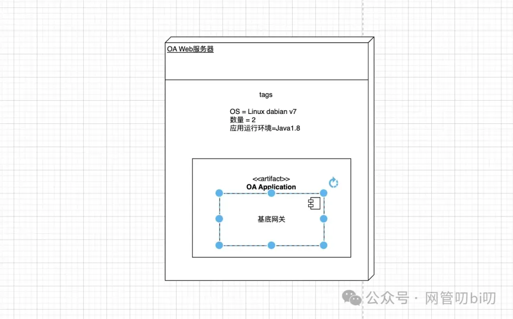

在工件里添加上构件，表现出它里面包含一个“基底网关”，这样整个OA Web服务器在架构图里就表达出来啦。

通过上面的演示过程我们演示了怎么画架构图中的各种节点，怎么画架构图中的某个服务的具体架构细节，这两个学会后我们就具备了用部署和构件图表示系统IT架构的基础技能啦，要完成整个架构图只需要先找出一张纸，把系统的IT架构想清楚，一项项的列出来：

- 客户端接入系统的方式有哪些
    
- 整个架构中有多少个模块或者叫服务
    
- 每个模块负责什么
    
- 模块和模块间的调用关系是什么
    
- 每个模块占用的IT资源（节点数等信息）和依赖软件环境是什么
    

思考上面这几个问题，并把答案一一列出来之后我们就可以把这些细节翻译成部署和构件图从而描述出系统的架构了。

比如还是拿我们上面的例子，我们可以先通过上面几个问题了解系统的背景、收集信息来回答上面的这些问题。

一套为公司员工提供考勤和费用报销线上化的在线OA系统，IT架构信息如下：

1. 该系统支持手机、笔记本和办公台式机三种终端登录到系统，其中手机、笔记本以互联网的方式连接系统而台式机智能由公司内网链接系统。
    
2. 公司有大概200名员工，根据工种不同配备的办公电脑系统为Windows 10 或者 MacOS
    
3. 系统采用分布式架构由OA的业务Web服务、费控服务、考勤服务组成
    
4. Web服务作为接入层依赖考勤服务和费控服务来处理员工客户端发起的考勤、请假和费用报销事项。
    
5. 考勤和费控服务的数据库部署在一个两节点的MySQL数据库服务器上，MySQL版本为5.8
    

之后我们只需要把上面列出来的架构信息一一翻译成上面介绍的部署图和构件图：

- 先画出要接入系统的客户端，客户端要与OA Web 服务交互就用连接线把他们连接起来，标出连接的方式--公网还是内网连接。
    
- 同样的OA Web 服务与费控服务和考勤服务模块有交互、费控和考勤服务的数据存储在数据库服务起上，那么他们之间都要用连接线连起来。
    
- 同时系统的服务之间还有依赖关系，那么我们就采用虚线箭头从依赖节点指向被依赖的节点标记出服务间的依赖关系。
    

按照上面的步骤我们就能画一个类似下面的架构图来

虽然不像网上有些分享的架构图那么酷炫，但是好在大道至简，即使没接触过UML里部署图和构建图语法的人也能从这个图也能快速了解系统架构的详细情况。同理只要了解了部署图和构建图的语法和画法，每个人也都能向上面这样画出简洁专业的系统架构图来。

好了关于架构图的动手实战演示就到这里了，我把上面这个架构图放到了下面这个仓库里，大家可以在画的时候可以拿来参考，一开始画的不好的可以从我分享的这个画布中先来拷贝一些元素，慢慢练习。

仓库地址：https://github.com/kevinyan815/developer-omni-illustration-tutorial

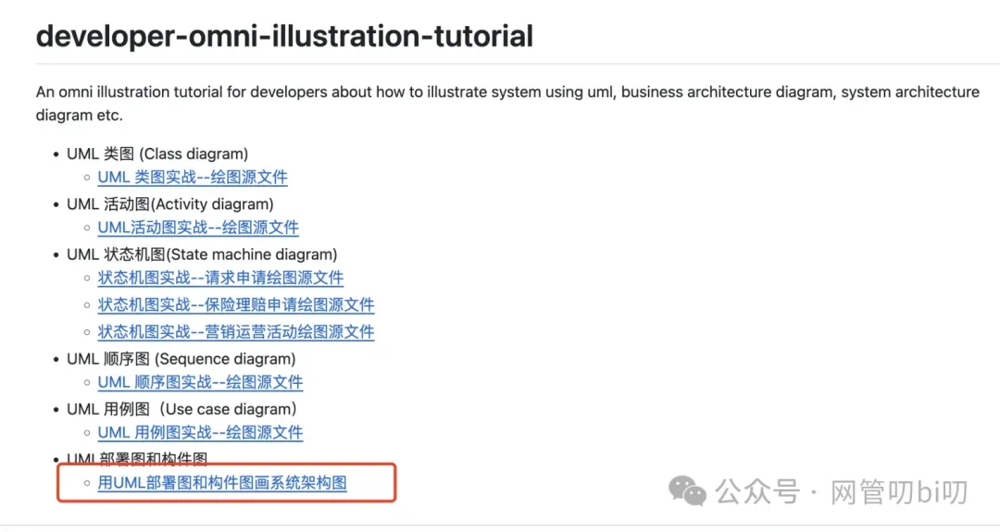

大家记得动手练起来吧，记得上面我交给大家的关键步骤哦--**按照我上面说的步骤先把你要想画架构图的系统的架构细节用我上面给出的那个公式一一列出来，然后再翻译成架构图**。