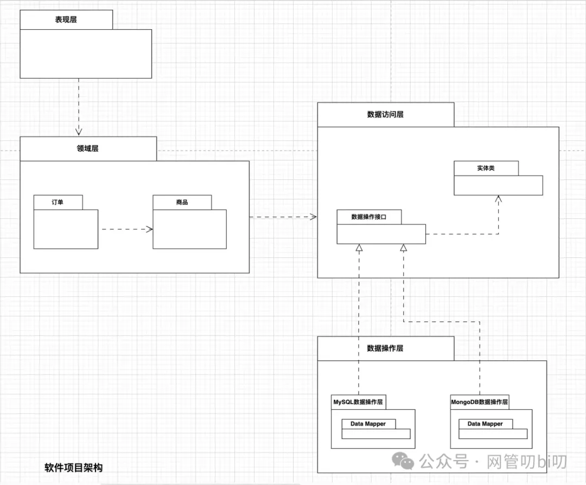
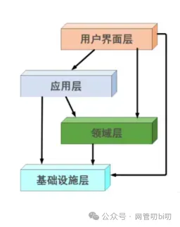
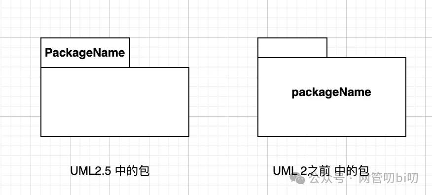
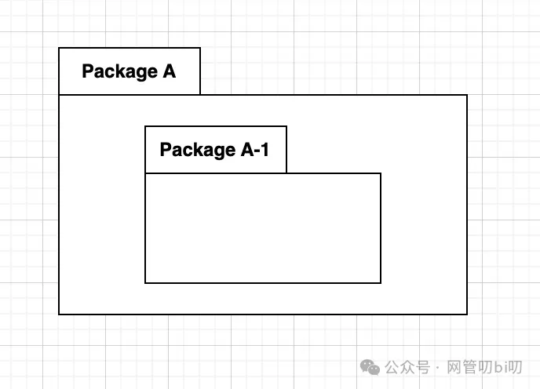
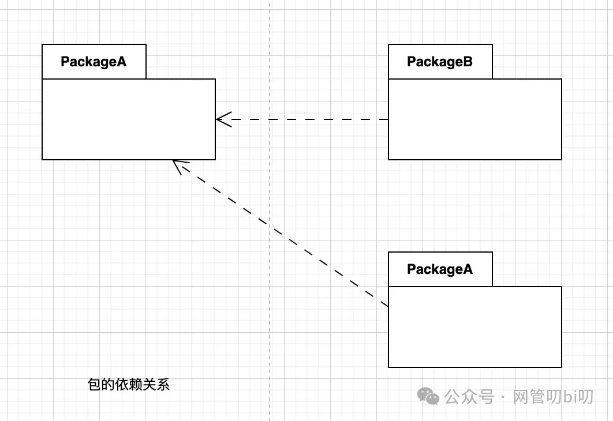
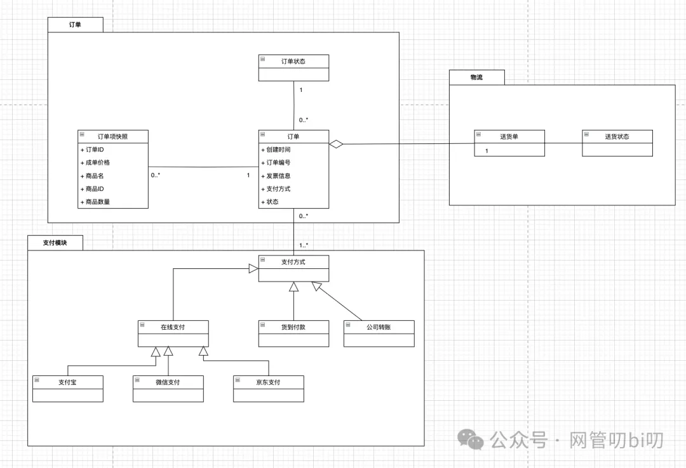
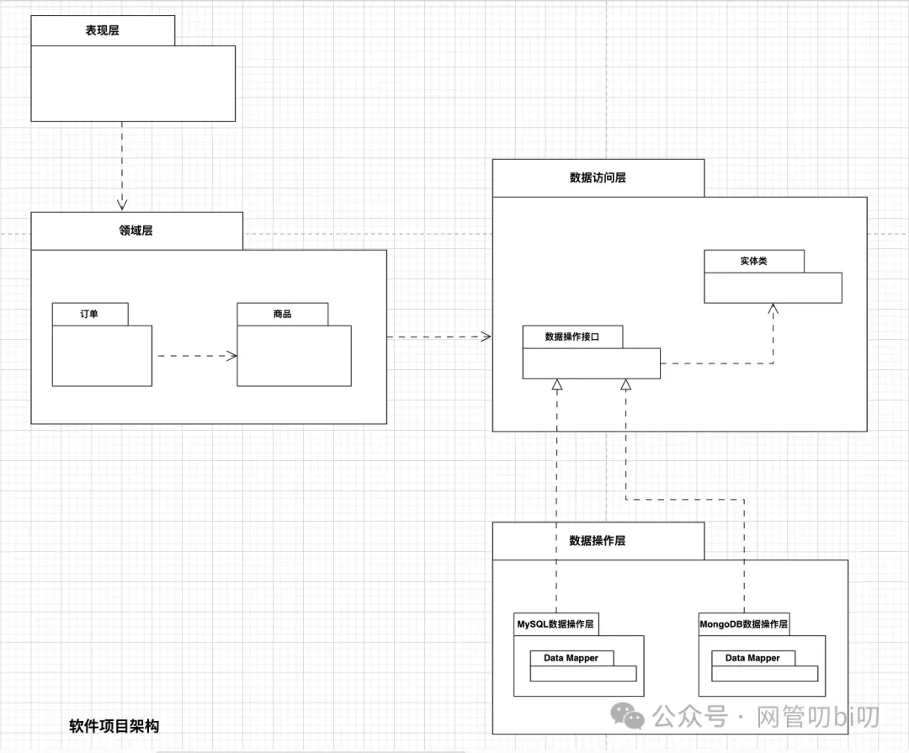
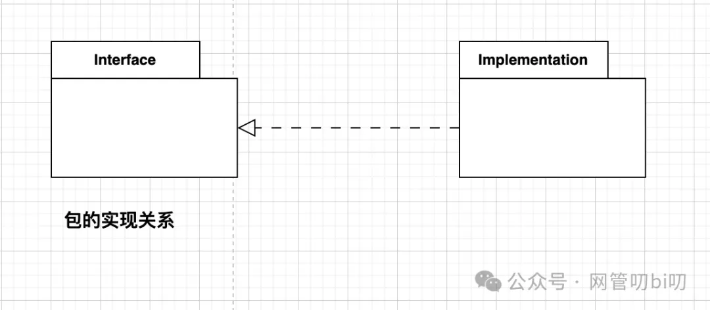
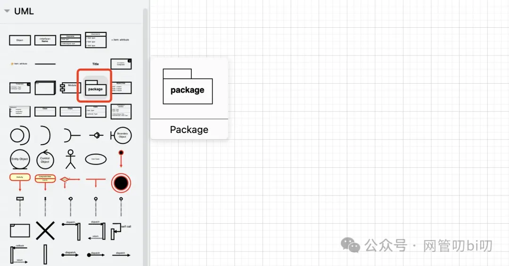
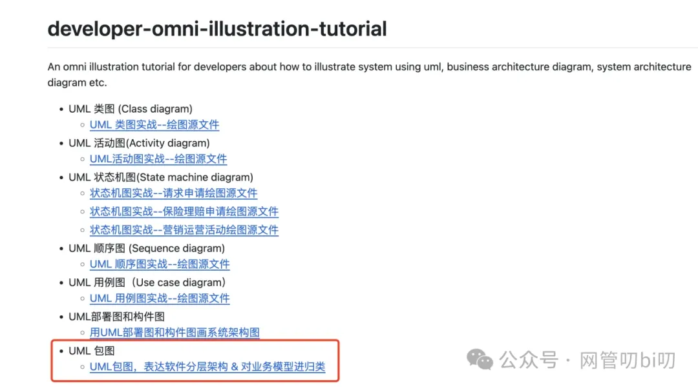

这节课来讲包图，包图一般有两大作用，其一是把对类图按照模块进行归类，防止类图太多了，模块和模块之间分不清楚。不过对于现在绘图软件的功能来说，这个作用聊胜于无，加不加包图好像也没太大区别，不用包图也其他办法让整个系统建模的类图不凌乱的。

第二个作用是能很好的表达出我们软件项目的分层设计。

如果你能用下面一张图说清楚你们项目的分层设计，那肯定比新进项目的弟弟妹妹问你“咱们项目是什么设计风格，代码该怎么写呀？” 你答曰：“MVC” 要强的没影了。

当然，画图不是目的，你能画出来证明你对项目的分层设计有详细的认识而且能总结出方法论来。新进项目的人看了你的图后也会能马上领悟到你们项目的代码应该按什么规范来写，其实上面这个图就是典型的分层架构的一个详细示例。

但是上面这个图整的太宏观，如果不讲出个所以然来让大家理解一致的话，两个人写出三套风格的代码也算是正常......

这节课就跟大家详细聊一些这方面的经验，首先我们还是会把包图的语法讲一下，以及用它怎么按照模块组织系统的类，然后再重点跟大家聊用它表达软件设计的方法。

## 包图

在对要开发的项目进行UML建模的过程中，模型的数量可能会很快增长，随着模型数量的增加这些模型既不好组织也不利于其他人浏览，因此就有了UML中专门用来组织模型的图表--包图（Package Diagram） 上面说的建模中的模型指得是UML中的各类元素：类图、接口、构建、节点、用例，包，也就是说包图可以用来组织一切UML模型。不过在实际应用中包图一般只用于做两件事：

- 将散乱的类图分门别类的组织起来
    
- 由宏观到微观的分解问题，常用于表示软件程序的层次结构设计
    

下面我们来看一下包图的UML语法，然后再来演示怎么用包图做好这两件事。

## 基本语法

包图英文名叫Package Diagram， UML图中包用一个类似文件夹的图形表示，不同的UML工具会稍有不一样，有的是在包左上角的便签位置书写包名，有的包名写在包的中心偏上方。

第一种是UML2.5中的语法，不过实际使用中视你使用的UML工具为准，用哪种包区别不大。 包图就是由这样一个个包组成的，最简单的包图是只有一个包的包图。包图中有多个包时，包与包之间有一定的关系，比如包的归属关系，就是包的嵌套来表示的。

包图中最常见的包的关系是依赖，表达方式和类的依赖关系类似，使用虚线箭头指向被依赖的包。

上图PackageB、PackageC分别用虚线箭头指向PackageA，这表示它们俩依赖于PackageA。

我们在使用包图时能经常用到的语法就这么多，是不是算我们已经见过的UML工具里最简单的了，虽然包图还有其他语法，但实际应用中我们用不到，所以就不浪费功夫在用不到的东西上了。

## 用包组织类图

在面向对象软件开发的过程中，类显然是构建整个系统的基本元素。但是对于大型的软件系统而言，其包含的类通常是成百上千个，再加上类的各种关联关系会让整个类图的复杂性大大超出人们对系统的理解和处理能力，为了能分门别类地管理这些类，我们有时候会选择引入“包”这种分组元素，这个时候包的作用是：

- 对语义上相关的类进行分组，把功能/业务领域相关的类放在一个包中。
    
- 提供封装的命名空间。
    

有一种说法是，在软件设计建模中UML图中的一个包对应类似Java项目的一个Package，在建模完成后再转换成Java项目中的包和类，这一点我觉得在实际工作中很不现实，所以使用包图和类图进行软件设计建模时建议不用做那么详细的设计，应该是UML图表达主干思想附以文字说明更合适，否则项目初期阶段代码结构和实现经常改来改去，大概率UML图是没办法及时更新的。

下面是用包图把一个系统的订单交易相关的类进行了重新组织，每个类都放在了自己相关的包中。

对于类图的组织，不同的人有不同的喜好，可以用包也可以不用包，并没有标准答案，这里只是给大家普及一下业内常用的方式，都了解一下也更容易看懂别人画的图。

事实上有的人不喜欢一张类图中有太多类，会倾向于把上面归属于一个包的类都单独画一张类图。有的人则喜欢把所有类都花在一张类图上，从而能在一个地方看到系统的全部类，而且因为现在UML工具都可以随意缩放和拖拽滑动，就算把所有类都放在一张图上阅读起来也很方便。

## 用包图进行软件设计

在实际的工作中，对需求进行分析、业务建模的阶段用到包图的机会并不多，就连上面介绍的用包图组织类图的场景中我们可以看到它起的作用也不大，完全可以不使用包图也能组织好类图。但是在软件设计时尤其是做软件架构设计时，包图的利用率就会变得非常高。

这主要是因为软件架构设计阶段要理清楚下面这几件事

- 软件程序设计中经常涉及到各种层的划分，每个层都可以对应到一个包
    
- 想清楚每一层中的主要构成部分（包的嵌套）
    
- 软件架构设计时要划分清楚各个层的“访问和依赖关系”（包的依赖等关系）
    

上面的分析中，每个层如果我们理解成一个模块，用构件图表示只能满足第一层软件设计的要求，对于模块内部构件图并没有语法来支持表达，而包图的语法对表达软件架构设计就很合适，可以理解为包图是把构件图剖开展示出了其内部的主要结构。

下图是用包图表示的一个常见的软件项目的架构

使用过Spring 和 Mybatis 开发软件项目的人对这个结构应该很熟悉，数据访问DAO层里的包“数据操作接口”中都是数据操作的接口，接口会返回与项目数据表对应的实体类，这里只是接口的定义真正操作数据库的是由“数据操作层”中各个实现了数据操作接口的Data Mapper实现来做的。

这里我们有用到了一个之前没有讲到的语法--包的实现，表达方式和类图的实现关系一样，也是使用虚线三角箭头由实现指向接口。

Interface包里面的都是接口或者抽象类，而Implementation包里的内容是对Intrace包中接口的实现。

## 画图参考

包图在 draw.io 绘图元素区的UML菜单下的这个位置

咱们使用包图不管是组织业务模型还是用它画软件分层架构需要的语法点都不多，各种表示不同含义的连线和箭头该怎么画咱们在类图的画图教程里有详细说过，这里就不再过多重复啦，还是先把我画的示例发给大家，大家实践时可以先拿下来参考，拷贝到自己画布上进行调整也是很方便的。

本节内容中的所有绘图其源文件都已经上传到仓库，大家可以下载使用。 仓库地址：https://github.com/kevinyan815/developer-omni-illustration-tutorial

## 总结

包图本来的主要作用是用来组织模型，不过在实际应用中，用于项目的软件架构设计的场景多于需求分析的场景，在做技术评审时，假如是新启动的项目要对团队成员说清楚项目的代码结构时建议使用包图对项目的软件架构进行讲解，这样理解起来更生动也更深刻些，有利于研发团队内部快速建议统一的标准规范。