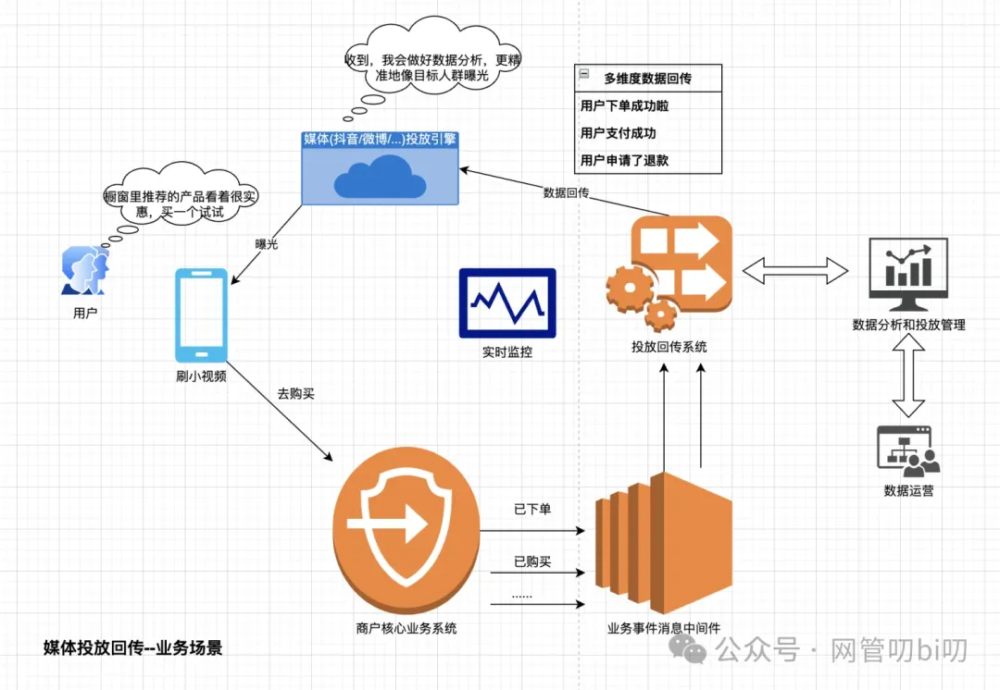
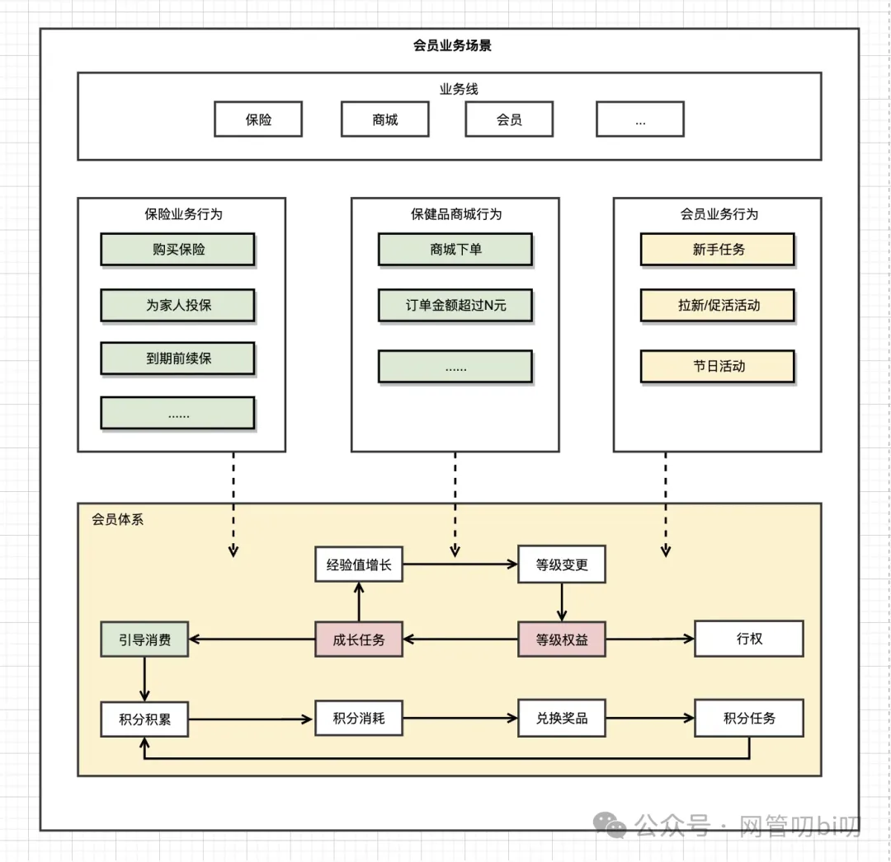

上一节课《[**自从有了OKR，没有程序员能逃开汇报这座“五指山”**](http://mp.weixin.qq.com/s?__biz=MzUzNTY5MzU2MA==&mid=2247500897&idx=1&sn=a26a8222bd0d17863c77fcc569a779de&chksm=fa8315f6cdf49ce05043d19ffbfbe04a792ab254b4212eceb156b9b42c371dc77346e60c902d&scene=21#wechat_redirect)》我们聊到了为什么在OKR大行其道的当下，每个程序员都不得不被这些汇报和复盘驱赶着往前走的环境因素。也大概聊了下做技术类汇报的原则是以PPT等多数人能理解的方式快速与听众建立统一语言，让他们知道我们将要表达的是一个什么样的事情。

从这一章开始我会花两节时间说一些让大家能应付这些工作的技能。

这两节的内容看完虽然不能让你成为PPT架构师，但也能增长一些营销自己的能力。

这一章节就来讲讲技术类PPT中常用的第一种图--业务场景图，下一章节教你从零学会画业务架构图。

## 业务场景图

业务场景图，顾名思义就是能表达出整个业务概貌及其作用的一张图，它不像前面学的UML图那样有明确的语法，更多的是靠个人自己的经验来画。 这里我总结下我个人关于业务场景图的一些经验给大家。

系统的业务场景图主要表达两个概念：

- 整个业务的目标是什么--即业务场景是什么。
    
- 系统在业务场景所处的位置--能提供什么来实现业务场景。
    

我用两个例子给大家讲解一下怎么表达这些，另外还会介绍一下我自己总结的一套画业务场景图的简易方法给大家，帮助大家快速搞定这些占用写代码工时的事情。

## 案例一：媒体投放点位回传系统

首先我们看一个媒体投放回传系统的案例，何为媒体投放回传呢？

就是我们平时在刷社交媒体的时候，总是会有一些商品推荐类的广告出现在我们的信息流中，这些就是商户在社交媒体上投放的广告位，一般社媒会按照：曝光、点击、商户下单、支付等行为收取不同的费用，那么用户在商户系统的行为就需要商户自己的业务系统回传给社交媒体的投放引擎，一般分两大类：

- 用户正向行为，比如：下订单、支付订单等
    
- 用户负向行为，比如：用户下单后30分钟未支付、用户申请退款等
    

具体的回传点位社媒的投放引擎会有专门的文档说明，每个行业不太一样，不过主要都是上面说的两大类的行为。

商户把这两类的行为回传后，媒体的投放引擎会根据这些调整曝光策略。

现在我们要通过一张图说明这个业务场景同时还要表达出我们建设的系统在这个场景中的作用，这张图该怎么画呢？下面是我给出的一个示例：

上面这个业务场景图表达的是用户刷手机玩抖音、微信等社交媒体时刷到商品推荐广告后进行进行点击、下单、购买等行为时，我们的系统是怎么跟媒体的这些投放引擎进行点位回传对接的。

同时我们还表达出了系统在整个业务场景中的作用：

- 首先是业务目标，通过投放回传系统，让业务更容易进行投放策略运营，达成投放转化目标。
    
- 其次是突出通过新建立的投放管理系统与现有核心业务系统进行解藕，让两个系统都能更专注于自身的业务目标 ，减少相互影响，更高效地支撑业务。
    

这就提炼出来了我们系统的建设目标了：负责公司媒体投放的统一管理和运营，降低对接渠道投放的系统成本。

这个系统负责的事情是媒体投放数据回传，整体来说相对单一，跟公司里的其他业务往来也没有特别复杂，大部分是单向的消费核心业务的业务事件来完成的，下面我们再看一个业务相互之间结合比较紧密的示例。

## 案例二：会员业务场景

这是一个公司会员体系的业务场景，首先大家思考一个问题：产品的用户和会员有什么区别？

其实在产品设计的逻辑中，用户属于使用产品的人的基本标识，没有用户很多产品的行为无法进行，而会员更多被设计一种用户的身份象征，同时结合一些积分、任务、等级成长、福利活动等运营手段让用户感知会员这个身份的存在，从而达到产品用户的促活和拉新。

这一点在运营产品的公司中非常重要，不活跃的僵尸用户和活跃用户在商业上的价值有云泥之别。 好了，了解完会员通常在产品设计中的作用后，我们接下来通过一个简洁的业务场景图来描述出会员的业务场景，同时通过这张图我们能把整个会员体系中有什么玩法，它跟公司其他的业务怎么结合表达出来。

通过上面这个业务场景图我们可以马上大体知道，这家公司的主营业务是什么，会员的业务场景是什么。

这是一家做大健康方向的公司，主营业务有保险中介和保健品商城，会员的主要增量来自这用户在这两个业务板块的用户消费行为，此外会员业务本身还会通过一些运营活动进行拉新。

用户在成为会员进入会员体系后，可以参与节假日的会员专属活动获得节假日福利，可以通过积分任务的参与积累经验值进而完成等级的提升，享用不同的权益。

通过这些方式即让用户获得了身份认知也提高了其自身的活跃意愿，在公司层面则是通过这些运营手段完成了促活拉新以及更长远的用户潜在消费意愿的积累。

## 业务场景图的推荐画法

通过上面两个案例给大家讲了业务场景图的一些用法，其实除了在PPT中使用，这些业务场景图在很多技术文档里也适合使用。

很多技术文档和产品需求文档里在开篇都需要描述清楚项目、需求的背景，这里我们依然可以用上面讲的业务场景图，再配上一些描述文字说明我们要在此次需求中要做的事情即可完成文档里项目、需求背景的编写，这样让其他处于工作流后续环节的同事也能快速了解需求或者项目的背景。

接下来为大家总结几点画业务场景图的要点，遵循这几个要点都能快速画出简洁、专业的业务场景图。

**推荐采用在大方框里套格子里面再堆砖块的方法，适用于任何业务场景图的绘制**

- 大框用来表达整个业务范围，既可以是整个公司的业务范围，也可以是某个系统的业务范围
    
- 如果大方框代表整个公司的业务，小格子就代表公司的子业务，同理大方框是某个业务系统代表的业务，它里面的小格子就是该系统的各个业务模块。
    
- 砖块用来表示一些有代表性的业务行为
    

画法确定了，在内容上我们还要突出三个重点，重点体现三部分的内容

- 流量入口
    
- 与其他兄弟业务系统/模块的交互关系
    
- 业务自身玩法的内循环（有哪些业务典型的业务行为）
    

一般来说流量的入口放在图的最上方，单独一个跨度为整个图宽度的格子。其他部分在其下面，按照实际需要遵循简洁、专业的原则进行排列即可，整个图中可以用一些箭头表达出用户从流量入口进来后的业务的流向。

这几个原则不需要绘画技巧，只要我们自己理清了业务场景后，按照这里推荐的一些技巧都能快速快出一个简洁、专业的业务场景图。

## 最后

恰逢年中，如果各位也正好有年中的汇报、复盘需要做，可以尝试一下本节教的方法看看效果，顺带也练习一下自己的表达能力。

下一节课我来教大家画业务架构图，这两节的绘图文件会在下节课的时候统一整理上传。