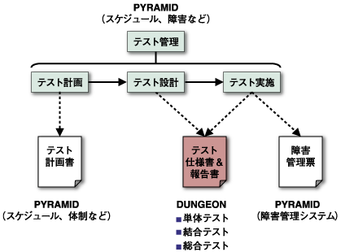
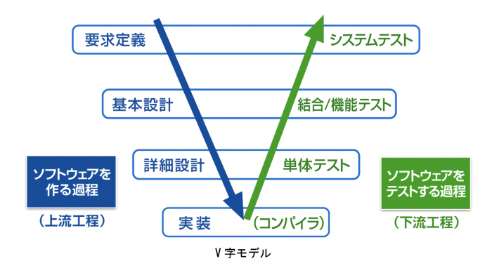
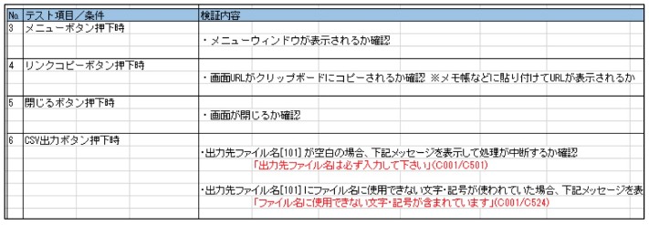
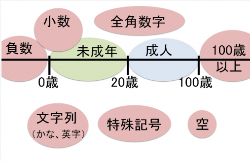
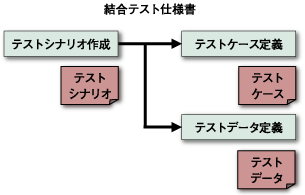

# テスト

## [単体試験](https://wa3.i-3-i.info/word1557.html)

「合体前の部品はそれぞれちゃんと動く？」を確認するテストです。

### 単体テストの観点と手法

#### 条件網羅テスト

おそらく最も一般的なテスト。
ロジックの条件を網羅できるようにテストケースを設定する。

#### 境界値テスト、異常値テスト

異常値テストとは、その名の通り異常となる値を入力してエラーとなることを確認するテスト方法だ。

上記例では、0歳〜99歳までを有効値とした場合の観点をいくつも挙げている。

>・境界値（-1、+1、98、100）
>・小数値（0.01等）
>・全角数字
>・かな文字や英字
>・特殊文字（※）
>・入力なし
>など

### 仕様書の項目と書き方

#### ①入力操作手順

入力データと操作内容・手順を記載する。
違う担当者が単体テストをする場合は、より具体的に書かなくてはならない。

#### ②期待される結果

①の入力操作手順を実施した後に得られるであろう結果を記載（*きさい*）する。

「設計書通りであること」とざっくりと書きたくなるところだが、レビュー者がテストケースを確認する際にいちいち設計書を見なくてもいいように具体的に書こう。

### 結果のエビデンス

エビデンスを残すのは下記の理由があるとされる。

#### ・テスト実施の証拠

​	悪い担当者だとテストを実施していないにも関わらず「テスト完了」とする可能性があるため、テスト実施の証拠としての効果がある。

#### ・レビュー時の確認資料

​	第三者がテスト結果を確認することで、担当者が気づかないような不備を検出できる可能性がある。

#### ・障害発生時の原因分析資料

​	後続のテスト工程で障害が発生した際に、「なぜ単体テストで気づかなかったのか？」という原因分析をするのだが、その際の分析資料として利用できる。

### エビデンスの取り方

#### エビデンスとして残すデータ

​	まず、システム全般としては、テスト前後の**データ状態**と、システムを実行した際のログを合わせてエビデンスとします。

​	Webシステムをはじめ、スクリーン表示があるシステムでは、テスト時の画面の**キャプチャ**をエビデンスとして残します。

#### テストシナリオ・テストケースの作成

​	テストを**おこなう手順**とテスト結果の**評価方法**をまとめたものを、テストシナリオやテストケースと呼びます。

​	結果がテストケースで定められた基準をクリアするかどうかで、テストの可否を決定します。

​	テストシナリオで手順を指定するときに、いつ・どのようにエビデンスを作成するのかも決めておきます。

#### エビデンスの紐(*ひも*)付け

​	エビデンスは、それ単体で効果を発揮するものではなく、必ず**テストケースと結び**つけられる必要があります。

​	そのためには、テストとエビデンスのデータが紐づいていなければなりません。

​	紐付けの方法としては、エビデンスにテストナンバーを振って、フォルダで階層を作成して管理するのが一般的です。

​	そのほか、スプレッドシートに格納(*かくのう*)する、あるいは専用のソフトウェアを使用して管理する方法もあります。

#### 結果・不具合管理表の作成

​	基本的に、結果として記録するべき項目は、**実施日・担当者・テスト結果**の3点です。

​	テスト結果を受けて対応が必要になることを考慮して、その分の項目を合わせて作成しておくことも大切です。

### 代表的なエビデンスツールを紹介

#### [TestRail](https://www.techmatrix.co.jp/product/testrail/index.html)

Webブラウザベースで利用できるツールで、エビデンスやテストケースをはじめとする、テストにまつわるさまざまな情報を紐付けて管理することができます。

#### [TestLink](https://testlink.org/)

外部ツールと連携することで、テスト結果を自動で記録することも可能となります。

#### [PractiTest](https://www.practitest.com/)

PractiTestでは、自動テストからテスト結果、エビデンスまでを一元管理することができます。

#### [Qase](https://qase.io/)

複数人のチームメンバーが同時に参加して情報を共有し、プロジェクトを進めていく機能に優れているのも特徴です。

## [結合試験](https://wa3.i-3-i.info/word1556.html)

それぞれの部品が「合体してちゃんと動く？」を確認するテストです。

[結合試験仕様書＿サンプル](./asset/sample/結合試験仕様書.xls)

### テストシナリオ

一連のテストの流れをパターン化したものです。

テストシナリオでは、どのようなテスト手順にすれば確認したいテスト内容をカバーできるかを考えます。

### 試験内容（テストパターン）

テストシナリオに対する詳細の試験内容を定義したものです。

* テストデータの選択
* 試験実施方法
* 確認する内容
* 実施した結果

### テストデータ

試験準備でセットしておくべきテストデータの定義フォームです。

### テスト結果データ

テスト結果データ（OUTPUT）

### 内部結合テスト

システム内のプログラムを結合させて実施するテスト。

プログラム間の連携毎にテストケースを設定する。

>例）
>　・画面→画面
>　・画面→バッチ
>　・バッチ→バッチ

### 外部結合テスト

２つのシステムを結合させて実施するテスト。

例えば、営業支援システムと人事情報システムとの間のデータ連携は、外部結合テストで検証する。

システム間のインターフェース毎にテストケースを設定する。

>例）
>　Aシステム　→　Bシステムへのデータ連携
>
>　Aシステム　←　Cシステムへのデータ連携

## [総合試験](https://wa3.i-3-i.info/word13714.html)

最後に、システム全体のテストをやります。

言わば、卒業試験みたいなものですね。

具体的には、要件定義で作成した**業務フローをもとに**テストシナリオ（テストの流れ）を作成し、機能要件と非機能要件を満たしているかどうかを検証していく。

### **目的**

* 要件を満たしているか

* 機能間の連携はうまくできているか

* 運用・保守の現実的に問題ないか

### **観点**

要件定義書の内容が全て満たされているかどうかが重要な観点となります。

### **種類**

#### **①機能テスト**

要件定義に基づき、本番環境と同じ状態で要件を満たしているか否かを確認するテスト。

#### **②性能テスト**

テスト対象の性能要件に基づき、システムのパフォーマンス（時間効率・資源効率）を評価します。

#### **③ユーザビリティテスト**

製品の操作性・学習性・見やすさ・理解しやすさ・満足度といったユーザーの求める製品であるかどうかを確認。

「使い方がわかりやすく誰でも簡単に使える」ことがポイントです。

#### **④セキュリティテスト**

仕様書に明記されている機能が、仕様書通り作動してセキュリティが保たれているかを確認するテスト。

#### **⑤回帰(*かいき*)テスト**

システムの改修をした場合、それに伴って変更していない箇所に新たな不具合が発生していないか確認するテスト。

### **流れ**

#### **①計画書の作成**

何のためにテストを行うのか、目的や対象範囲、テスト環境、実施方法、予定など全体の方向性をまとめて明記します。

#### **②環境構築**

テストを実施する環境は、原則として本番と同様。

データも本番と同じものを用意し、想定外の不具合や動作がないかをチェックします。

#### **③テスト項目作成**

実際に行うシステムテストの具体的な項目を作成。

誰がどのテストを行うか、テストをクリアする評価基準等も決定しておきます。

#### **④データ・手順準備**

テストの実施手順や内容、実施用のテストデータを作成。

#### **⑤実行**

準備したテスト環境下で、実行します。

テストケースに基づき操作し、期待値の確認と画面キャプチャや結果を確認できるものを取得。

テスト工程で確認した結果は、全て記録に残します。

#### **⑥テスト内容の評価**

システムテスト全体の計画がうまくいかなかったり、機能しなかったりした場合、インシデント報告（欠陥報告）やその動作原因を探り、特定します。

システムの修正が必要となったときは、追加修正の影響範囲となるテストケースをもう一度行います。

