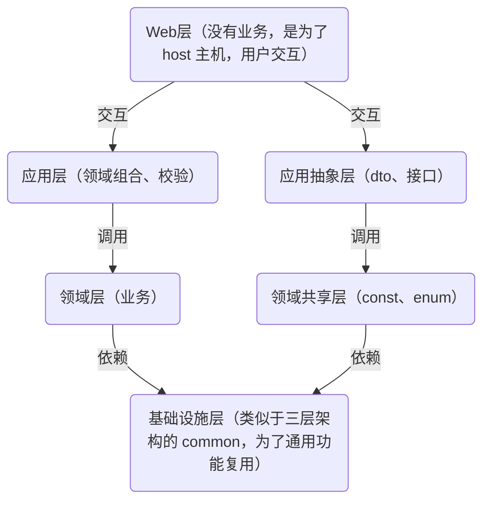

## Web层
`Yi.Abp.Web`
- **作用**：没有业务逻辑，仅用于 host 主机和用户交互。

## 应用层
`Yi.Abp.Application`
- 处理应用逻辑，与业务层进行交互。
### 文件结构
- Jobs
- Services: 应用服务，将多个[[领域服务]]组合
## 应用抽象层
`Yi.Abp.Application.Contracts`
- 负责应用层的抽象，提供通用能力。
### 文件结构
- Dtos: 对外控制器的dto,领域层到应用层的dto
- IServices: 应用服务接口
## 领域层
`Yi.Abp.Domain`
### 文件结构
- Entities: 领域实体
- EventHandlers: 领域事件
- Managers: 领域服务（类似java中的service）
- Repositories: 仓储接口（具体实现放在ORM中）

## 领域共享层
`Yi.Abp.Domain.Shared`
- **领域共享层**：包含常量（`const`）、枚举（`enum`）等共享内容。
轻量
提供给第三方引用

### 文件结构
- Consts
- Dtos
- Enums
- Etos

## 基础设施层（ORM）
`Yi.Abp.SqlSugarCore`
- 类似于三层架构的 `common`，提供通用功能复用。
